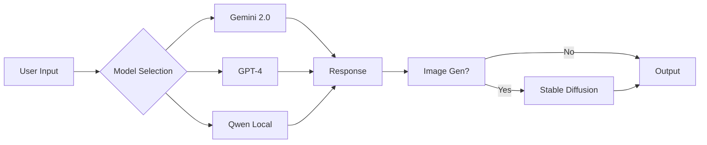
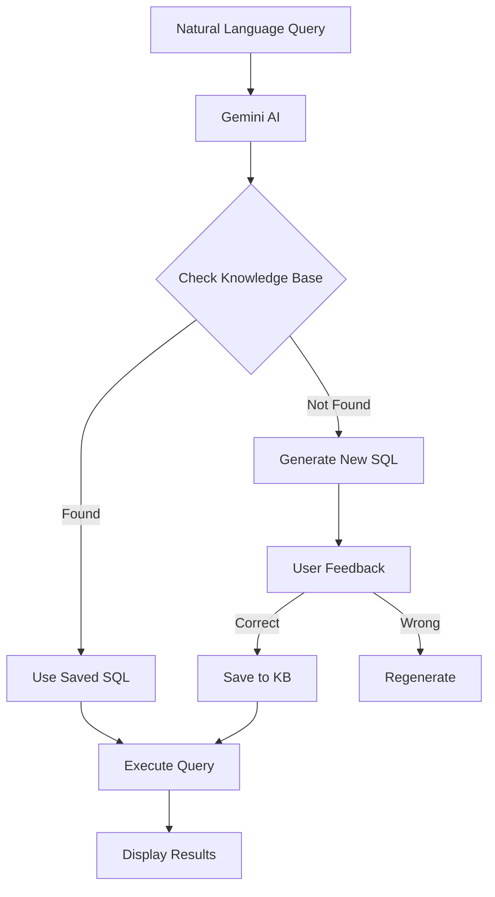
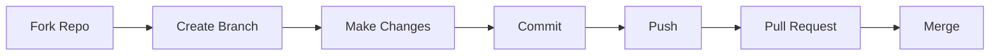

<div align="center">

#  AI-Assistant 
### *Nền Tảng Tích Hợp Đa Dịch Vụ AI*


---


<br/>


<br/>

### ⭐⭐ **2 STARS ACHIEVED!** ⭐⭐
*Thank you for your support! 🎉*

** Nền tảng tích hợp 4 dịch vụ AI mạnh mẽ **

[ Tính năng](#-tính-năng-nổi-bật)  
[ Quick Start](#-quick-start)  
[ Cài đặt](#-yêu-cầu-hệ-thống)  
[ Tài liệu](#-tài-liệu)

</div>

---

<div align="center">

##  **SHOWCASE** 

</div>

<table>
<tr>
<td width="50%">

###  **ChatBot AI**


-  Gemini 2.0 Flash
-  Stable Diffusion Integration
-  AI Memory System
-  Google & GitHub Search
-  PDF Export

</td>
<td width="50%">

###  **Text2SQL**  NEW!


-  Vietnamese Support
-  Multi-Database
-  AI Learning System
-  Question Generation
-  Cloud Deploy Ready

</td>
</tr>
<tr>
<td width="50%">

###  **Speech2Text**


-  Dual-Model Fusion
-  Speaker Diarization
-  Vietnamese Fine-tuned
-  Real-time WebUI
-  Multi-format Support

</td>
<td width="50%">

###  **Stable Diffusion**


-  Text-to-Image
-  Image-to-Image
-  LoRA & VAE Support
-  ControlNet
-  API Enabled

</td>
</tr>
</table>

---

<div align="center">

##  **TỔNG QUAN**

</div>

> **AI-Assistant** là nền tảng AI tích hợp gồm **4 dịch vụ độc lập**, mỗi service có thể chạy riêng hoặc kết hợp với nhau. Dự án được xây dựng với kiến trúc **modular, production-ready**.

<div align="center">

###  **CÁC DỊCH VỤ**

|  Service |  Mô Tả |  Port |  Status |  Docs |
|:-----------|:---------|:--------|:----------|:--------|
|  **ChatBot v2.0**  | Multi-model AI + Auto-File Analysis + Stop Gen | `5001` |  | [ Docs](ChatBot/README.md) |
|  **Text2SQL v2.0**  | Natural Language  SQL + AI Learning | `5002` |  | [ Docs](Text2SQL%20Services/README.md) |
|  **Speech2Text** | Vietnamese Transcription + Diarization | `7860` |  | [ Docs](Speech2Text%20Services/README.md) |
|  **Stable Diffusion** | AI Image Generation (AUTOMATIC1111) | `7861` |  | [ Docs](stable-diffusion-webui/README.md) |

</div>

---

<div align="center">

##  **TÍNH NĂNG NỔI BẬT** 

</div>

<details open>
<summary><b> ChatBot Service (v2.0)</b></summary>
<br>



####  Tính năng chính:

| Feature | Description | Status |
|:--------|:------------|:-------|
|  **Multi-Model** | Gemini 2.0, GPT-4, DeepSeek, Qwen, BloomVN |  |
|  **Auto-File Analysis** | Upload & instant AI insights (50MB max) |  NEW v2.0 |
|  **Stop Generation** | Interrupt AI mid-response & keep output |  NEW v2.0 |
|  **Image Gen** | Stable Diffusion + LoRA + VAE |  |
|  **AI Memory** | Lưu trữ conversations & images |  |
|  **Message Versioning** | Track multiple response versions |  NEW v2.0 |
|  **Tools** | Google Search, GitHub Search |  |
|  **Export** | PDF với metadata |  |
|  **UI** | Full-screen ChatGPT-like, Dark Mode |  v2.0 |

<div align="right">

 **[Chi tiết đầy đủ ](ChatBot/README.md)** |  **Port**: `5001`

</div>

</details>

<details open>
<summary><b> Text2SQL Service  MỚI NHẤT v2.0</b></summary>
<br>



####  Tính năng chính:

<table>
<tr>
<td width="50%">

** ChatBot v2.0 Features:**
-  Auto-File Analysis (up to 50MB)
-  Stop Generation mid-response
-  Message History Versioning
-  Full-screen ChatGPT-like UI
-  Smart Storage Management

</td>
<td width="50%">

** Text2SQL v2.0 Features:**
-  Vietnamese + English Support
-  Multi-DB Support
-  AI Learning System
-  Deep Thinking Mode
-  Deploy FREE on Render.com

</td>
</tr>
</table>

<div align="right">

 **[Chi tiết đầy đủ ](Text2SQL%20Services/README.md)** |  **Port**: `5002`  
 **[Deployment Guide ](Text2SQL%20Services/README.md#-deployment)**

</div>

</details>

<details>
<summary><b> Speech2Text Service (v3.6.0+)</b></summary>
<br>

####  Công nghệ:

```
 Audio Input   Whisper + PhoWhisper   Diarization   Qwen Enhancement   Output
```

| Feature | Technology | Accuracy |
|:--------|:-----------|:---------|
|  **Transcription** | Whisper + PhoWhisper Fusion | 98%+ |
|  **Diarization** | pyannote.audio 3.1 | 95-98% |
|  **Vietnamese** | Fine-tuned models | 98%+ |
|  **Enhancement** | Qwen LLM | High |

** Supported Formats:** MP3, WAV, M4A, FLAC

<div align="right">

 **[Chi tiết đầy đủ ](Speech2Text%20Services/README.md)** |  **Port**: `7860`

</div>

</details>

<details>
<summary><b> Stable Diffusion WebUI</b></summary>
<br>

> **Based on:** [AUTOMATIC1111/stable-diffusion-webui](https://github.com/AUTOMATIC1111/stable-diffusion-webui)  
> **Customized** for optimized performance 

####  Capabilities:

<table>
<tr>
<td width="33%">

** Generation**
- Text-to-Image
- Image-to-Image
- Inpainting
- Outpainting

</td>
<td width="33%">

** Advanced**
- LoRA Models
- VAE Support
- ControlNet
- Textual Inversion

</td>
<td width="33%">

** Integration**
- RESTful API
- ChatBot Integration
- CUDA 12.1 Optimized
- xformers Support

</td>
</tr>
</table>

<div align="right">

 **[Chi tiết đầy đủ ](stable-diffusion-webui/README.md)** |  **Port**: `7861`  
 **[Original Project ](https://github.com/AUTOMATIC1111/stable-diffusion-webui)**

</div>

</details>

---

<div align="center">

##  **QUICK START**

</div>

<table>
<tr>
<td width="50%">

### 1 **Text2SQL** (Recommended! )

```bash
cd "Text2SQL Services"
python -m venv Text2SQL
.\Text2SQL\Scripts\activate
pip install -r requirements.txt
# Setup .env with GEMINI_API_KEY_1
python app_simple.py
```

<div align="center">

 ** http://localhost:5002**

[](Text2SQL%20Services/README.md)

</div>

</td>
<td width="50%">

### 2 **ChatBot**

```bash
cd ChatBot
python -m venv venv_chatbot
.\venv_chatbot\Scripts\activate
pip install -r requirements.txt
# Setup .env with API keys
python app.py
```

<div align="center">

 ** http://localhost:5001**

[](ChatBot/README.md)

</div>

</td>
</tr>
<tr>
<td width="50%">

### 3 **Speech2Text**

```bash
cd "Speech2Text Services"
.\scripts\fix_dependencies.bat
# Optional: Setup HF_TOKEN
.\start_webui.bat
```

<div align="center">

 ** http://localhost:7860**

[](Speech2Text%20Services/SETUP_FINAL.md)

</div>

</td>
<td width="50%">

### 4 **Stable Diffusion**

```bash
cd stable-diffusion-webui
.\webui.bat
```

<div align="center">

 ** http://localhost:7861**

[](stable-diffusion-webui/README.md)

</div>

</td>
</tr>
</table>

---

<div align="center">

##  **CẤU TRÚC DỰ ÁN**

</div>

```
 AI-Assistant/

  ChatBot/                     ChatBot Service (v2.0)
     app.py                   Main application
     requirements.txt         Dependencies
     src/                     Source code
     templates/               HTML templates
     static/                  CSS, JS, images
     Storage/                 Conversations & images

  Text2SQL Services/           Text2SQL Service (v2.0) 
     app_simple.py            Main application
     requirements.txt         Dependencies
     src/                     Source code
     config/                  Configurations
     data/                    Knowledge base & prompts

  Speech2Text Services/        Speech2Text Service (v3.6)
     app/                     Web UI application
     src/                     Core processing
     scripts/                 Setup scripts
     requirements.txt         Dependencies

  stable-diffusion-webui/      Stable Diffusion WebUI
     webui.bat                Launch script
     launch.py                Main launcher
     modules/                 Core modules
     extensions/              Extensions

  config/                      Global configurations
  docs/                        Documentation
  examples/                    Code examples
  README.md                    This file
```

---

<div align="center">

##  **YÊU CẦU HỆ THỐNG**

</div>

<table>
<tr>
<td width="50%">

###  **Phần Cứng**

| Component | Minimum | Recommended |
|:----------|:--------|:------------|
|  **CPU** | 4 cores | 8+ cores |
|  **RAM** | 8 GB | 16+ GB |
|  **GPU** | Optional | NVIDIA RTX 3060+ (6GB+) |
|  **Storage** | 20 GB | 50+ GB SSD |

</td>
<td width="50%">

###  **Phần Mềm**

| Software | Version |
|:---------|:--------|
|  **OS** | Windows 10/11, Linux, macOS 11+ |
|  **Python** | 3.10, 3.11 (recommended: 3.10) |
|  **CUDA** | 12.1+ (for NVIDIA GPU) |
|  **Git** | Latest version |

</td>
</tr>
</table>

<div align="center">

###  **API Keys** (Tùy chọn theo service)

[](https://ai.google.dev)
[](https://platform.openai.com)
[](https://huggingface.co)

</div>

---

<div align="center">

##  **TÀI LIỆU**

</div>

<table>
<tr>
<td width="25%" align="center">

###  ChatBot

[](ChatBot/README.md)

Multi-model AI với Image Generation

</td>
<td width="25%" align="center">

###  Text2SQL

[](Text2SQL%20Services/README.md)

Natural Language to SQL

</td>
<td width="25%" align="center">

###  Speech2Text

[](Speech2Text%20Services/README.md)

Vietnamese Transcription

</td>
<td width="25%" align="center">

###  Stable Diffusion

[](stable-diffusion-webui/README.md)

AI Image Generation

</td>
</tr>
</table>

---

<div align="center">

##  **USE CASES**

</div>

<table>
<tr>
<td width="50%">

###  **Business**
-  Business Intelligence Dashboards
-  Database Query Automation
-  Data Analysis without SQL
-  Customer Support Automation

</td>
<td width="50%">

###  **Education & Research**
-  Meeting Transcription
-  Vietnamese Podcast Processing
-  Interview Documentation
-  Multi-speaker Content Analysis

</td>
</tr>
<tr>
<td width="50%">

###  **Creative**
-  Content Creation for Social Media
-  Concept Art Generation
-  Product Visualization
-  Creative Design Assistance

</td>
<td width="50%">

###  **Personal**
-  Personal AI Assistant with File Analysis
-  Auto-analyze documents & code
-  Content Creation with Images
-  Interactive Conversations with Stop Control
-  Smart Storage Management

</td>
</tr>
</table>

---

<div align="center">

##  **WHAT'S NEW IN v2.0**

</div>

<table>
<tr>
<td width="50%">

###  **ChatBot v2.0** (Nov 2025)

** Auto-File Analysis**
```
Upload → AI analyzes instantly
No need to type questions!
```

** Stop Generation**
```
Stop button → Keep partial response
Continue from there
```

** Full-Screen UI**
```
ChatGPT-like experience
100vh layout, better visibility
```

</td>
<td width="50%">

###  **Key Improvements**

-  File upload up to **50MB**
-  Image compression (1200px max)
-  Message history versioning
-  Smart storage with auto-cleanup
-  Enhanced chat item visibility
-  GitHub badge integration
-  ES6 modular architecture
-  Performance optimizations

 **[Full Changelog](ChatBot/CHANGELOG.md)**

</td>
</tr>
</table>

---

<div align="center">

##  **CONTRIBUTING**


</div>



<div align="center">

**Làm theo các bước sau:**

1.  **Fork** repository này
2.  Tạo branch mới (`git checkout -b feature/AmazingFeature`)
3.  Code your magic 
4.  Commit (`git commit -m ''Add some AmazingFeature''`)
5.  Push (`git push origin feature/AmazingFeature`)
6.  Mở **Pull Request**

</div>

---

<div align="center">

##  **LICENSE**

[](LICENSE)

Dự án này được phân phối dưới giấy phép **MIT License**

</div>

---

<div align="center">

##  **AUTHORS & CONTRIBUTORS**

</div>

<table>
<tr>
<td align="center" width="50%">


### **SkastVnT**

[](https://github.com/SkastVnT)
[](mailto:your-email@example.com)

**Solo Developer • AI Enthusiast • Full-Stack Engineer**

*Developed with late nights, lots of coffee ☕, and a passion for AI* 

</td>
<td align="center" width="50%">


### **sug1omyo**

[](https://github.com/sug1omyo)

**Fresher Software Engineer**

*Collaborator & Contributor* 

</td>
</tr>
</table>

<div align="center">

---

<div align="center">

##  **ACKNOWLEDGMENTS**

Cảm ơn các công nghệ và thư viện tuyệt vời:

[](https://github.com/AUTOMATIC1111/stable-diffusion-webui)
[](https://ai.google.dev)
[](https://openai.com)
[](https://huggingface.co)

</div>

---

<div align="center">

## 🎖️ **MILESTONES & ACHIEVEMENTS** 🎖️

<table>
<tr>
<td align="center" width="25%">

<br/>
<sub><b>Nov 3, 2025</b></sub>
<br/>
<sub>🎉 First Milestone!</sub>
</td>
<td align="center" width="25%">

<br/>
<sub><b>Production Ready</b></sub>
<br/>
<sub>ChatBot • Text2SQL • Speech2Text • SD</sub>
</td>
<td align="center" width="25%">

<br/>
<sub><b>Team Growing</b></sub>
<br/>
<sub>SkastVnT • sug1omyo</sub>
</td>
<td align="center" width="25%">

<br/>
<sub><b>MIT Licensed</b></sub>
<br/>
<sub>Free & Open to All</sub>
</td>
</tr>
</table>

### 🎯 **Next Milestones:**
- 🎯 **5 Stars** - Add demo video
- 🎯 **10 Stars** - Release v2.0 with new features
- 🎯 **25 Stars** - Community showcase section
- 🎯 **50 Stars** - Docker support & Easy deployment
- 🎯 **100 Stars** - 🎊 Special celebration!

</div>

---

<div align="center">

##  **STATISTICS**


</div>

---

<div align="center">

##  **STAR HISTORY**

[](https://star-history.com/#SkastVnT/AI-Assistant&Date)

</div>

---

<div align="center">


###  **Nếu project này hữu ích, đừng quên cho một !** 


**Made with  by [SkastVnT](https://github.com/SkastVnT)**

* 2025 SkastVnT. All rights reserved.*

</div>