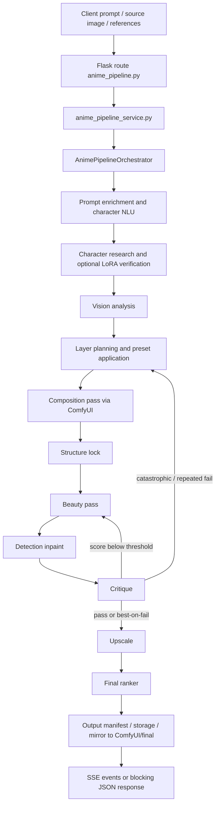

# Đánh giá nhánh feat/img_detect của SkastVnT/AI-Assistant về mức sẵn sàng đạt chất lượng Anime Gen ngang ChatGPT PRO và Gemini Nano Banana

## Tóm tắt điều hành

Kết luận ngắn gọn là: **chưa có đủ bằng chứng để khẳng định nhánh `feat/img_detect` của `SkastVnT/AI-Assistant` đã đạt chất lượng sinh ảnh anime cục bộ ngang mức ChatGPT PRO hoặc Gemini Nano Banana 2 Ultra**. Từ mã nguồn công khai của nhánh này, có thể xác nhận hệ thống đã có một pipeline anime local tương đối sâu, có multi-pass, critique/refine loop, auto LoRA, character NLU, benchmark harness, và tích hợp vào chatbot qua các route `/api/anime-pipeline/*`. Tuy nhiên, **parity với ChatGPT/Nano Banana hiện mới ở mức mục tiêu benchmark và quy trình đánh giá**, chưa phải kết quả đã được chứng minh bằng run thực tế hoặc báo cáo benchmark được commit vào repo. Repo còn ghi rất rõ rằng comparator parity là việc **manual offline import + blind review**, còn `local_quality_gate_passed` chỉ là cổng chất lượng nội bộ, không phải bằng chứng ngang hàng với các hệ thống cloud mục tiêu. citeturn22view0turn31view0turn31view1turn35view0turn36view0turn42view0

Điểm mạnh hiện có là pipeline local anime không còn là “single prompt → single checkpoint → image” đơn giản. Nó đã có orchestrator nhiều tác tử, planner preset, vision analysis, character research, tự nhận diện nhân vật từ prompt tiếng Việt/tiếng Anh, auto-search và verify LoRA, VRAM-aware retry, ranker chọn ảnh cuối, cùng framework benchmark cho các ca `t2i_anime`, `identity`, `anatomy`, `pose`, `complex_background`, `multi_ref`, `semantic_edit`, và `multi_turn_edit`. Điều này cho thấy nhánh `feat/img_detect` đã tiến khá xa về **kiến trúc**. Nhưng về **chất lượng đã đạt hay chưa**, nhánh này còn thiếu hai thứ quan trọng nhất: **kết quả benchmark sống** và **evidence so sánh trực tiếp** với ChatGPT Images/Nano Banana ở cùng bộ ca kiểm thử. citeturn22view0turn21view0turn14view2turn35view0turn36view0turn42view0

Rủi ro lớn nhất nằm ở chỗ nhiều thành phần “giữ cấu trúc” và “sửa lỗi cục bộ” vẫn đang **bị tắt theo mặc định** trong các profile local quan trọng. Cụ thể, cấu hình `anime_pipeline.yaml` dùng checkpoint WAI Illustrious SDXL v170 cho cả composition/beauty/final, nhưng tất cả structure-lock ControlNet mặc định đều `enabled: false` vì model ControlNet SD1.5 không tương thích kiến trúc với SDXL; detection inpaint cũng mặc định `enabled: false`; profile mặc định trong `config.py` lại là `anime_pipeline_laptop_6gb.yaml`, tức thiên về cấu hình demo/giảm chi phí chứ không phải profile tối đa chất lượng. Điều đó làm giảm khả năng đạt độ ổn định pose/identity/background ở mức ngang các hệ cloud mới nhất. citeturn23view1turn27view0turn26view0turn26view2turn39view0

Phán đoán kỹ thuật hợp lý nhất, dựa trên code hiện có, là: **pipeline local này có thể mạnh về “anime look”, có tiềm năng cạnh tranh ở style-match thuần anime khi chạy profile 12 GB trở lên với LoRA phù hợp; nhưng chưa có bằng chứng cho thấy nó đã ngang ChatGPT PRO/Gemini Nano Banana về tính nhất quán, độ tin cậy đa tham chiếu, độ phân giải đầu ra thực dụng, tốc độ, và chất lượng đã được đo kiểm lặp lại.** citeturn27view0turn29view0turn34view0turn34view1turn42view0

## Phạm vi bằng chứng và giới hạn

Phần có thể xác nhận chắc chắn là **repo public** `SkastVnT/AI-Assistant` trên nhánh `feat/img_detect`. Từ cây thư mục branch này, có thể thấy một submodule/private pointer tên `private @ 909f862`; tức public repo đang tham chiếu tới một trạng thái của phần private, nhưng ở bằng chứng tôi truy xuất được trong phiên này thì **không có file-level visibility cho `SkastVnT/AI-Assistant-private`**. Vì vậy, các kết luận dưới đây có độ tin cậy cao cho phần public repo, còn với private repo thì chỉ có thể nói rằng nó được tham chiếu ở commit/submodule `909f862`; nội dung thực tế của private repo vẫn là **không xác minh được trong nguồn đã truy xuất**. citeturn19view0

Một giới hạn quan trọng khác là **không có kết quả benchmark sống hoặc ảnh sinh ra được commit vào nhánh để đối chiếu**. Repo chỉ chứa payload mẫu và output manifest mẫu; không có thư mục chứa ảnh benchmark thực tế, summary benchmark, hoặc artifacts A/B đã commit. Hơn nữa, benchmark runner ở chế độ live còn yêu cầu `pipeline_fn` và `scorer` thật; nếu chỉ chạy CLI mặc định thì `--dry-run` cho wiring check chứ không tạo ra điểm chất lượng thực. Vì vậy, phần “đã đạt ngang chưa” không thể trả lời bằng kiểu “có số liệu live rồi”, mà chỉ có thể trả lời theo mức độ **evidence hiện diện trong code**. citeturn37view0turn37view1turn35view0turn42view0

Một giới hạn nữa là hệ benchmark hiện tại của repo **không dùng FID, LPIPS, PSNR, SSIM** trong các module evaluator đã kiểm tra. Những gì hiện diện là LLM-as-judge theo dimension score, pass-rate, local quality gate, blind review và manual comparator import. Vì thế, nếu tiêu chuẩn của bạn là benchmark theo các metric thị giác cổ điển, repo hiện tại **chưa cung cấp** chúng trong phần evaluator đã thấy. Đây là kết luận dạng kiểm tra mã nguồn: tôi không thấy implementation cho các metric đó trong `benchmark_runner.py`, `scorer.py`, `experiment_log.py`, và các YAML benchmark đã đọc. citeturn35view0turn35view1turn36view0turn36view1turn42view0

## Cấu trúc mã và workflow

Từ README gốc và cây thư mục, pipeline local anime được đặt chủ yếu ở `app/image_pipeline/anime_pipeline/`, được bridge vào chatbot qua `services/chatbot/core/anime_pipeline_service.py` và `services/chatbot/routes/anime_pipeline.py`. Ngoài ra còn có một nhánh router ảnh tổng quát ở `services/chatbot/core/image_gen/` và một capability router ở `app/image_pipeline/workflow/capability_router.py` để chọn model/provider theo task. citeturn19view0turn14view0turn18view0turn31view0turn31view1turn30view0

Điểm đáng chú ý là tài liệu `README.md` của anime pipeline mô tả kiến trúc “7 stage”, nhưng docstring mới hơn của `orchestrator.py` thực tế liệt kê **8 stage**: `vision_analysis`, `layer_planning`, `composition_pass`, `structure_lock`, `beauty_pass`, `detection_inpaint`, `critique`, `upscale`, và code còn có thêm các khối character research / LoRA stage / replan. Điều này cho thấy tài liệu và code **không hoàn toàn đồng bộ**; branch này đang trong trạng thái phát triển tích cực, nên một phần tài liệu đã lạc hậu so với code. citeturn22view0turn23view0turn24view0turn24view2

Bảng dưới đây tóm tắt các file/chức năng chịu trách nhiệm cho từng chặng của pipeline.

| Giai đoạn | File chính | Trách nhiệm | Ghi chú |
|---|---|---|---|
| Ingress HTTP | `services/chatbot/routes/anime_pipeline.py` | Expose `/api/anime-pipeline/health`, `/stream`, `/generate`; enrich prompt với `character_key`, auto NLU từ prompt | Canonical API route của anime pipeline. citeturn31view1 |
| Service bridge | `services/chatbot/core/anime_pipeline_service.py` | Kiểm tra feature flag, reachability ComfyUI, concurrency semaphore, mirror ảnh cuối, chuyển SSE | Cầu nối giữa Flask route và orchestrator. citeturn31view0 |
| Runtime policy | `app/image_pipeline/anime_pipeline/runtime_policy.py` | Khóa outbound theo profile, local-only generation, chỉ cho external validation trong một số điều kiện | Quan trọng cho local benchmark. citeturn38view0 |
| Điều phối chính | `app/image_pipeline/anime_pipeline/orchestrator.py` | Tạo/runs job, quản lý stage order, refine loop, replan, character research, LoRA stage, ranking | Single source of truth về thứ tự stage. citeturn22view0turn23view0turn24view0turn24view1turn24view2 |
| Vision + planning | `agents/vision_analyst.py`, `vision_service.py`, `agents/layer_planner.py`, `planner_presets.py`, `prompt_layers.py`, `vision_prompts.py` | Phân tích ảnh/tham chiếu, sinh plan, style preset, prompt layering, discrepancy prompt | Kết hợp local/có thể external vision tùy profile. citeturn22view0turn41view2turn44view0turn43view0turn44view1 |
| Sinh ảnh chính | `workflow_builder.py`, `comfy_client.py`, `agents/composition_pass.py`, `agents/beauty_pass.py`, `agents/upscale.py` | Xây workflow ComfyUI, submit pass composition/beauty/upscale | Batch size mặc định quan sát được là 1 trong builder composition. citeturn23view2turn22view0 |
| Sửa lỗi cục bộ | `agents/detection_inpaint.py`, `agents/detection_detail.py`, `lora_manager.py`, `eye_taped_lora.py` | YOLO detect + inpaint từng vùng, auto tìm và verify LoRA nhân vật, eye-specific LoRA | Nhiều phần nặng và phụ thuộc asset ngoài repo. citeturn21view0turn40view0turn27view0 |
| Chấm điểm/kết quả | `agents/critique.py`, `critique_service.py`, `agents/final_ranker.py`, `agents/output_manifest.py`, `result_store.py` | Vision critique, chấm từng dimension, chọn winner, sinh manifest, lưu artifact | Cốt lõi cho refine loop và benchmark. citeturn45view1turn45view2turn46view0turn22view0 |
| Benchmark | `evaluator/benchmark_runner.py`, `evaluator/scorer.py`, `evaluator/experiment_log.py`, `configs_vps/anime_benchmark_*.yaml` | Chạy suite, LLM-as-judge, lưu summary, gate chất lượng local | Không thấy metric cổ điển như FID/LPIPS/PSNR. citeturn35view0turn35view1turn42view0turn36view0turn36view1 |

Luồng dữ liệu đầy đủ, theo code hiện thấy, có thể tóm tắt như sau:



Về multi-agent coordination, hệ này dùng `AnimePipelineJob` làm shared state, còn từng agent là module chuyên trách. Ngoài pipeline pass agents, repo còn có **Local Image Council** với bốn vai trò rõ ràng: `Director`, `IdentityGuardian`, `CompositionCritic`, `DetailCritic`, chạy qua local VLM và chỉ trả JSON directive/risk chứ không lộ “hidden reasoning”. Điều này khá gần với tinh thần “multi-agent orchestration”, nhưng trên local profile 6 GB thì council bị tắt; trên profile 12 GB nó có thể bật 1 round. citeturn22view0turn23view0turn45view0turn26view0turn26view1

## Mô hình, checkpoint, prompt, conditioning và runtime

**Model stack local anime chính** trong nhánh này đang xoay quanh checkpoint **`waiIllustriousSDXL_v170.safetensors`**. Trong `anime_pipeline.yaml`, cả ba slot `composition`, `beauty`, và `final` đều cùng trỏ về checkpoint này, với sampler/scheduler và step khác nhau theo pass. Upscale model là **`RealESRGAN_x4plus_anime_6B`**, có fallback `RealESRGAN_x4plus`. Ở registry tổng (`models.yaml`), model local canonical cũng được khai báo là `comfyui-wai-v170`, VRAM 6 GB, capability `t2i/i2i/inpaint/preview`; ngoài ra còn có FLUX.2-klein 4B/9B, Qwen Image Edit 2511, SDXL base, ADetailer, IP-Adapter và các model API như `gpt-image-1`, `nano-banana`, `nano-banana-2`. citeturn27view0turn28view1turn29view0

Về prompt và conditioning, repo không chứa mã fine-tune huấn luyện base model; thay vào đó, branch này tập trung vào **prompt engineering + LoRA + region repair + critique loop**. `prompt_layers.py` định nghĩa engine 6 lớp prompt nội bộ: planning, execution, composition, refinement, correction, verification. `vision_prompts.py` lại chuẩn hóa prompt JSON cho caption ngắn, rich caption kiểu JoyCaption, anime tag extraction, discrepancy detection, và full structured analysis. `planner_presets.py` cung cấp preset `anime_quality`, `anime_speed`, `anime_reference_strict`, `anime_background_heavy`; nghĩa là pipeline cố cải thiện quality chủ yếu bằng **prompt structure, sampler/step/cfg scheduling, identity emphasis, control strength scaling**, chứ không phải bằng training code in-repo. citeturn43view0turn44view0turn44view1

LoRA là lớp conditioning quan trọng nhất của branch này. Có hai tầng LoRA: LoRA “chất lượng/style” trong `lora_registry.yaml` như `Anime_artistic_2.safetensors`, `HueSpark1llust.safetensors`, `Anime_Enhancer_V4_XL.safetensors`, `Eyes_for_Illustrious_Lora_Perfect_anime_eyes.safetensors`; và LoRA nhân vật được auto-search qua CivitAI bởi `lora_manager.py`, sau đó test-generate và vision-verify trước khi giữ lại. Điều này cho thấy repo muốn tăng **character fidelity** và **anime detail quality** bằng curated/adaptive LoRA stack. Tuy nhiên, **license của các checkpoint/LoRA không được mã hóa rõ ràng trong repo**; `anime_pipeline_assets.yaml` còn nhấn mạnh phải provision bằng tay, xác minh điều khoản license, checksum có thể trống, và runtime downloads bị tắt. Vì vậy, với yêu cầu “weights, license”, trạng thái đúng nhất là **tên checkpoint/LoRA có, license chủ yếu không được chỉ định trong code đã thấy**. citeturn28view0turn40view0turn26view3

Về runtime local, nhánh này có nhiều profile. Rủi ro lớn là **profile mặc định trong `config.py` là `anime_pipeline_laptop_6gb.yaml`**, không phải profile production 12 GB. Profile 6 GB giảm resolution xuống `640x896` / `768x768`, tắt ControlNet, tắt YOLO detailer, tắt council, chỉ để local VLM tùy chọn `Qwen2.5-VL-3B-Instruct-GGUF`. Profile `pc_12gb` tăng step, cho phép `flux2_klein`, bật council 1 round và yêu cầu local VLM `Qwen2.5-VL-7B-Instruct-GGUF`. Profile `rtx5070` mô tả rõ hơn: cần PyTorch ≥ 2.7 với CUDA 12.8+, NVIDIA driver ≥ 555, `torch 2.11.0+cu128` được ghi nhận là chạy được vào ngày 2026-05-18; resolution test là `768x1152`, max upscale `1728`, detection inpaint bị tắt để giảm VRAM/time. citeturn23view1turn26view0turn26view1turn26view2

Về tốc độ và batch size, code và config chỉ cho phép suy luận gián tiếp chứ chưa có benchmark result commit sẵn. `workflow_builder.build_composition(...)` có `batch_size: int = 1` mặc định; `anime_pipeline.yaml` đặt timeout composition/beauty ở 120 giây, còn profile RTX5070 nâng lên 180 giây cho first-compile overhead; manifest mẫu cho một run thành công ghi tổng latency khoảng `6781.5 ms`, nhưng manifest này lại dùng model cũ kiểu `animagine-xl-4.0-opt` / `noobai-xl-1.1`, nên nên xem đây là **ví dụ format**, không phải bằng chứng latency của cấu hình WAI/branch hiện tại. citeturn23view2turn27view0turn26view2turn37view1

Một phát hiện quan trọng về chất lượng là **structure lock hiện gần như chưa phát huy do các ControlNet layer mặc định bị vô hiệu hóa**. `anime_pipeline.yaml` chú thích thẳng rằng lineart/depth ControlNet SD1.5 không tương thích với SDXL, vì vậy đều `enabled: false`; profile 6 GB và RTX5070 cũng giữ trạng thái này. Nói cách khác, pipeline multi-pass có stage structure lock trong kiến trúc, nhưng **vũ khí then chốt để khóa pose/identity/composition hiện chưa được bật trong mặc định chất lượng chính**. Đây là một khoảng cách lớn nếu so với kỳ vọng “ngang ChatGPT PRO / Gemini” ở các ca khó. citeturn27view0turn26view0turn26view2

## Đánh giá chất lượng và so sánh với ChatGPT PRO và Gemini Nano Banana

Evidence mạnh nhất để trả lời câu hỏi “đã đạt ngang chưa” nằm ở framework benchmark của chính repo. `anime_benchmark_suite.yaml` ghi comparator capture mode là **`manual_offline_import`**, blind review bật `randomize_labels`, và danh sách hệ so sánh gồm “ChatGPT Images 2.0 with thinking”, “Nano Banana 2 (Gemini 3.1 Flash Image)”, và “Nano Banana Pro”. `ExperimentLog` còn nói rõ hơn: `local_quality_gate_passed` là **local qualification only**, còn **comparator parity là manual review riêng**. Điều đó có nghĩa là codebase đã **định nghĩa cách so sánh** với mục tiêu ChatGPT/Gemini, nhưng **không chứng minh rằng parity đã đạt**. Trạng thái chuẩn xác nhất hiện nay là: **benchmark harness sẵn sàng, parity result chưa được xác nhận trong repo**. citeturn36view0turn42view0

Về methodology, evaluator hiện là **LLM-as-judge**. `Scorer` chấm theo các dimension như `instruction_adherence`, `identity_consistency`, `detail_handling`, `semantic_edit`, `multi_ref_quality`, `multi_turn_stability`, `text_rendering`, `correction_success`, tùy intent. `anime_benchmark_policy.yaml` đặt threshold điển hình như `instruction_adherence >= 0.70`, `identity_consistency >= 0.80`, anatomy và detail ở 0.70, category pass rate 0.70, và `local_quality_gate_threshold = 0.80`. Nhưng **không có FID/LPIPS/PSNR/SSIM** trong phần evaluator đã thấy; cũng không có summary benchmark đã commit. Vì vậy, hiện trạng có thể đo bằng nội bộ LLM judge, nhưng chưa có evidence thực chạy. citeturn35view1turn36view1turn42view0

Bảng dưới đây tổng hợp các metric/điểm đánh giá mà branch này **thực sự có** hoặc **không có** trong bằng chứng đã kiểm tra.

| Nhóm đánh giá | Có trong branch hay không | Kết quả hiện thấy | Nhận xét |
|---|---|---|---|
| LLM-as-judge theo dimension | Có | **Chưa có run result commit** | Có `Scorer`, `ExperimentLog`, policy threshold, nhưng chưa có summary artifact sống. citeturn35view1turn42view0turn36view1 |
| Blind review so với comparator | Có kế hoạch | **Chưa thấy kết quả** | Suite dùng `manual_offline_import`, randomize labels, kết hợp human + local VLM. citeturn36view0 |
| Local quality gate | Có | **Chưa có kết quả** | Pass nếu overall pass rate đạt ngưỡng và không có critical failure. citeturn42view0turn36view1 |
| FID | Không thấy trong evaluator đã kiểm tra | Chưa chạy | Không thấy implementation hoặc config liên quan. citeturn35view0turn35view1turn42view0 |
| LPIPS | Không thấy | Chưa chạy | Tương tự FID. citeturn35view0turn35view1turn42view0 |
| PSNR / SSIM | Không thấy | Chưa chạy | Không thấy code hoặc YAML scoring cổ điển. citeturn35view0turn35view1turn42view0 |
| Human eval thực tế được commit | Không thấy | Chưa có | Blind review mới ở mức framework/chính sách. citeturn36view0turn42view0 |

Nếu so theo các tiêu chí bạn yêu cầu — **visual fidelity, style match to Anime Gen, consistency, resolution, artifacts, speed** — thì đánh giá kỹ thuật hợp lý cho branch hiện tại là như sau. Đây là **suy luận kỹ thuật từ cấu hình và code**, không phải benchmark live đã chạy:

| Tiêu chí | Đánh giá cho `feat/img_detect` | Cơ sở kỹ thuật |
|---|---|---|
| Visual fidelity | **Khá tốt về tiềm năng, chưa chứng minh parity** | WAI Illustrious SDXL v170 cho cả composition/beauty/final + upscale anime ESRGAN + quality LoRA registry. citeturn27view0turn28view1turn28view0 |
| Style match với anime | **Khả năng cao là điểm mạnh nhất** | Checkpoint anime-native, prompt presets, anime tag extraction, LoRA cho mắt/chất lượng/style. citeturn27view0turn44view1turn28view0 |
| Character/identity consistency | **Trung bình đến khá, nhưng còn lỗ hổng lớn** | Có character NLU, SAA lookup, character research, auto LoRA verify; nhưng structure lock ControlNet mặc định bị tắt và multi-ref mạnh hơn nằm ở FLUX/Qwen tiers ngoài local WAI core. citeturn31view1turn41view0turn41view1turn40view0turn27view0turn29view0 |
| Resolution thực dụng | **Dưới kỳ vọng parity cloud** | Local gen mặc định 832x1216 hoặc thấp hơn; upscale tối đa 2048x2048 trong profile chính, 1728 ở RTX5070 test; trong khi route Nano Banana hỗ trợ 1K/2K/4K và OpenAI provider có các size API riêng. citeturn27view0turn26view2turn34view0turn34view1 |
| Artifact suppression | **Có cơ chế, nhưng phần mạnh nhất bị tắt mặc định** | Critique loop, final ranker, YOLO detection inpaint, eye-specific LoRA đều có; nhưng detection_inpaint mặc định false trong cấu hình chính/test. citeturn45view2turn46view0turn27view0turn26view2 |
| Speed/latency | **Khó đạt ngang cloud ở local canonical stack** | Timeout composition/beauty 120–180s; local fast providers có nhưng không phải canonical anime-quality stack. citeturn27view0turn26view2turn29view0 |

Tóm lại, nếu câu hỏi là “**branch này đã đạt ngang chưa**”, câu trả lời có trách nhiệm là **chưa thể kết luận có**. Nếu câu hỏi là “**branch này đã có đủ nền móng để đẩy tới mức gần ngang trong một số ca anime không**”, câu trả lời là **có, nhưng cần benchmark thật và vài thay đổi kiến trúc/cấu hình trước khi tuyên bố parity**. citeturn36view0turn42view0turn27view0

## Hướng dẫn tái lập cục bộ và khuyến nghị

Về tái lập, repo cung cấp đường chạy cơ bản và test command rõ ràng cho chatbot service. README gốc hướng dẫn tạo `venv-core`, cài `requirements-core.txt`, copy hai file `.env.example`, và chạy `python services\chatbot\run.py`. Anime pipeline README cũng nêu các lệnh `pytest` cho planner, workflow builder, critique/refine/ranker, ComfyUI integration, E2E dry run, cùng lệnh chạy benchmark runner `--dry-run`. Nhưng benchmark sống cần `pipeline_fn` và `scorer` thật; nếu không thì chỉ là wiring check. citeturn19view0turn22view0turn35view0

Quy trình tái lập thực tế, sát nhất với bằng chứng hiện có, có thể làm như sau:

```bash
python -m venv venv-core
.\venv-core\Scripts\Activate.ps1
pip install -r requirements-core.txt

copy app\config\.env.example app\config\.env
copy services\chatbot\.env.example services\chatbot\.env

set IMAGE_PIPELINE_V2=true
set ANIME_PIPELINE_CONFIG=app/configs_vps/anime_pipeline_rtx5070.yaml
set COMFYUI_URL=http://127.0.0.1:8188

python services\chatbot\run.py
```

Sau khi service lên, gửi request mẫu tới anime pipeline bằng payload cùng cấu trúc như file ví dụ:

```json
{
  "prompt": "1girl, silver hair, blue eyes, school uniform, standing under cherry blossom tree, wind blowing petals, detailed eyes, soft light, anime style",
  "quality": "high",
  "preset": "anime_quality",
  "source_image": null,
  "reference_images": [],
  "orientation": "portrait",
  "debug": false
}
```

Các bằng chứng đi kèm cho thấy route chuẩn là `/api/anime-pipeline/generate` hoặc `/api/anime-pipeline/stream`, còn payload mẫu ở `examples/request_payload.json`. citeturn31view1turn37view0turn22view0

Để chạy test theo repo:

```bash
..\..\venv-core\Scripts\python.exe -m pytest tests/test_planner_agent.py -v
..\..\venv-core\Scripts\python.exe -m pytest tests/test_critique_refine_ranker.py -v
..\..\venv-core\Scripts\python.exe -m pytest tests/test_workflow_builder.py -v
..\..\venv-core\Scripts\python.exe -m pytest tests/test_comfyui_integration.py -v
..\..\venv-core\Scripts\python.exe -m pytest tests/test_e2e_dry_run.py -v
..\..\venv-core\Scripts\python.exe -m pytest tests/test_anime_pipeline.py tests/test_anime_pipeline_integration.py -v
python -m image_pipeline.evaluator.benchmark_runner --run-id run-001 --dry-run
```

Các ràng buộc phần cứng nên giả định từ profile. Nếu không chỉ định profile riêng, code hiện mặc định về `anime_pipeline_laptop_6gb.yaml`. Nếu muốn đánh giá chất lượng nghiêm túc hơn cho anime gen local, nên dùng profile 12 GB hoặc `rtx5070` vì profile 6 GB chủ đích giảm tài nguyên và tắt bớt capability. Repo không chỉ ra một “minimum exact hardware constraint” duy nhất cho mọi chế độ; thay vào đó, nó cung cấp nhiều profile tách biệt. citeturn23view1turn26view0turn26view1turn26view2

Về “example generated images”, nhánh này **không commit ảnh sinh ra thực tế** trong vùng tôi kiểm tra. Chỉ có `request_payload.json` và `output_manifest.json` mẫu. Vì vậy tôi không thể đính kèm ảnh output thực từ repo; nếu bạn chạy được pipeline local, chính `debug/intermediate` và output manifest sẽ là nơi nên thu artifact để so A/B. citeturn37view0turn37view1turn22view0

Các khuyến nghị ưu tiên cao nhất, theo thứ tự tác động tới mục tiêu “Anime Gen ngang ChatGPT PRO / Gemini Nano Banana”, là:

1. **Thực thi benchmark sống và commit summary artifacts**. Hệ benchmark đã có, nhưng chưa có run result. Không có `summary.json`/A-B artifact thì mọi phát biểu parity đều yếu. Cần chạy ít nhất toàn bộ suite local anime, lưu `ExperimentLog`, rồi import comparator outputs theo đúng `manual_offline_import` để có blind review thật. citeturn35view0turn36view0turn42view0

2. **Giải quyết khoảng trống structure lock cho SDXL**. Hiện stage structure lock tồn tại nhưng ControlNet mặc định bị tắt vì incompatibility SD1.5↔SDXL. Đây là nút thắt lớn nhất với consistency. Cần chuyển sang SDXL-native ControlNet/IP-Adapter stack ổn định, hoặc thay hẳn bằng một cơ chế identity/pose preservation tương thích WAI SDXL. citeturn27view0turn26view2

3. **Đặt profile mặc định cho benchmark quality là 12 GB hoặc cao hơn**. Hiện `config.py` mặc định trỏ vào `anime_pipeline_laptop_6gb.yaml`, vốn thiên về demo, tắt nhiều tính năng, không thích hợp để tuyên bố parity. Nên chuyển default benchmarking profile sang `pc_12gb` hoặc profile tương đương, và tách rõ “demo profile” khỏi “benchmark profile”. citeturn23view1turn26view0turn26view1

4. **Biến detection-inpaint từ “có mà tắt” thành capability có thể benchmark được**. Repo đã đầu tư rất nhiều vào 27 YOLO models, eye LoRA, region prompt, nhưng cấu hình chính vẫn disable. Nếu mục tiêu là vượt artifact/hands/eyes của cloud systems, đây là phần cần chạy thật và đo thật thay vì chỉ để trong code. citeturn27view0turn40view0turn45view2

5. **Chuẩn hóa tài liệu và manifest model/license**. Hiện docs và code lệch nhau: README anime pipeline nói 7 stage, orchestrator nói 8 stage; sample manifest còn mang model cũ `animagine`/`noobai`; assets manifest lại để operator tự xác minh license. Muốn report chất lượng có trọng lượng, phải có một manifest asset/checkpoint/LoRA/licensing đồng bộ và một doc chuẩn hóa stage/order/model slot hiện hành. citeturn22view0turn23view0turn37view1turn26view3

6. **Nếu mục tiêu là “ngang Nano Banana” ở multi-ref/edit**, cân nhắc đẩy local stack sang FLUX.2-klein 9B hoặc Qwen-Image-Edit local/VPS trước khi cố ép WAI-only pipeline gánh mọi bài. `models.yaml` và capability router cho thấy repo đã có định hướng này; WAI local rất tốt cho anime look, nhưng multi-ref/semantic-edit mạnh dường như đang được kỳ vọng ở các stack FLUX/Qwen hơn là ở canonical WAI-only path. citeturn29view0turn30view0

Những câu hỏi còn mở là: private repo `AI-Assistant-private` thực sự bổ sung gì ở commit/submodule `909f862`; có summary benchmark hoặc artifact A/B nào nằm trong private mà public repo không có; và benchmark parity với ChatGPT/Gemini đã từng được chạy nội bộ hay chưa. Với bằng chứng hiện có, tôi đánh giá branch này là **“đã xây xong phần lớn bộ khung chất lượng cao cho local anime generation, nhưng chưa đủ evidence để tuyên bố đã đạt parity với ChatGPT PRO hay Gemini Nano Banana 2 Ultra.”** citeturn19view0turn36view0turn42view0