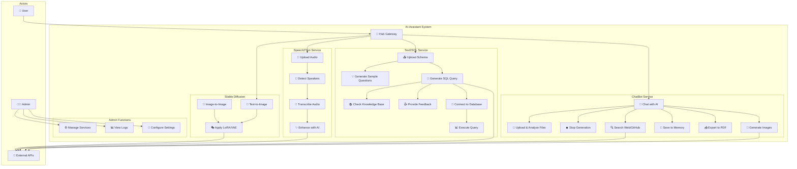

# 1️⃣ USE CASE DIAGRAM

> **Biểu đồ ca sử dụng hệ thống AI-Assistant**  
> Mô tả tương tác giữa người dùng và 4 dịch vụ AI chính + Hub Gateway

---

## 📋 Mô tả

Use Case Diagram thể hiện:
- **Actors:** User (người dùng thông thường), Admin (quản trị viên), External APIs (API bên ngoài)
- **Services:** 4 dịch vụ AI độc lập + Hub Gateway
- **Use Cases:** Các chức năng chính của từng service

---

## 🎯 Biểu đồ

---

## 📊 Chi tiết Use Cases

### 🤖 ChatBot Service (7 use cases)

| ID | Use Case | Mô tả | Actor |
|:---|:---------|:------|:------|
| UC1 | Chat with AI | Trò chuyện với AI models (Gemini, GPT-4, DeepSeek, etc.) | User |
| UC2 | Upload & Analyze Files | Upload file (PDF/Image/Code) và nhận phân tích tự động | User |
| UC3 | Stop Generation | Dừng AI giữa chừng và giữ lại output | User |
| UC4 | Generate Images | Tạo ảnh với Stable Diffusion + LoRA/VAE | User → External API |
| UC5 | Save to Memory | Lưu conversations vào AI Memory | User |
| UC6 | Export to PDF | Export cuộc trò chuyện sang PDF | User |
| UC7 | Search Web/GitHub | Tìm kiếm Google hoặc GitHub | User → External API |

### 📊 Text2SQL Service (7 use cases)

| ID | Use Case | Mô tả | Actor |
|:---|:---------|:------|:------|
| UC8 | Upload Schema | Upload database schema hoặc kết nối trực tiếp | User |
| UC9 | Generate Sample Questions | AI tự động tạo câu hỏi mẫu từ schema | User |
| UC10 | Generate SQL Query | Chuyển câu hỏi tiếng Việt/Anh → SQL | User → External API |
| UC11 | Check Knowledge Base | Tìm kiếm trong Knowledge Base trước khi gen SQL | System |
| UC12 | Provide Feedback | Đánh giá SQL đúng/sai để AI học | User |
| UC13 | Connect to Database | Kết nối đến ClickHouse/MongoDB/PostgreSQL | User |
| UC14 | Execute Query | Chạy SQL và hiển thị kết quả | User |

### 🎙️ Speech2Text Service (4 use cases)

| ID | Use Case | Mô tả | Actor |
|:---|:---------|:------|:------|
| UC21 | Upload Audio | Upload file audio (MP3/WAV/M4A/FLAC) | User |
| UC22 | Detect Speakers | Phân biệt người nói (Speaker Diarization) | System |
| UC23 | Transcribe Audio | Chuyển âm thanh → text (Whisper + PhoWhisper) | System |
| UC24 | Enhance with AI | Cải thiện ngữ pháp, dấu câu với Qwen | System → External API |

### 🎨 Stable Diffusion Service (3 use cases)

| ID | Use Case | Mô tả | Actor |
|:---|:---------|:------|:------|
| UC25 | Text-to-Image | Tạo ảnh từ text prompt | User → External API |
| UC26 | Image-to-Image | Chỉnh sửa ảnh với prompt | User → External API |
| UC27 | Apply LoRA/VAE | Áp dụng style models | System → External API |

### ⚙️ Admin Functions (3 use cases)

| ID | Use Case | Mô tả | Actor |
|:---|:---------|:------|:------|
| UC28 | Manage Services | Start/Stop/Restart services | Admin |
| UC29 | View Logs | Xem system logs | Admin |
| UC30 | Configure Settings | Cấu hình API keys, models, etc. | Admin |

---

## 🔗 Quan hệ giữa Use Cases

### Include Relationships (bắt buộc)
- **UC1** (Chat) bao gồm UC2, UC3, UC4, UC5, UC6, UC7
- **UC8** (Upload Schema) bao gồm UC9
- **UC10** (Generate SQL) bao gồm UC11 (check KB trước)
- **UC21** (Upload Audio) bao gồm UC22
- **UC22** (Diarization) bao gồm UC23
- **UC23** (Transcribe) bao gồm UC24

### Extend Relationships (tùy chọn)
- **UC10** (Generate SQL) có thể extend sang UC13, UC14 (nếu có DB connection)
- **UC25/UC26** có thể extend sang UC27 (nếu chọn LoRA/VAE)

---

## 📈 Thống kê

| Metric | Số lượng |
|:-------|:---------|
| **Tổng Use Cases** | 24 |
| **Primary Actors** | 2 (User, Admin) |
| **External Systems** | 1 (APIs) |
| **Services** | 4 |
| **Use Cases/Service** | 3-7 |

---

## 🚀 Luồng hoạt động cơ bản

1. **User** truy cập **Hub Gateway**
2. **Hub** route request đến service tương ứng
3. **Service** xử lý và gọi **External APIs** nếu cần
4. Kết quả trả về cho **User**

---

## 📝 Ghi chú kỹ thuật

- **Hub Gateway**: Đang ở dạng đơn giản (file `hub.py`), có thể nâng cấp thành API Gateway với authentication
- **External APIs**: Gemini, OpenAI, DeepSeek, Stable Diffusion API
- **Future**: Thêm user authentication, rate limiting, payment integration

---

[⬅️ Back to Diagram Index](README.md) | [➡️ Next: Class Diagram](02_class_diagram.md)

