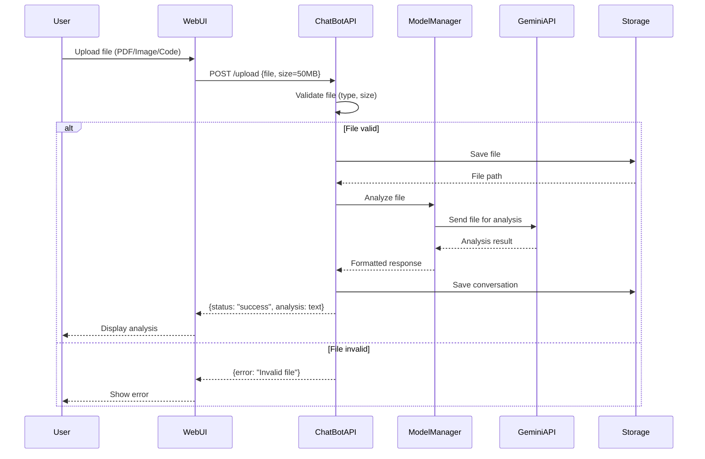
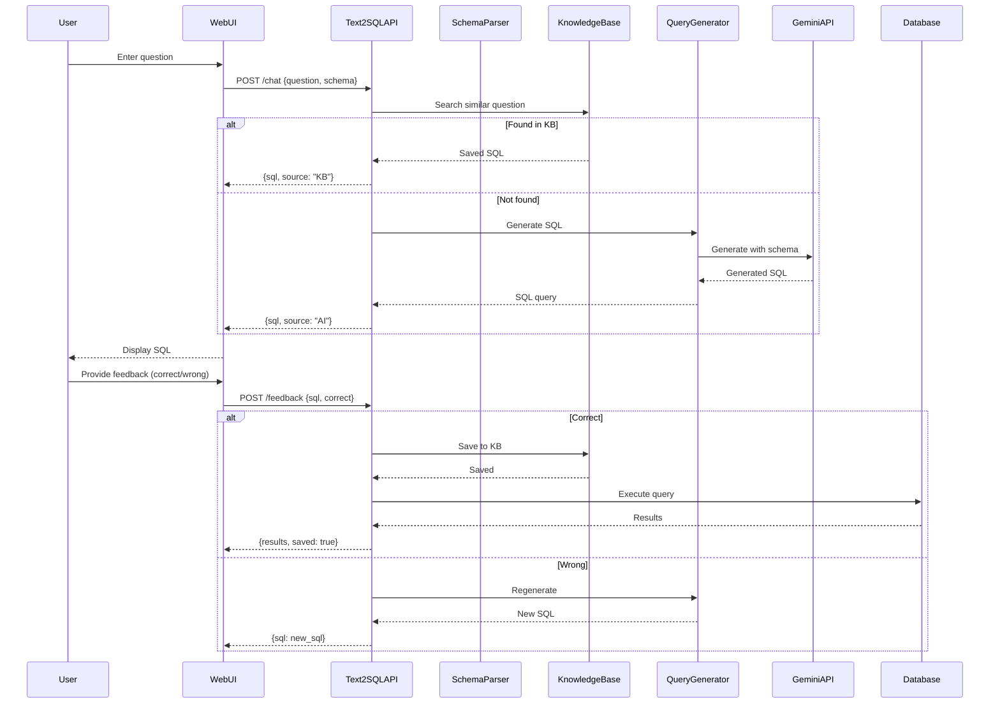
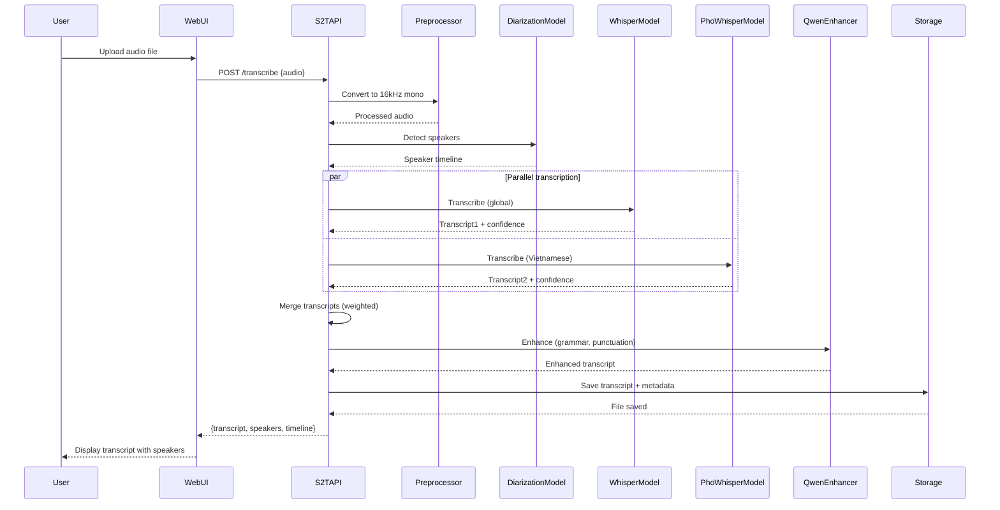

# 3️⃣ SEQUENCE DIAGRAMS

> **Biểu đồ tuần tự - 3 chức năng quan trọng nhất**  
> Mô tả luồng xử lý và tương tác giữa các components

---

## 📋 Mô tả

Sequence Diagrams thể hiện:
- **Actors:** User, WebUI, Services, APIs
- **Lifelines:** Timeline của từng component
- **Messages:** Request/Response giữa các components
- **Timing:** Thứ tự thực hiện các operations

---

## 🎯 3 Chức năng quan trọng nhất

1. **ChatBot - File Upload & Auto-Analysis** (Tính năng mới v2.0)
2. **Text2SQL - AI Learning System** (Core feature)
3. **Speech2Text - Dual-Model Transcription** (Độc đáo)

---

## 1️⃣ ChatBot - File Upload & Auto-Analysis

> **Tính năng mới nhất v2.0:** Upload file → AI tự động phân tích trong 2-3 giây

### Luồng xử lý:



### Chi tiết steps:

| Step | Component | Action | Time |
|:----:|:----------|:-------|:-----|
| 1 | User | Click "Upload" button | - |
| 2 | WebUI | FormData with file | - |
| 3 | ChatBotAPI | Validate (type, size ≤50MB) | <100ms |
| 4 | Storage | Save to `ChatBot/Storage/` | 100-500ms |
| 5 | ModelManager | Load Gemini model | 200-500ms |
| 6 | GeminiAPI | Analyze file content | 1-3s |
| 7 | Storage | Save conversation + metadata | 50-100ms |
| 8 | WebUI | Render analysis with markdown | 100ms |

**Total time:** 2-4 seconds

### Code reference:
- **API endpoint:** `ChatBot/app.py` → `/upload`
- **File handler:** `ChatBot/src/chatbot_engine.py` → `upload_file()`
- **Storage:** `ChatBot/Storage/conversations/`

---

## 2️⃣ Text2SQL - AI Learning System

> **Core feature:** AI học từ feedback và reuse queries đã đúng

### Luồng xử lý:



### Chi tiết steps:

#### Scenario A: Found in Knowledge Base (Fast path)
| Step | Component | Action | Time |
|:----:|:----------|:-------|:-----|
| 1 | User | Type question | - |
| 2 | Text2SQLAPI | Parse question | 10-50ms |
| 3 | KnowledgeBase | Semantic search (embeddings) | 50-200ms |
| 4 | WebUI | Display saved SQL | 50ms |

**Total time:** ~300ms ⚡ (10x faster!)

#### Scenario B: Not found (AI generation)
| Step | Component | Action | Time |
|:----:|:----------|:-------|:-----|
| 1-2 | Same as A | - | 60ms |
| 3 | KnowledgeBase | No match found | 50-200ms |
| 4 | QueryGenerator | Build prompt with schema | 50-100ms |
| 5 | GeminiAPI | Generate SQL | 2-5s |
| 6 | QueryGenerator | Validate & format SQL | 100-200ms |
| 7 | WebUI | Display AI-generated SQL | 50ms |

**Total time:** 2.5-5.5s

#### Feedback loop:
| Step | Component | Action | Time |
|:----:|:----------|:-------|:-----|
| 1 | User | Click "Correct" or "Wrong" | - |
| 2 | Text2SQLAPI | Update KB (if correct) | 50-100ms |
| 3 | Database | Execute query (if correct) | 100ms-5s |

### Code reference:
- **API endpoint:** `Text2SQL Services/app_simple.py` → `/chat`, `/feedback`
- **Knowledge Base:** `Text2SQL Services/data/knowledge_base/`
- **Query Generator:** `Text2SQL Services/src/query_generator.py`

---

## 3️⃣ Speech2Text - Dual-Model Transcription

> **Độc đáo:** Fusion của Whisper + PhoWhisper cho accuracy 98%+

### Luồng xử lý:



### Chi tiết steps:

| Step | Component | Action | Time | Progress |
|:----:|:----------|:-------|:-----|:---------|
| 1 | User | Upload audio (10 min) | - | 0% |
| 2 | Preprocessor | Resample to 16kHz mono | 5-10s | 10% |
| 3 | DiarizationModel | Speaker detection (pyannote) | 20-40s | 30% |
| 4a | WhisperModel | Transcribe (Large-v3) | 60-90s | 60% |
| 4b | PhoWhisperModel | Transcribe (Vietnamese) | 60-90s | 60% |
| 5 | S2TAPI | Merge with weights (0.6/0.4) | 2-5s | 80% |
| 6 | QwenEnhancer | Grammar + punctuation | 10-15s | 95% |
| 7 | Storage | Save to file | 1-2s | 100% |

**Total time:** ~150-250 seconds cho 10 phút audio (ratio 1:1.5)

### Dual-Model Fusion Logic:

```python
def merge_transcripts(whisper_result, phowhisper_result):
    merged = []
    for w, p in zip(whisper_result, phowhisper_result):
        if w['confidence'] > 0.8:
            # High confidence → use Whisper
            merged.append(w)
        elif p['confidence'] > 0.8:
            # PhoWhisper better at Vietnamese
            merged.append(p)
        else:
            # Weighted average
            merged.append({
                'text': blend_text(w['text'], p['text'], 0.6, 0.4),
                'confidence': (w['confidence'] * 0.6 + p['confidence'] * 0.4)
            })
    return merged
```

### Code reference:
- **API endpoint:** `Speech2Text Services/app.py` → `/transcribe`
- **Models:** 
  - `Speech2Text Services/models/whisper-large-v3`
  - `Speech2Text Services/models/phowhisper-base`
  - `Speech2Text Services/models/pyannote-diarization`
- **Output:** `Speech2Text Services/output/`

---

## 📊 So sánh Performance

| Feature | ChatBot Upload | Text2SQL Gen | Speech2Text |
|:--------|:--------------|:-------------|:------------|
| **Input** | 1 file (50MB) | 1 question | 10 min audio |
| **Processing Time** | 2-4s | 2.5-5.5s (new) | 150-250s |
| **Processing Time** | - | ~300ms (KB hit) | - |
| **Bottleneck** | Gemini API | Gemini API | Model inference |
| **Optimization** | File compression | Knowledge Base | GPU acceleration |
| **Accuracy** | 95%+ | 90-95% | 98%+ (fusion) |

---

## 🔄 Common Patterns

### 1. Validation Pattern
Tất cả 3 workflows đều validate input trước:
```
Input → Validate → Process → Save → Return
```

### 2. External API Pattern
2/3 workflows gọi external APIs:
```
Internal Processing → External API Call → Format Response
```

### 3. Storage Pattern
Tất cả đều lưu kết quả:
```
Process Complete → Save to Storage → Return Reference
```

---

## ⚡ Optimization Strategies

### ChatBot:
- ✅ **File compression** trước khi upload
- ✅ **Streaming response** cho real-time feedback
- 🚧 **Caching** cho repeated files

### Text2SQL:
- ✅ **Knowledge Base** cho instant results
- ✅ **Schema caching** giảm parsing time
- 🚧 **Query optimization** suggestions

### Speech2Text:
- ✅ **GPU acceleration** (CUDA)
- ✅ **VAD** (Voice Activity Detection) skip silence
- ✅ **Parallel processing** (Whisper + PhoWhisper)
- 🚧 **Streaming transcription** cho real-time

---

## 📈 Future Improvements

### ChatBot:
1. **WebSocket** cho streaming upload progress
2. **Multi-file batch** upload
3. **File versioning** system

### Text2SQL:
1. **Vector DB** (Pinecone/Weaviate) cho KB
2. **Query explanation** với AI
3. **Auto-fix** SQL errors

### Speech2Text:
1. **Real-time transcription** với WebRTC
2. **Multi-language** support (extend)
3. **Custom vocabulary** training

---

## 📝 Error Handling

### Common error scenarios:

#### ChatBot:
- File too large (>50MB) → Reject with message
- Invalid file type → Suggest supported formats
- Gemini API timeout → Retry 3 times

#### Text2SQL:
- Invalid schema → Parse error with suggestions
- SQL syntax error → Auto-fix with AI
- Database connection fail → Switch to mock mode

#### Speech2Text:
- Audio too short (<5s) → Skip diarization
- Low quality audio → Warning + best-effort
- Model loading fail → Fallback to CPU

---

<div align="center">

[⬅️ Previous: Class Diagram](02_class_diagram.md) | [Back to Index](README.md) | [➡️ Next: Database Design](04_database_design.md)

</div>
