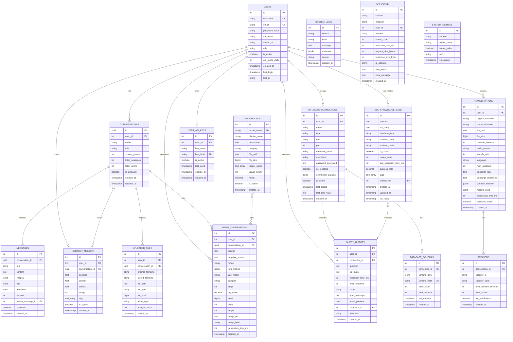

# 5️⃣ ENTITY RELATIONSHIP (ER) DIAGRAM

> **Biểu đồ thực thể - liên kết hệ thống AI-Assistant**  
> Mô tả quan hệ giữa các bảng trong database

---

## 📋 Mô tả

ER Diagram thể hiện:
- **Entities (Bảng):** 18 bảng chính
- **Relationships:** One-to-Many, Many-to-Many
- **Cardinality:** 1:1, 1:N, M:N
- **Attributes:** Primary Keys, Foreign Keys, Important fields

---

## 🎯 Biểu đồ tổng quan



---

## 📊 Chi tiết quan hệ

### 1. User-Centric Relationships (1:N)

| Parent Table | Child Table | Relationship | Description |
|:------------|:------------|:------------|:------------|
| **USERS** | CONVERSATIONS | 1:N | User có nhiều conversations |
| **USERS** | DATABASE_CONNECTIONS | 1:N | User lưu nhiều DB connections |
| **USERS** | TRANSCRIPTIONS | 1:N | User tạo nhiều transcriptions |
| **USERS** | IMAGE_GENERATIONS | 1:N | User generate nhiều images |
| **USERS** | USER_API_KEYS | 1:N | User có nhiều API keys |
| **USERS** | CHATBOT_MEMORY | 1:N | User có nhiều memories |
| **USERS** | QUERY_HISTORY | 1:N | User execute nhiều queries |

**Total:** 1 User → N Records (across 7 tables)

---

### 2. Conversation-Centric Relationships (1:N)

| Parent Table | Child Table | Relationship | Description |
|:------------|:------------|:------------|:------------|
| **CONVERSATIONS** | MESSAGES | 1:N | Conversation chứa nhiều messages |
| **CONVERSATIONS** | CHATBOT_MEMORY | 1:N (optional) | Conversation có thể saved to memory |
| **CONVERSATIONS** | UPLOADED_FILES | 1:N (optional) | Conversation có thể chứa files |
| **CONVERSATIONS** | IMAGE_GENERATIONS | 1:N (optional) | Images generated trong conversation |

**Total:** 1 Conversation → N Messages (required) + N Files/Images (optional)

---

### 3. Database Connection Relationships (1:N)

| Parent Table | Child Table | Relationship | Description |
|:------------|:------------|:------------|:------------|
| **DATABASE_CONNECTIONS** | QUERY_HISTORY | 1:N | Connection execute nhiều queries |
| **DATABASE_CONNECTIONS** | DATABASE_SCHEMAS | 1:1 or 1:N | Connection có schema (cached) |

**Total:** 1 Connection → N Queries + 1-N Schemas

---

### 4. Speech2Text Relationships (1:N)

| Parent Table | Child Table | Relationship | Description |
|:------------|:------------|:------------|:------------|
| **TRANSCRIPTIONS** | SPEAKERS | 1:N | Transcription có nhiều speakers |

**Total:** 1 Transcription → N Speakers (typically 1-5)

---

### 5. Knowledge Base Relationships (N:1)

| Child Table | Parent Table | Relationship | Description |
|:-----------|:------------|:------------|:------------|
| **QUERY_HISTORY** | SQL_KNOWLEDGE_BASE | N:1 (optional) | Query có thể match với KB entry |

**Total:** N Queries → 1 KB Entry (reuse)

---

### 6. LoRA Usage (M:N - through JSONB)

| Table A | Table B | Relationship | Description |
|:--------|:--------|:------------|:------------|
| **IMAGE_GENERATIONS** | LORA_MODELS | M:N | Image có thể dùng nhiều LoRAs |

**Implementation:** JSONB array trong `IMAGE_GENERATIONS.lora_models`

```json
{
  "lora_models": [
    {"name": "anime_style_v1", "weight": 0.8},
    {"name": "detailed_face", "weight": 0.6}
  ]
}
```

---

## 🔑 Key Constraints

### Primary Keys (PK):
- **SERIAL:** Auto-increment integer (most tables)
- **UUID:** Globally unique (CONVERSATIONS)
- **Composite:** None (using surrogate keys for simplicity)

### Foreign Keys (FK):
- **ON DELETE CASCADE:** Child records deleted when parent deleted
  - Examples: `MESSAGES`, `DOCUMENT_ANALYSIS`, `SPEAKERS`
- **ON DELETE SET NULL:** Keep child, but clear FK
  - Examples: `CONVERSATIONS.user_id`, `QUERY_HISTORY.connection_id`

### Unique Constraints (UK):
- `USERS.username`
- `USERS.email`
- `USER_API_KEYS.key_hash`
- `SQL_KNOWLEDGE_BASE.(question, database_type)` - Composite
- `DATABASE_SCHEMAS.schema_hash`
- `LORA_MODELS.model_name`

---

## 📈 Cardinality Summary

| Relationship Type | Count | Examples |
|:-----------------|:------|:---------|
| **1:N (Mandatory)** | 10 | User→Conversations, Conversation→Messages |
| **1:N (Optional)** | 7 | Conversation→Files, Query→KB_Match |
| **1:1** | 1 | Connection→Schema (cached) |
| **M:N** | 1 | Image_Gen↔LoRA_Models (via JSONB) |
| **Self-referencing** | 1 | MESSAGES.parent_message_id |

**Total Relationships:** 20

---

## 🔄 Common Query Patterns

### 1. Get user's recent conversations with messages:
```sql
SELECT c.*, array_agg(m.* ORDER BY m.created_at) as messages
FROM conversations c
LEFT JOIN messages m ON c.id = m.conversation_id
WHERE c.user_id = ? AND c.is_archived = false
GROUP BY c.id
ORDER BY c.updated_at DESC
LIMIT 10;
```

### 2. Search Knowledge Base for similar question:
```sql
SELECT * FROM sql_knowledge_base
WHERE database_type = 'clickhouse'
  AND schema_hash = ?
  AND to_tsvector('english', question) @@ to_tsquery('monthly sales')
ORDER BY usage_count DESC, success_rate DESC
LIMIT 5;
```

### 3. Get transcription with speakers:
```sql
SELECT t.*, json_agg(s.*) as speakers
FROM transcriptions t
LEFT JOIN speakers s ON t.id = s.transcription_id
WHERE t.id = ?
GROUP BY t.id;
```

### 4. Get popular LoRA models:
```sql
SELECT 
    lm.*,
    COUNT(ig.id) as usage_in_images
FROM lora_models lm
LEFT JOIN image_generations ig ON ig.lora_models::text LIKE '%' || lm.model_name || '%'
WHERE lm.is_active = true
GROUP BY lm.id
ORDER BY usage_in_images DESC, lm.rating DESC
LIMIT 20;
```

---

## 📊 Data Growth Estimates

### Assumptions:
- **Users:** 1,000 active users
- **Usage:** Daily active for 1 year
- **ChatBot:** 10 conversations/user/month, 20 messages/conversation
- **Text2SQL:** 50 queries/user/month
- **Speech2Text:** 2 transcriptions/user/month
- **Images:** 10 images/user/month

### Growth Projection:

| Table | Records/Year | Size/Year | Growth Rate |
|:------|:------------|:----------|:------------|
| **USERS** | 1,000 | 1 MB | Slow |
| **CONVERSATIONS** | 120K | 100 MB | Moderate |
| **MESSAGES** | 2.4M | 1.5 GB | Fast |
| **CHATBOT_MEMORY** | 50K | 50 MB | Slow |
| **SQL_KNOWLEDGE_BASE** | 10K | 20 MB | Slow (reuse) |
| **QUERY_HISTORY** | 600K | 300 MB | Fast |
| **TRANSCRIPTIONS** | 24K | 2 GB | Moderate |
| **IMAGE_GENERATIONS** | 120K | 4 GB | Fast |
| **API_USAGE** | 10M | 8 GB | Very Fast |
| **SYSTEM_LOGS** | 50M | 10 GB | Very Fast |

**Total Estimated:** ~25 GB/year (excluding file storage)

### File Storage (separate from DB):
- **Uploaded files:** ~200 GB/year
- **Images:** ~300 GB/year
- **Transcription audio:** ~200 GB/year

**Grand Total:** ~925 GB/year (DB + Files)

---

## 🚀 Optimization Strategies

### 1. Partitioning (for large tables):
```sql
-- Partition API_USAGE by month
CREATE TABLE api_usage (
    -- columns...
) PARTITION BY RANGE (created_at);

CREATE TABLE api_usage_2025_11 PARTITION OF api_usage
    FOR VALUES FROM ('2025-11-01') TO ('2025-12-01');
```

### 2. Archiving old data:
- Move conversations older than 1 year to `conversations_archive`
- Move logs older than 3 months to cold storage

### 3. Indexing strategy:
- **B-Tree indexes:** For exact matches, ranges (timestamps, IDs)
- **GIN indexes:** For full-text search, JSONB, arrays
- **Hash indexes:** For equality checks (rare)

### 4. Materialized views:
```sql
-- User stats summary
CREATE MATERIALIZED VIEW user_stats AS
SELECT 
    u.id,
    COUNT(DISTINCT c.id) as total_conversations,
    COUNT(DISTINCT qh.id) as total_queries,
    COUNT(DISTINCT pd.id) as total_documents
FROM users u
LEFT JOIN conversations c ON u.id = c.user_id
LEFT JOIN query_history qh ON u.id = qh.user_id
LEFT JOIN processed_documents pd ON u.id = pd.user_id
GROUP BY u.id;

-- Refresh daily
REFRESH MATERIALIZED VIEW user_stats;
```

---

## 📝 Normalization Analysis

### Current Normalization: **3NF (Third Normal Form)**

**Compliance:**
✅ **1NF:** All attributes atomic (no repeating groups)  
✅ **2NF:** No partial dependencies (all FKs depend on full PK)  
✅ **3NF:** No transitive dependencies  

**JSONB fields (denormalized):**
- `MESSAGES.images` - Array of image objects
- `MESSAGES.metadata` - Flexible metadata
- `IMAGE_GENERATIONS.lora_models` - Array of LoRA configs
- `PROCESSED_DOCUMENTS.extracted_info` - Flexible extracted data

**Reason:** PostgreSQL's JSONB provides fast queries while maintaining flexibility for semi-structured data.

---

## 🔐 Security Considerations

### 1. Sensitive Data Encryption:
- `DATABASE_CONNECTIONS.password_encrypted` - AES-256 encryption
- `USER_API_KEYS.key_hash` - bcrypt hashing

### 2. Row-Level Security (RLS):
```sql
-- Enable RLS on conversations
ALTER TABLE conversations ENABLE ROW LEVEL SECURITY;

-- Policy: Users can only see their own conversations
CREATE POLICY user_conversations_policy ON conversations
    FOR SELECT
    USING (user_id = current_setting('app.current_user_id')::int);
```

### 3. Audit Trail:
- All tables have `created_at` timestamp
- Important tables have `updated_at` trigger
- `SYSTEM_LOGS` tracks all actions

---

<div align="center">

[⬅️ Previous: Database Design](04_database_design.md) | [Back to Index](README.md)

---

**🎉 ALL DIAGRAMS COMPLETE!**

Ready to migrate to production database 🚀

</div>
