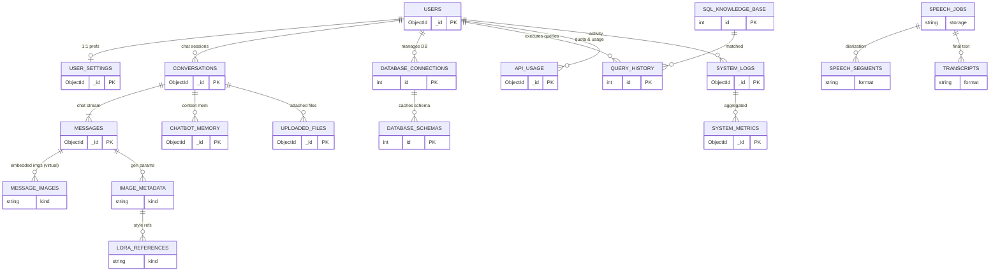
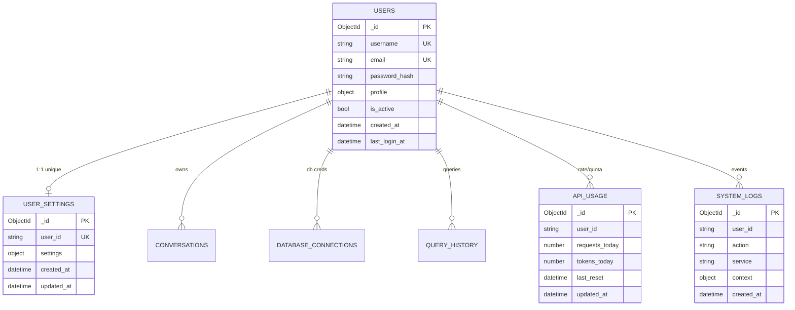
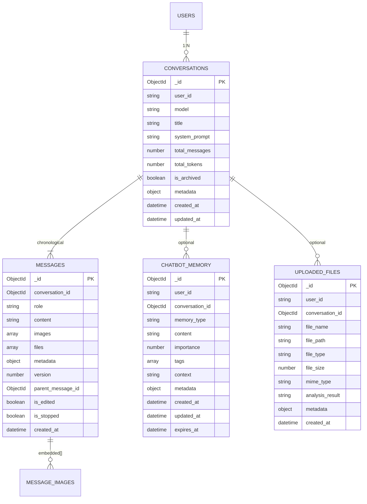
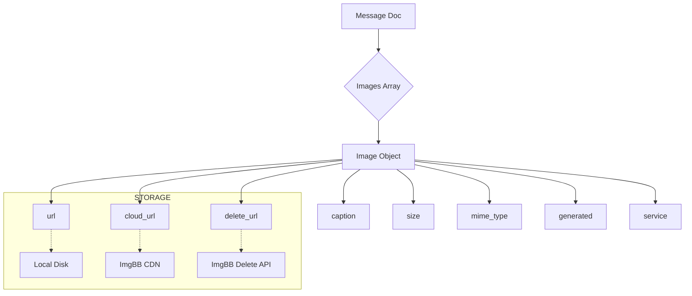
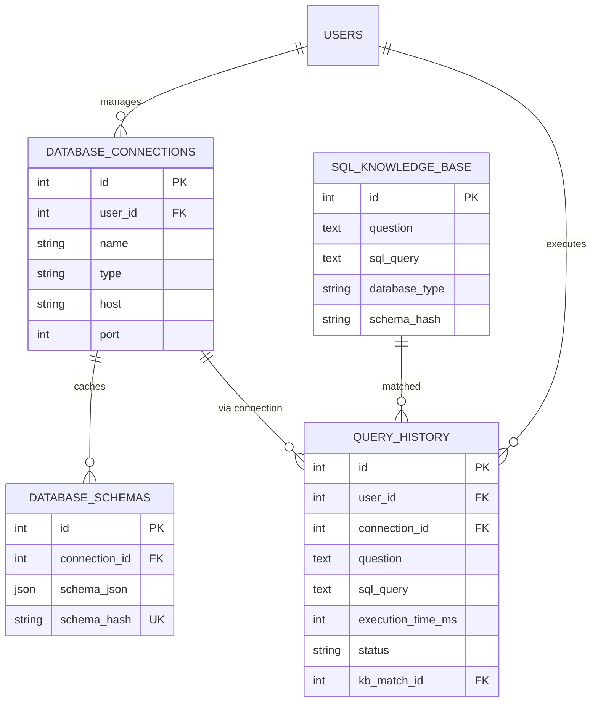
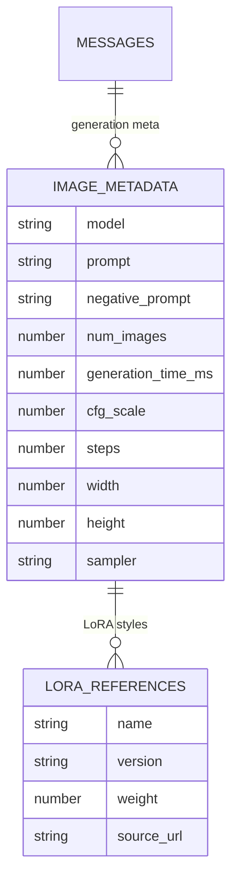
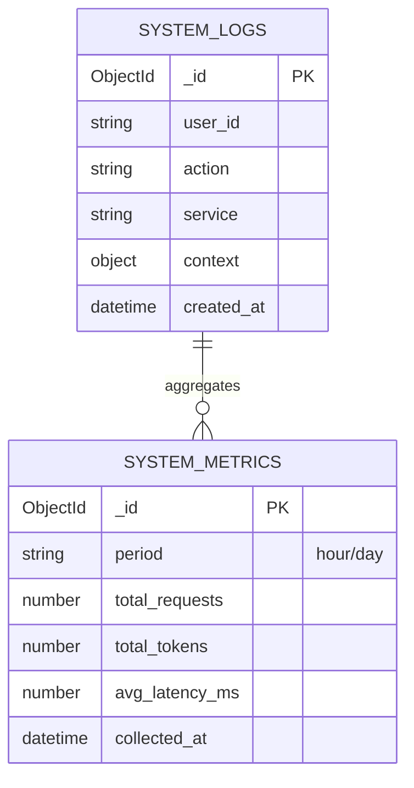
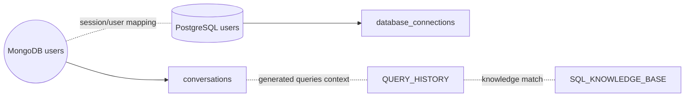

# 5️⃣ ENTITY RELATIONSHIP (ER) DIAGRAM – FULL SYSTEM (MongoDB + PostgreSQL + Services)

> "Toàn cảnh cấu trúc dữ liệu & quan hệ liên dịch vụ"  
> Accurate production-aligned unified ER view (MongoDB + PostgreSQL + External Pipelines) – November 2025

---

## 🧭 HIERARCHY OVERVIEW

Level 0 (Root): Unified cross-service entities & data domains  
Level 1: Core domains (User Identity, ChatBot Context, Text2SQL Knowledge, Media Generation & Storage, Speech2Text Pipeline, Observability & Ops)  
Level 2: Collection/Table details per domain  
Level 3: Metadata & relationship patterns (embeddings, images, memory, history)

---

## 🌐 LEVEL 0 — FULL SYSTEM UNIFIED ER



> Legend: MongoDB (ObjectId) • PostgreSQL (int PK) • Virtual (derived/embedded) • Filesystem/External (file+json)

---

## 🟩 LEVEL 1A — USER & IDENTITY DOMAIN



---

## 💬 LEVEL 1B — CHATBOT (MongoDB)



---

## 🧠 LEVEL 2A — MESSAGE IMAGES (Embedded & Storage Flow)



---

## 🗃️ LEVEL 1C — TEXT2SQL (PostgreSQL)



---

## 🎙️ LEVEL 1D — SPEECH2TEXT PIPELINE (Logical Model)

```mermaid
graph LR
    AUDIO_RAW[Audio File WAV] --> JOB[Speech Job JSON]
    JOB --> DIAR[Diarization Segments]
    DIAR --> SEG1[Segment start|end|speaker|text]
    JOB --> TRANS[Transcript TXT]
    TRANS --> REFUSE[Linked to Conversation]
    REFUSE -. optional mapping .- CONVERSATIONS

    style AUDIO_RAW fill:#37474F,stroke:#263238,color:#fff
    style JOB fill:#546E7A,stroke:#37474F,color:#fff
    style DIAR fill:#78909C,stroke:#455A64,color:#fff
    style SEG1 fill:#90A4AE,stroke:#546E7A
    style TRANS fill:#607D8B,stroke:#37474F,color:#fff
    style REFUSE fill:#90CAF9,stroke:#1976D2,color:#000
```

---

## 🖼️ LEVEL 1E — IMAGE GENERATION (Stable Diffusion + Metadata)



---

## 📊 LEVEL 2B — OBSERVABILITY & METRICS



---

## 🔗 LEVEL 2C — CROSS-SERVICE IDENTITY MAPPING



---

## 🧩 RELATIONSHIP PATTERNS SUMMARY

| Pattern | Count | Example |
|---------|-------|---------|
| 1:1 | 1 | users → user_settings |
| 1:N (mandatory) | 1 | conversations → messages |
| 1:N (optional) | 6 | conversations → memory/files, user → conversations, user → query_history, user → database_connections, logs → metrics |
| M:N (implicit via arrays) | 2 | messages ↔ images, messages ↔ lora_refs |
| Virtual / Embedded | 4 | images[], metadata, lora_references, profile/settings |
| Cross-DB Mapping | 1 | Mongo users ↔ SQL users |

---

## 🚀 INDEX & PERFORMANCE SNAPSHOT

| Area | Key Index Strategy | Notes |
|------|--------------------|-------|
| Mongo Conversations | user_id, created_at desc, compound(user_id+created_at) | Recent session dashboard |
| Mongo Messages | conversation_id, created_at, images.cloud_url (sparse) | Image lookups / streaming |
| Mongo Memory | conversation_id TTL optional | Expirable context |
| SQL Query History | user_id, connection_id, status | Reporting & audit |
| SQL Knowledge Base | schema_hash, database_type | Semantic retrieval base |
| Logs | service, created_at | Filter by service/time |

Optimization: prune old messages, archive conversations, externalize large blobs (images) to ImgBB.

---

## 🧪 FUTURE EXTENSIONS

| Feature | Data Impact | Suggested Model |
|---------|-------------|-----------------|
| Agent Tool Invocations | Medium | tool_calls collection (Mongo) |
| Vector Embeddings | High | embeddings collection + external vector DB (e.g., Chroma) |
| Billing & Subscription | Medium | billing_plans (SQL) + usage_rollups (Mongo) |
| Real-time Events | Medium | websocket_events (ephemeral) |

---

## 🔚 NAVIGATION

[⬅️ ER MongoDB Only](05_er_diagram_mongodb.md) | [Database Design](04_database_design.md) | [Component Diagram](06_component_diagram.md) | [🏠 Index](README.md)

---

**✅ FULL SYSTEM ER DIAGRAM COMPLETE**  
Canonical high-level + modular branch diagrams for Word-friendly export.
