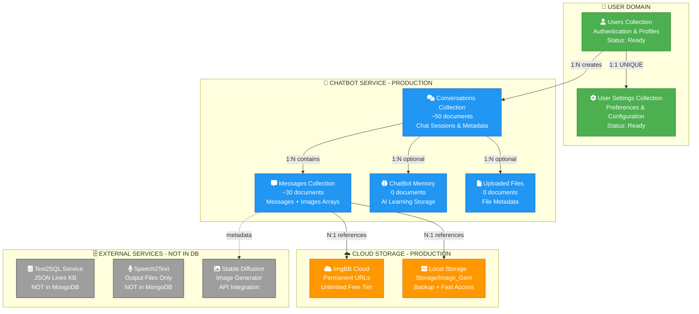
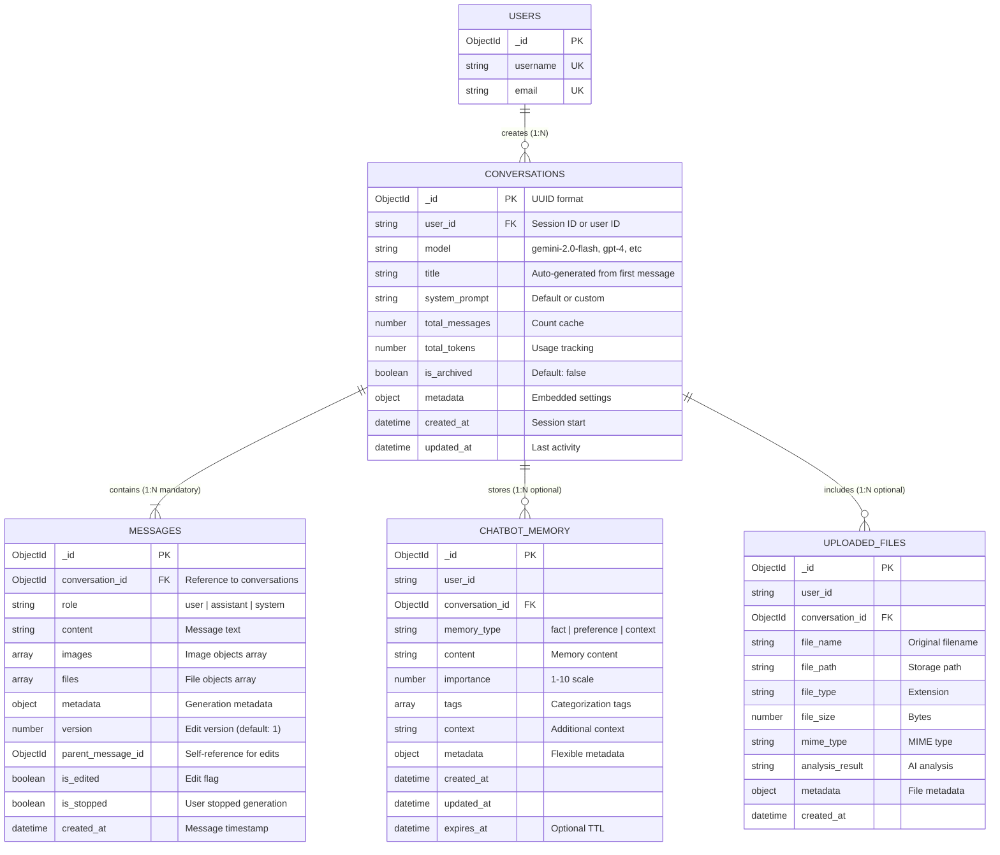
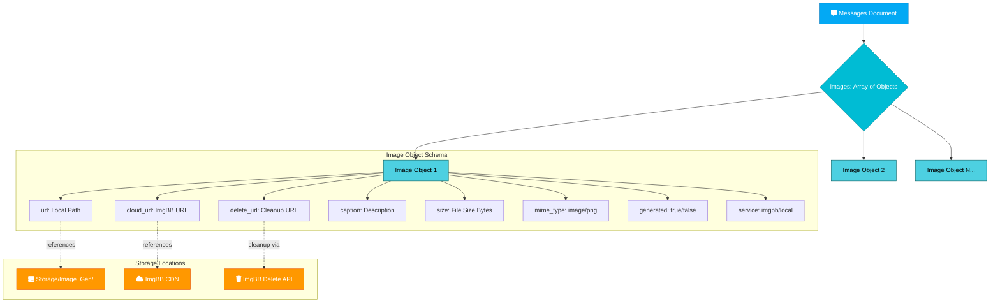
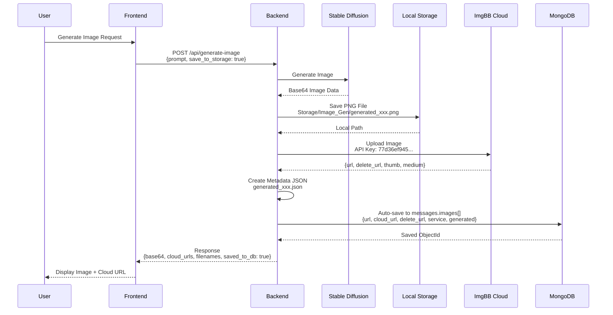
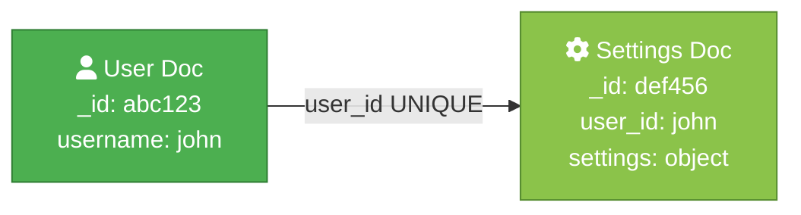
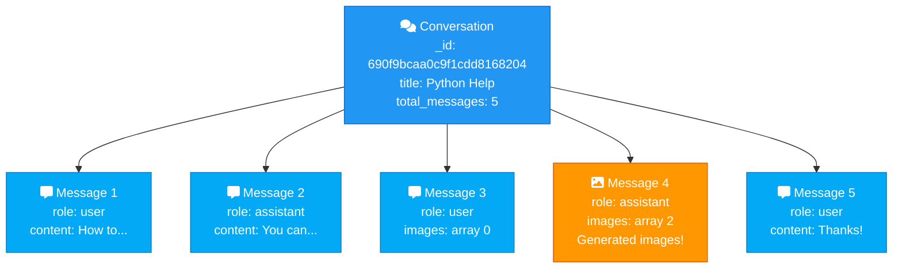
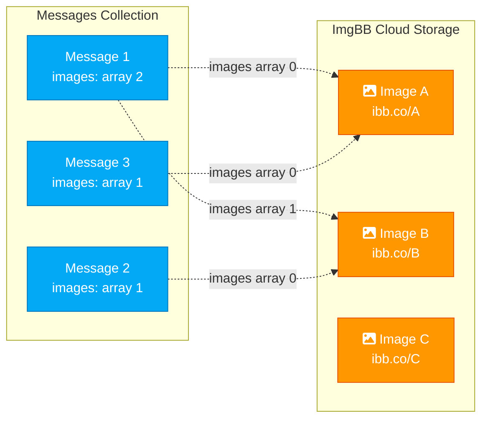
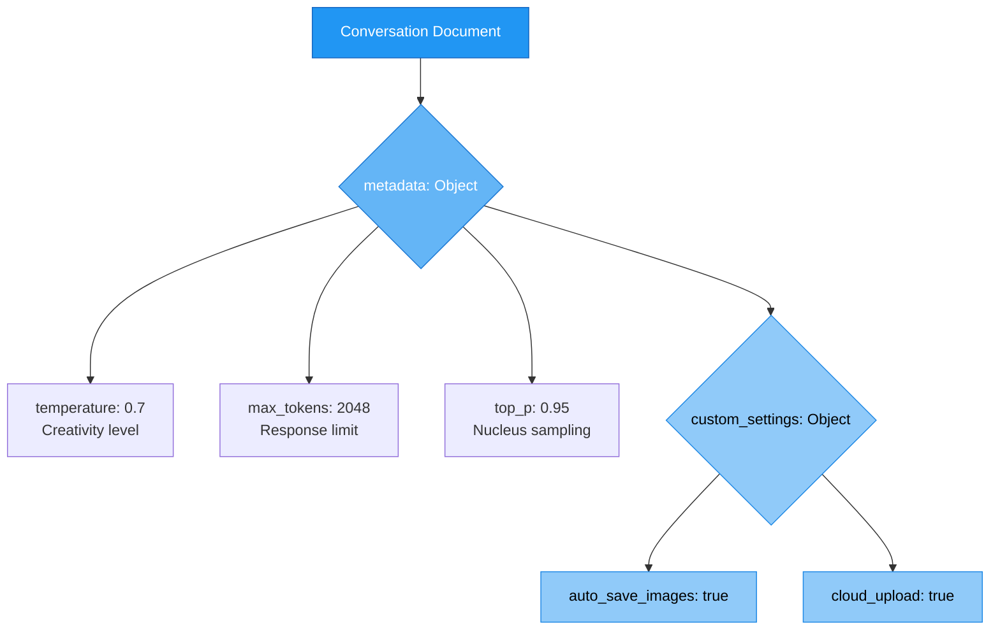
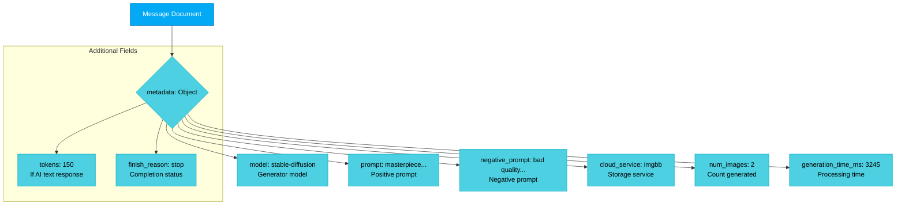

# 5️⃣ ENTITY RELATIONSHIP (ER) DIAGRAM - MongoDB Atlas

> **Biểu đồ thực thể - liên kết hệ thống AI-Assistant**  
> MongoDB Atlas Collections & Document Relationships  
> **Production Implementation - November 2025**

---

## 📋 OVERVIEW

**Current Database:** MongoDB Atlas M0 Free Tier (512MB)  
**Collections:** 6 production collections  
**Indexes:** 26 optimized indexes  
**Storage:** Hybrid (Local + ImgBB Cloud + MongoDB)

> **Note:** Diagram sử dụng ER notation để dễ hiểu, nhưng implementation thực tế là NoSQL document-based với embedded documents và references.

---

## 🌳 ROOT LEVEL - System Architecture



### Root Level Statistics:

| Domain | Collections | Documents | Status | Purpose |
|--------|-------------|-----------|--------|---------|
| **User Domain** | 2 | 0 | ✅ Ready | Future multi-user system |
| **ChatBot Service** | 4 | ~80 | ✅ Active | Production chat service |
| **External Services** | 0 | N/A | 🔄 Integration | JSON files, APIs |
| **Cloud Storage** | N/A | N/A | ✅ Active | ImgBB cloud hosting |

---

## 📊 LEVEL 1.1 - User Domain

```mermaid
erDiagram
    USERS ||--o| USER_SETTINGS : "has one (1:1)"
    
    USERS {
        ObjectId _id PK "MongoDB auto-generated"
        string username UK "Unique constraint"
        string email UK "Unique constraint"
        string password_hash "bcrypt hashed"
        object profile "Nested document"
        boolean is_active "Default: true"
        datetime created_at "Auto timestamp"
        datetime last_login_at "Updated on login"
    }
    
    USER_SETTINGS {
    ## 🧩Database Diagram (SQL) + Data Structure (NoSQL)

    > **Lưu ý:** Các diagram sau đây mô tả đúng kiến trúc và dữ liệu thực tế của dự án AI-Assistant, không dùng mẫu báo cáo. Dữ liệu được lấy từ production MongoDB Atlas (ChatBot) và PostgreSQL (Text2SQL).

    ### Combined Overview — Project Database Structure

    ```mermaid
    graph TB
      %% Text2SQL Service (PostgreSQL)
      subgraph "Text2SQL (PostgreSQL)"
        T2SQL_USERS[(users)]
        T2SQL_KB[(kb_documents)]
        T2SQL_SCHEMAS[(db_schemas)]
        T2SQL_QUERIES[(queries)]
        T2SQL_LOGS[(query_logs)]
        T2SQL_USERS -->|1:N| T2SQL_QUERIES
        T2SQL_KB -->|N:1| T2SQL_QUERIES
        T2SQL_SCHEMAS -->|N:1| T2SQL_QUERIES
        T2SQL_QUERIES -->|1:N| T2SQL_LOGS
      end

      %% ChatBot Service (MongoDB Atlas)
      subgraph "ChatBot (MongoDB Atlas)"
        CB_USERS((users))
        CB_SETTINGS((user_settings))
        CB_CONV((conversations))
        CB_MSG((messages))
        CB_FILES((uploaded_files))
        CB_MEMORY((chatbot_memory))
        CB_USERS -->|1:1| CB_SETTINGS
        CB_USERS -->|1:N| CB_CONV
        CB_CONV -->|1:N| CB_MSG
        CB_CONV -->|1:N| CB_FILES
        CB_CONV -->|1:N| CB_MEMORY
      end

      %% Cross-service mapping (if needed)
      T2SQL_USERS -. session/user mapping .- CB_USERS

      classDef sql fill:#8BC34A,stroke:#558B2F,color:#fff
      classDef nosql fill:#03A9F4,stroke:#0277BD,color:#fff
      class T2SQL_USERS,T2SQL_KB,T2SQL_SCHEMAS,T2SQL_QUERIES,T2SQL_LOGS sql
      class CB_USERS,CB_SETTINGS,CB_CONV,CB_MSG,CB_FILES,CB_MEMORY nosql
    ```

    ---

    ## 📸 Biểu Đồ Chi Tiết (Chia Nhỏ Để Chụp)

    ### A. Text2SQL ER Diagram (PostgreSQL — Production)
    ```mermaid
    erDiagram
      USERS ||--o{ QUERIES : "executes"
      QUERIES ||--o{ QUERY_LOGS : "has"
      KB_DOCUMENTS ||--o{ QUERIES : "references"
      DB_SCHEMAS ||--o{ QUERIES : "targets"

      USERS {
        int id PK
        string email UK
        string full_name
        datetime created_at
      }
      KB_DOCUMENTS {
        int id PK
        string title
        text content
        json embeddings
      }
      DB_SCHEMAS {
        int id PK
        string db_name
        json schema_json
      }
      QUERIES {
        int id PK
        int user_id FK
        int kb_doc_id FK
        int schema_id FK
        text question
        text sql_generated
        datetime created_at
      }
      QUERY_LOGS {
        int id PK
        int query_id FK
        float latency_ms
        boolean success
        text error_message
        datetime created_at
      }
    ```

    ### B. ChatBot Data Structure (MongoDB Atlas — Production)
    ```mermaid
    graph TB
      MDB[[MongoDB Atlas]]
      MDB --> USERS[users]
      USERS --> username[username]
      USERS --> email[email]
      USERS --> profile[profile]
      MDB --> USER_SETTINGS[user_settings]
      USER_SETTINGS --> default_model[default_model]
      USER_SETTINGS --> temperature[temperature]
      MDB --> CONVERSATIONS[conversations]
      CONVERSATIONS --> title[title]
      CONVERSATIONS --> model[model]
      CONVERSATIONS --> metadata[metadata]
      MDB --> MESSAGES[messages]
      MESSAGES --> role[role]
      MESSAGES --> content[content]
      MESSAGES --> images[images[]]
      MDB --> UPLOADED_FILES[uploaded_files]
      UPLOADED_FILES --> file_name[file_name]
      UPLOADED_FILES --> cloud_url[cloud_url]
      MDB --> CHATBOT_MEMORY[chatbot_memory]
      CHATBOT_MEMORY --> memory_type[memory_type]
      CHATBOT_MEMORY --> importance[importance]
    ```

    ---
        ObjectId _id PK "MongoDB auto-generated"
        string user_id UK "Reference to users (UNIQUE)"
        object settings "Nested document"
        datetime created_at "Auto timestamp"
        datetime updated_at "Modified timestamp"
    }
```

### User Profile Schema (Embedded):
```javascript
{
  display_name: "John Doe",
  avatar_url: "/static/avatars/user123.png",
  bio: "AI enthusiast and developer"
}
```

### User Settings Schema (Embedded):
```javascript
{
  default_model: "gemini-2.0-flash-thinking-exp",
  temperature: 0.7,
  max_tokens: 2048,
  theme: "dark",
  language: "vi",
  custom: {
    auto_save_images: true,
    cloud_upload: true
  }
}
```

**Indexes:**
- `users`: _id_, username_idx (UNIQUE), email_idx (UNIQUE), active_idx
- `user_settings`: _id_, user_id_idx (UNIQUE)

**Status:** ✅ Ready for future multi-user implementation (currently using anonymous sessions)

---

## 💬 LEVEL 1.2 - ChatBot Service (Production Active)



### Collection Statistics:

| Collection | Documents | Avg Size | Indexes | Growth Rate |
|-----------|-----------|----------|---------|-------------|
| **conversations** | ~50 | 500 bytes | 7 | Moderate |
| **messages** | ~30 | 1-2 KB | 5 | Fast |
| **chatbot_memory** | 0 | - | 4 | Slow |
| **uploaded_files** | 0 | - | 4 | Slow |

### Indexes Detail:

**conversations (7 indexes):**
1. `_id_` - Default primary key
2. `user_id_1` - User lookup
3. `created_at_-1` - Recent first
4. `is_archived_1` - Filter archived
5. `user_created_idx` - Compound: {user_id: 1, created_at: -1}
6. `user_archived_idx` - Compound: {user_id: 1, is_archived: 1}
7. `updated_idx` - {updated_at: -1}

**messages (5 indexes):**
1. `_id_` - Default primary key
2. `conversation_id_1` - Conversation lookup
3. `created_at_-1` - Chronological order
4. `role_1` - Filter by role
5. `conv_created_idx` - Compound: {conversation_id: 1, created_at: -1}

---

## 🖼️ LEVEL 1.3 - Message Images Structure (Embedded Array)



### Image Object Complete Schema:

```javascript
{
  // Local Storage
  url: "/static/Storage/Image_Gen/generated_20251110_143052_0.png",
  
  // Cloud Storage (ImgBB)
  cloud_url: "https://i.ibb.co/xyzAbc123/generated_20251110_143052_0.png",
  delete_url: "https://ibb.co/delete/abc123def456ghi789jkl012mno345",
  
  // Metadata
  caption: "Generated: masterpiece, best quality, anime girl",
  size: 945680,                    // Bytes (945 KB)
  mime_type: "image/png",
  generated: true,                 // AI-generated vs user-uploaded
  service: "imgbb"                 // Storage service: "imgbb" | "local"
}
```

### Image Storage Workflow:



**Key Features:**
- ✅ **Dual Storage:** Local backup + Cloud permanent URL
- ✅ **Auto-save:** Triggered by `save_to_storage: true` flag
- ✅ **Delete URLs:** ImgBB provides cleanup links
- ✅ **Metadata JSON:** Complete generation parameters saved
- ✅ **MongoDB Reference:** All URLs stored in messages.images[] array

---

## 🔗 LEVEL 1.4 - Relationship Patterns

### Pattern 1: One-to-One (User → Settings)



**Query Example:**
```javascript
// Get user with settings
db.users.aggregate([
  {$match: {username: "john"}},
  {$lookup: {
    from: "user_settings",
    localField: "username",
    foreignField: "user_id",
    as: "settings"
  }},
  {$unwind: "$settings"}
])
```

---

### Pattern 2: One-to-Many (Conversation → Messages)



**Query Example:**
```javascript
// Get conversation with all messages (sorted)
db.conversations.aggregate([
  {$match: {_id: ObjectId("690f9bcaa0c9f1cdd8168204")}},
  {$lookup: {
    from: "messages",
    localField: "_id",
    foreignField: "conversation_id",
    as: "messages"
  }},
  {$addFields: {
    messages: {
      $sortArray: {
        input: "$messages",
        sortBy: {created_at: 1}
      }
    }
  }}
])
```

---

### Pattern 3: Many-to-Many via Arrays (Messages ↔ Images)



**Implementation:**
```javascript
// Message 1: 2 images embedded
{
  _id: ObjectId("msg1"),
  conversation_id: ObjectId("conv123"),
  role: "assistant",
  content: "Generated 2 variations",
  images: [
    {url: "/static/..._0.png", cloud_url: "https://i.ibb.co/A"},
    {url: "/static/..._1.png", cloud_url: "https://i.ibb.co/B"}
  ]
}

// Message 2: 1 image (reusing same ImgBB URL)
{
  _id: ObjectId("msg2"),
  conversation_id: ObjectId("conv456"),
  role: "assistant",
  content: "Used previous generation as reference",
  images: [
    {url: "/static/..._ref.png", cloud_url: "https://i.ibb.co/B"}
  ]
}

// Query: Find all messages using Image B
db.messages.find({"images.cloud_url": "https://i.ibb.co/B"})
```

---

## 📊 LEVEL 1.5 - Metadata Structures (Embedded Objects)

### Conversation Metadata:



**Example:**
```javascript
{
  _id: ObjectId("..."),
  user_id: "anonymous_session_abc123",
  model: "gemini-2.0-flash-thinking-exp",
  title: "Image Generation Session",
  metadata: {
    temperature: 0.7,
    max_tokens: 2048,
    top_p: 0.95,
    custom_settings: {
      auto_save_images: true,
      cloud_upload: true,
      image_service: "imgbb"
    }
  }
}
```

---

### Message Metadata (Image Generation):



**Example (Text2Img):**
```javascript
{
  _id: ObjectId("..."),
  conversation_id: ObjectId("..."),
  role: "assistant",
  content: "✅ Generated image with prompt: anime girl",
  images: [...],
  metadata: {
    model: "stable-diffusion",
    prompt: "masterpiece, best quality, beautiful anime girl, detailed face",
    negative_prompt: "bad quality, blurry, distorted, ugly, worst quality",
    cloud_service: "imgbb",
    num_images: 1,
    generation_time_ms: 3245
  }
}
```

**Example (Img2Img):**
```javascript
{
  metadata: {
    model: "stable-diffusion-img2img",
    prompt: "add beautiful flowers background, vibrant colors",
    negative_prompt: "blurry, low quality",
    denoising_strength: 0.8,
    cloud_service: "imgbb",
    num_images: 1,
    generation_time_ms: 4120
  }
}
```

---

## 🔍 COMMON QUERY PATTERNS

### Query 1: Get User's Recent Conversations with Message Count

```javascript
db.conversations.aggregate([
  // Match user's active conversations
  {$match: {
    user_id: "anonymous_session_abc123",
    is_archived: false
  }},
  
  // Lookup message count
  {$lookup: {
    from: "messages",
    localField: "_id",
    foreignField: "conversation_id",
    as: "messages"
  }},
  
  // Calculate stats
  {$addFields: {
    message_count: {$size: "$messages"},
    last_message_at: {$max: "$messages.created_at"}
  }},
  
  // Remove full messages array (only keep count)
  {$project: {
    messages: 0
  }},
  
  // Sort by recent activity
  {$sort: {updated_at: -1}},
  
  // Limit results
  {$limit: 20}
])
```

---

### Query 2: Find All Images with Cloud URLs

```javascript
db.messages.aggregate([
  // Match messages with images
  {$match: {
    "images.0": {$exists: true},
    "images.service": "imgbb"
  }},
  
  // Unwind images array
  {$unwind: "$images"},
  
  // Filter ImgBB images only
  {$match: {
    "images.service": "imgbb"
  }},
  
  // Lookup conversation info
  {$lookup: {
    from: "conversations",
    localField: "conversation_id",
    foreignField: "_id",
    as: "conversation"
  }},
  
  // Unwind conversation
  {$unwind: "$conversation"},
  
  // Project relevant fields
  {$project: {
    conversation_id: 1,
    conversation_title: "$conversation.title",
    created_at: 1,
    prompt: "$metadata.prompt",
    cloud_url: "$images.cloud_url",
    local_url: "$images.url",
    caption: "$images.caption",
    file_size: "$images.size"
  }},
  
  // Sort by recent
  {$sort: {created_at: -1}},
  
  // Limit
  {$limit: 50}
])
```

---

### Query 3: Search Images by Prompt Keywords

```javascript
db.messages.find({
  // Text search in prompt
  "metadata.prompt": {
    $regex: "anime girl|beautiful|masterpiece",
    $options: "i"  // Case-insensitive
  },
  
  // Must have images
  "images.0": {$exists: true}
  
}).sort({created_at: -1})
```

---

### Query 4: Get Conversation with Full Chat History

```javascript
db.conversations.aggregate([
  // Match specific conversation
  {$match: {
    _id: ObjectId("690f9bcaa0c9f1cdd8168204")
  }},
  
  // Lookup all messages
  {$lookup: {
    from: "messages",
    let: {conv_id: "$_id"},
    pipeline: [
      {$match: {
        $expr: {$eq: ["$conversation_id", "$$conv_id"]}
      }},
      {$sort: {created_at: 1}}
    ],
    as: "messages"
  }},
  
  // Calculate stats
  {$addFields: {
    total_messages: {$size: "$messages"},
    total_images: {
      $sum: {
        $map: {
          input: "$messages",
          as: "msg",
          in: {$size: {$ifNull: ["$$msg.images", []]}}
        }
      }
    },
    has_images: {
      $gt: [
        {$sum: {
          $map: {
            input: "$messages",
            as: "msg",
            in: {$size: {$ifNull: ["$$msg.images", []]}}
          }
        }},
        0
      ]
    }
  }}
])
```

**Result:**
```javascript
{
  _id: ObjectId("690f9bcaa0c9f1cdd8168204"),
  user_id: "anonymous_session_abc123",
  model: "gemini-2.0-flash-thinking-exp",
  title: "Image Generation Session",
  total_messages: 5,
  total_images: 3,
  has_images: true,
  messages: [
    {role: "user", content: "Generate anime girl", images: []},
    {role: "assistant", content: "Generated!", images: [{...}, {...}]},
    {role: "user", content: "Make it img2img", images: []},
    {role: "assistant", content: "Done!", images: [{...}]},
    {role: "user", content: "Perfect!", images: []}
  ]
}
```

---

## 📈 CARDINALITY SUMMARY

| Relationship Pattern | Count | Examples |
|:-------------------|:------|:---------|
| **1:1 (UNIQUE)** | 1 | User → User Settings |
| **1:N (Mandatory)** | 1 | Conversation → Messages |
| **1:N (Optional)** | 3 | Conversation → Memory/Files, User → Conversations |
| **M:N (via Arrays)** | 1 | Messages ↔ Images (embedded) |
| **Self-Reference** | 1 | Messages.parent_message_id |

**Total Relationship Types:** 7

---

## 📊 DATA GROWTH PROJECTIONS

### Assumptions (1 Year, 1000 Users):
- **Conversations:** 10 per user/month
- **Messages:** 20 per conversation
- **Images:** 2 images per 10 messages (20% rate)
- **Files:** 1 file per 20 messages (5% rate)

### Growth Estimate:

| Collection | Records/Year | Size/Record | Total Size | Notes |
|-----------|--------------|-------------|------------|-------|
| **users** | 1,000 | 500 bytes | ~500 KB | Slow growth |
| **user_settings** | 1,000 | 300 bytes | ~300 KB | 1:1 with users |
| **conversations** | 120,000 | 500 bytes | ~60 MB | 10/user/month |
| **messages** | 2,400,000 | 1 KB | ~2.4 GB | 20/conversation |
| **chatbot_memory** | 50,000 | 300 bytes | ~15 MB | Optional feature |
| **uploaded_files** | 120,000 | 200 bytes | ~24 MB | 5% of messages |
| **TOTAL DB** | **2,692,000** | - | **~2.5 GB** | Fits in M10 ($57/mo) |

### File Storage (External to MongoDB):

| Storage Type | Est. Size/Year | Location | Cost |
|-------------|---------------|----------|------|
| **Local Images** | ~300 GB | Storage/Image_Gen/ | Disk space |
| **ImgBB Cloud** | Unlimited | i.ibb.co CDN | FREE (unlimited) |
| **Uploaded Files** | ~200 GB | Storage/Uploads/ | Disk space |
| **Total Files** | **~500 GB** | Local disk | ~$10/year (VPS) |

**MongoDB Atlas Tier Recommendations:**
- **Current:** M0 Free (512MB) - ✅ OK for development
- **< 2 GB:** M2 Shared ($9/month) - 2GB storage
- **2-8 GB:** M10 Dedicated ($57/month) - 10GB storage
- **> 8 GB:** M20+ ($140+/month) - 20GB+ storage

**Optimization:** Keep MongoDB under 2GB by:
- ✅ Store images on ImgBB (cloud URLs only in DB)
- ✅ Limit message history per conversation (e.g., last 100)
- ✅ Archive old conversations (move to separate collection)
- ✅ Cleanup local files after 30 days (keep cloud URLs)

---

## 🔐 INDEXES & PERFORMANCE

### Index Strategy:

**conversations (7 indexes - 26 total across all collections):**
```javascript
db.conversations.createIndex({user_id: 1})                           // User lookup
db.conversations.createIndex({created_at: -1})                      // Recent first
db.conversations.createIndex({is_archived: 1})                      // Filter archived
db.conversations.createIndex({user_id: 1, created_at: -1})         // Compound: user recent
db.conversations.createIndex({user_id: 1, is_archived: 1})         // Compound: user active
db.conversations.createIndex({updated_at: -1})                      // Last activity
```

**messages (5 indexes):**
```javascript
db.messages.createIndex({conversation_id: 1})                       // Conversation lookup
db.messages.createIndex({created_at: -1})                          // Chronological
db.messages.createIndex({role: 1})                                 // Filter by role
db.messages.createIndex({conversation_id: 1, created_at: -1})     // Compound: conv chronological
db.messages.createIndex({"images.cloud_url": 1})                   // Image lookup (sparse)
```

**Performance Tips:**
- ✅ Use compound indexes for frequent multi-field queries
- ✅ Create sparse indexes on optional fields (e.g., `images.cloud_url`)
- ✅ Use covered queries (projection matches index fields)
- ✅ Monitor slow queries with MongoDB Atlas Performance Advisor
- ✅ Enable MongoDB Atlas Query Profiler for optimization

---

<div align="center">

## 📚 RELATED DOCUMENTATION

**Current Production Schema:**
- [MongoDB Schema Documentation](../docs/archives/2025-11-10/MONGODB_SCHEMA_UPDATED_1110.md) - Complete schema with examples
- [Database Design](04_database_design.md) - Overview & legacy PostgreSQL design
- [MongoDB Config](../ChatBot/config/mongodb_config.py) - Connection setup
- [MongoDB Helpers](../ChatBot/config/mongodb_helpers.py) - CRUD operations

**External Resources:**
- [MongoDB Atlas Docs](https://www.mongodb.com/docs/atlas/)
- [PyMongo Tutorial](https://pymongo.readthedocs.io/en/stable/tutorial.html)
- [MongoDB Schema Design Best Practices](https://www.mongodb.com/developer/products/mongodb/mongodb-schema-design-best-practices/)
- [ImgBB API Documentation](https://api.imgbb.com/)

---

[⬅️ Previous: Database Design](04_database_design.md) | [➡️ Next: Component Diagram](06_component_diagram.md) | [🏠 Back to Index](README.md)

---

## 📊 DOCUMENT INFO

| Property | Value |
|----------|-------|
| **Document Type** | Entity Relationship Diagram (MongoDB) |
| **Version** | 2.0 |
| **Database** | MongoDB Atlas M0 Free Tier |
| **Collections** | 6 (Production) |
| **Indexes** | 26 (Optimized) |
| **Created** | November 10, 2025 |
| **Last Updated** | November 10, 2025 |
| **Status** | ✅ Production Active |

---

**🎉 MONGODB ER DIAGRAM COMPLETE**

Structured by hierarchy: Root → Level 1 (User, ChatBot, Storage)  
Updated with ImgBB cloud integration and current production state

</div>
