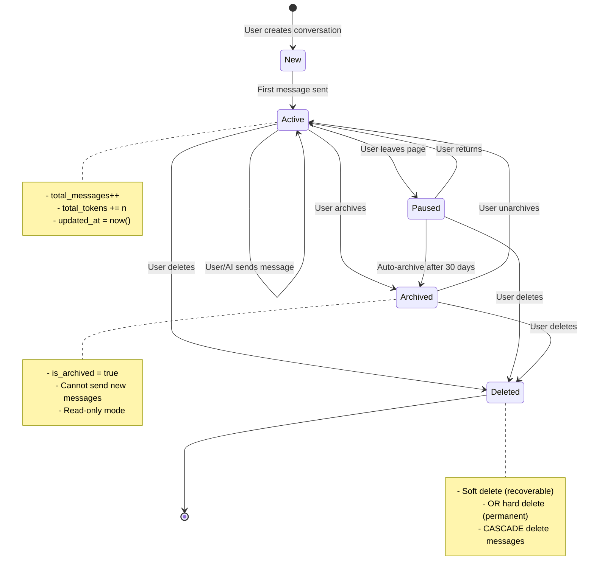
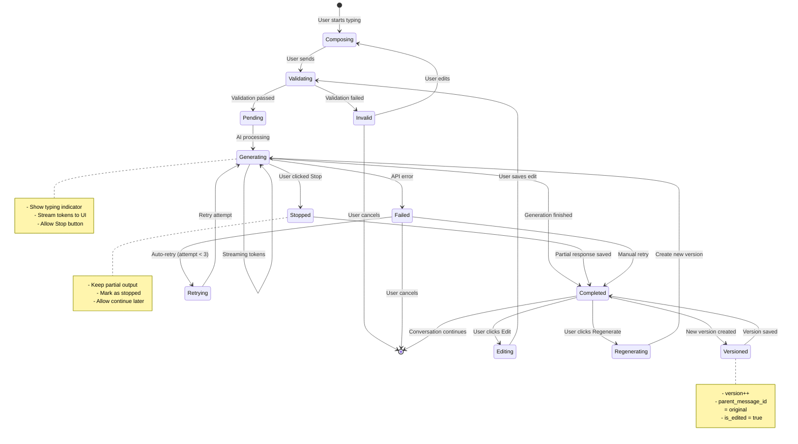
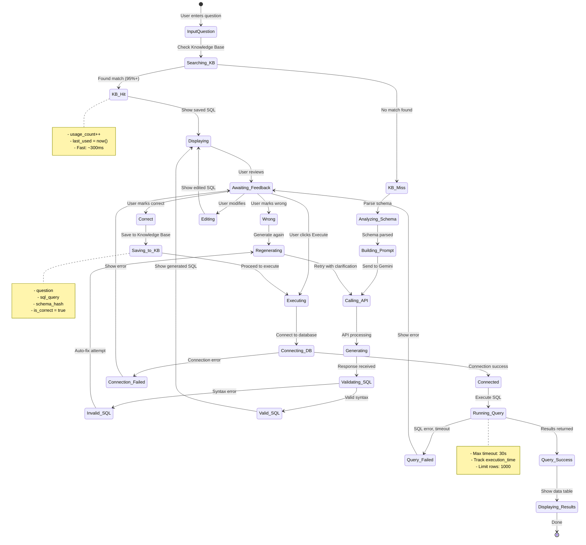
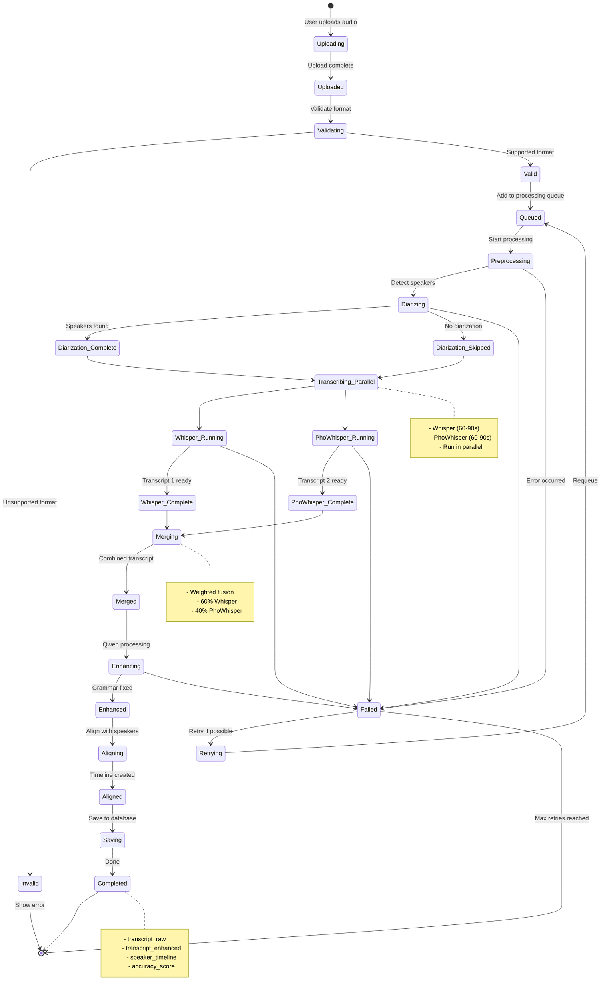
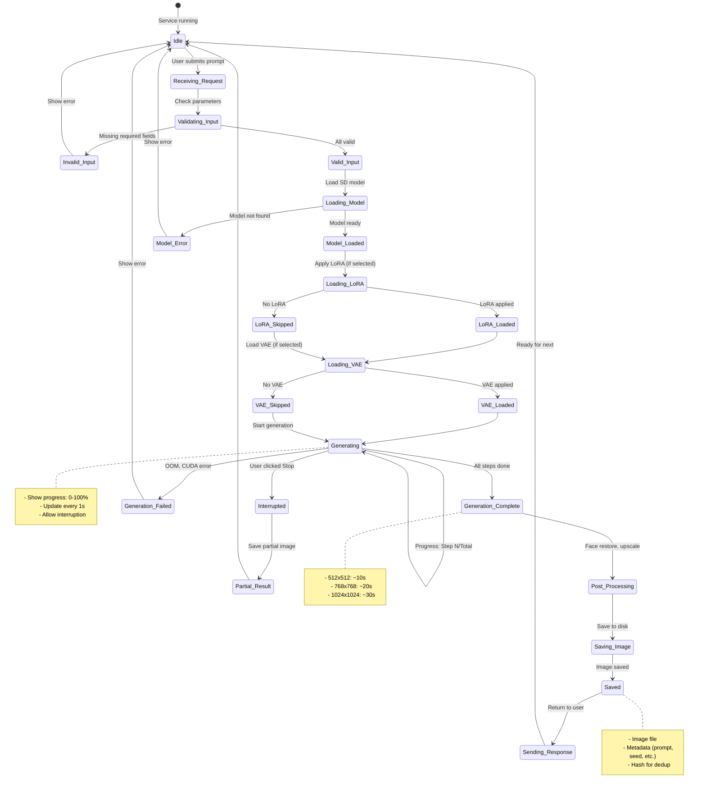
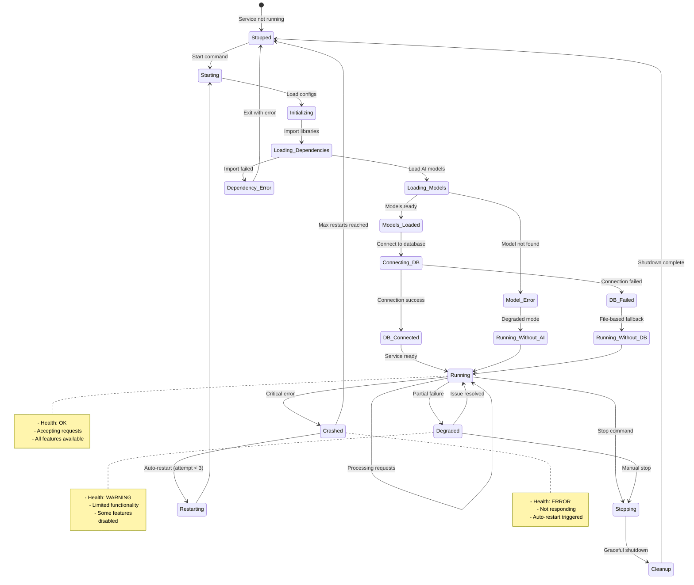

# 8️⃣ STATE DIAGRAM

> **Biểu đồ trạng thái hệ thống AI-Assistant**  
> Mô tả các trạng thái và transitions của các entities chính

---

## 📋 Mô tả

State Diagram thể hiện:
- **States:** Các trạng thái của entities (Conversation, Query, Transcription, etc.)
- **Transitions:** Sự chuyển đổi giữa các trạng thái
- **Events:** Sự kiện kích hoạt transitions
- **Actions:** Hành động xảy ra khi transition

---

## 🎯 Key State Machines

1. **Conversation State (ChatBot)**
2. **Message State (ChatBot)**
3. **SQL Query State (Text2SQL)**
4. **Transcription State (Speech2Text)**
5. **Image Generation State (Stable Diffusion)**
6. **Service State (System)**

---

## 1️⃣ Conversation State Machine (ChatBot)



### Conversation States:

| State | Description | Can Modify? | Auto-transition? |
|:------|:------------|:------------|:-----------------|
| **New** | Just created, no messages | ✅ | → Active (on first message) |
| **Active** | Currently in use | ✅ | → Paused (on inactivity) |
| **Paused** | User left, inactive | ✅ | → Archived (after 30 days) |
| **Archived** | Long-term storage | ❌ (read-only) | No |
| **Deleted** | Marked for deletion | ❌ | → Permanent delete (after 7 days) |

### State Transitions:

```python
# Example: Archive conversation
def archive_conversation(conv_id):
    conv = get_conversation(conv_id)
    if conv.state in ['Active', 'Paused']:
        conv.state = 'Archived'
        conv.is_archived = True
        conv.updated_at = datetime.now()
        save(conv)
        return True
    return False
```

---

## 2️⃣ Message State Machine (ChatBot)



### Message States:

| State | Description | User Actions | System Actions |
|:------|:------------|:-------------|:---------------|
| **Composing** | User typing | Type, paste, upload file | Auto-save draft |
| **Validating** | Checking input | Wait | Validate length, content |
| **Pending** | Queued for AI | Wait | Add to queue |
| **Generating** | AI creating response | Click Stop | Stream tokens, update UI |
| **Stopped** | Manually interrupted | View partial | Save partial response |
| **Failed** | Error occurred | Retry, cancel | Log error, retry logic |
| **Completed** | Finished successfully | Edit, regenerate, continue | Save to DB |
| **Editing** | User modifying | Save, cancel | Create new version |
| **Versioned** | New version created | View versions | Link to parent |

---

## 3️⃣ SQL Query State Machine (Text2SQL)



### Query States:

| State | Description | Duration | Next States |
|:------|:------------|:---------|:------------|
| **Searching_KB** | Check if question exists | 50-200ms | KB_Hit, KB_Miss |
| **KB_Hit** | Found in Knowledge Base | Instant | Displaying |
| **Analyzing_Schema** | Parse database schema | 100-500ms | Building_Prompt |
| **Calling_API** | Request to Gemini | 2-5s | Generating |
| **Generating** | AI creating SQL | 2-5s | Validating_SQL |
| **Validating_SQL** | Check SQL syntax | 50-100ms | Valid_SQL, Invalid_SQL |
| **Displaying** | Show SQL to user | - | Awaiting_Feedback |
| **Executing** | Running SQL query | 0.1-30s | Query_Success, Query_Failed |
| **Saving_to_KB** | Add to Knowledge Base | 50-100ms | Executing |

### Learning System Flow:

```
┌─────────────────────────────────────────────┐
│ Question → KB Check → Generate → Feedback  │
│                ↓                    ↓       │
│            Found (Fast)         Correct?    │
│                                    ↓        │
│                                  Yes        │
│                                    ↓        │
│                              Save to KB     │
│                                    ↓        │
│                           Reuse next time   │
└─────────────────────────────────────────────┘
```

---

## 4️⃣ Transcription State Machine (Speech2Text)



### Transcription States:

| State | Description | Progress | Duration (10min audio) |
|:------|:------------|:---------|:-----------------------|
| **Uploading** | File upload in progress | 0% | 1-5s |
| **Validating** | Check format & size | 5% | 0.5s |
| **Queued** | Waiting for processing | 10% | Variable |
| **Preprocessing** | Audio conversion, VAD | 15% | 10-15s |
| **Diarizing** | Speaker detection | 30% | 40-60s |
| **Transcribing_Parallel** | Dual-model transcription | 60% | 60-90s (parallel) |
| **Merging** | Combine transcripts | 80% | 2-5s |
| **Enhancing** | AI grammar improvement | 90% | 10-15s |
| **Aligning** | Align with speakers | 95% | 2-5s |
| **Completed** | Finished successfully | 100% | - |

---

## 5️⃣ Image Generation State Machine (Stable Diffusion)



### Image Generation States:

| State | Description | GPU Usage | Can Interrupt? |
|:------|:------------|:----------|:---------------|
| **Idle** | Waiting for request | Low (VRAM: ~2GB) | N/A |
| **Loading_Model** | Loading SD checkpoint | High (VRAM: +4GB) | ❌ |
| **Loading_LoRA** | Applying LoRA weights | Medium | ❌ |
| **Generating** | Creating image (steps) | Very High (VRAM: 6-12GB) | ✅ |
| **Post_Processing** | Upscale, face restore | High | ❌ |
| **Saved** | Image saved to disk | Low | N/A |

### Generation Progress Tracking:

```
Step  1/30 ████░░░░░░░░░░░░░░░░░░░░░░░░  3%  (1s)
Step 10/30 ████████████░░░░░░░░░░░░░░░░ 33%  (10s)
Step 20/30 ████████████████████░░░░░░░░ 67%  (20s)
Step 30/30 ████████████████████████████ 100% (30s) ✅
```

---

## 6️⃣ Service State Machine (System-wide)



### Service States:

| State | Health Status | Accepting Requests? | Features |
|:------|:--------------|:-------------------|:---------|
| **Stopped** | ⚫ Offline | ❌ | None |
| **Starting** | 🟡 Starting | ❌ | None |
| **Initializing** | 🟡 Starting | ❌ | Loading... |
| **Running** | 🟢 Healthy | ✅ | All |
| **Degraded** | 🟠 Warning | ⚠️ Partial | Limited |
| **Crashed** | 🔴 Error | ❌ | None |
| **Stopping** | 🟡 Stopping | ❌ | None |

### Health Check Response:

```json
{
  "service": "ChatBot",
  "state": "Running",
  "health": "Healthy",
  "uptime": "2d 5h 30m",
  "requests_served": 15234,
  "errors_last_hour": 2,
  "features": {
    "ai_models": "available",
    "database": "connected",
    "file_storage": "available",
    "external_apis": "available"
  },
  "resource_usage": {
    "cpu_percent": 15.2,
    "memory_mb": 2048,
    "disk_gb": 125.5
  }
}
```

---

## 🔄 State Transition Events

### Global Events (All State Machines):

| Event | Description | Trigger |
|:------|:------------|:--------|
| **created** | Entity created | User action, system trigger |
| **updated** | Entity modified | User edit, system update |
| **deleted** | Entity removed | User delete, auto-cleanup |
| **error** | Error occurred | Exception, validation failure |
| **timeout** | Operation timed out | Exceeds max duration |
| **retry** | Retry operation | Auto-retry logic |
| **cancelled** | Operation cancelled | User interruption |

---

## 📊 State Statistics (ChatBot Example)

### Conversation State Distribution:

```
Active:    45% ████████████████████░░░░░░░░░░░░░░░░░░░░
Paused:    30% ████████████████░░░░░░░░░░░░░░░░░░░░░░░░
Archived:  20% ██████████████░░░░░░░░░░░░░░░░░░░░░░░░░░
Deleted:    5% ███░░░░░░░░░░░░░░░░░░░░░░░░░░░░░░░░░░░░░
```

### Average State Duration:

| State | Avg Duration | Min | Max |
|:------|:-------------|:----|:----|
| **Active** | 15 minutes | 1 min | 2 hours |
| **Paused** | 2 days | 5 min | 30 days |
| **Archived** | Indefinite | - | - |

---

## 🎯 State Validation Rules

### Conversation States:

```python
# Valid transitions
VALID_TRANSITIONS = {
    'New': ['Active', 'Deleted'],
    'Active': ['Active', 'Paused', 'Archived', 'Deleted'],
    'Paused': ['Active', 'Archived', 'Deleted'],
    'Archived': ['Active', 'Deleted'],
    'Deleted': []  # Terminal state
}

def can_transition(current_state, new_state):
    return new_state in VALID_TRANSITIONS.get(current_state, [])
```

### Business Rules:

1. **Cannot send messages in Archived state** → Must unarchive first
2. **Soft delete recoverable within 7 days** → After 7 days, hard delete
3. **Auto-archive after 30 days of inactivity** → Move Paused → Archived
4. **Max active conversations per user: 50** → Must archive old ones

---

## 🚀 Future State Enhancements

### Planned States:

1. **Conversation: Shared** → Allow multiple users to collaborate
2. **Query: Scheduled** → Run SQL query on schedule
3. **Transcription: Streaming** → Real-time transcription
4. **Image: Batch** → Generate multiple images in batch
5. **Service: Scaling** → Auto-scale based on load

---

<div align="center">

[⬅️ Previous: Activity Diagram](07_activity_diagram.md) | [Back to Index](README.md) | [➡️ Next: Deployment Diagram](09_deployment_diagram.md)

</div>
