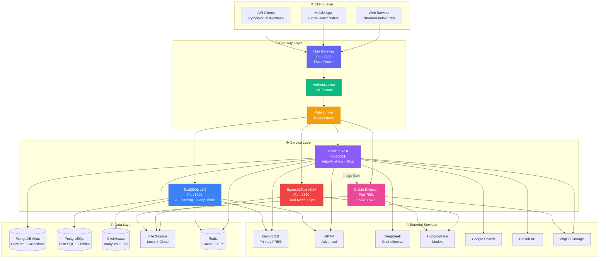
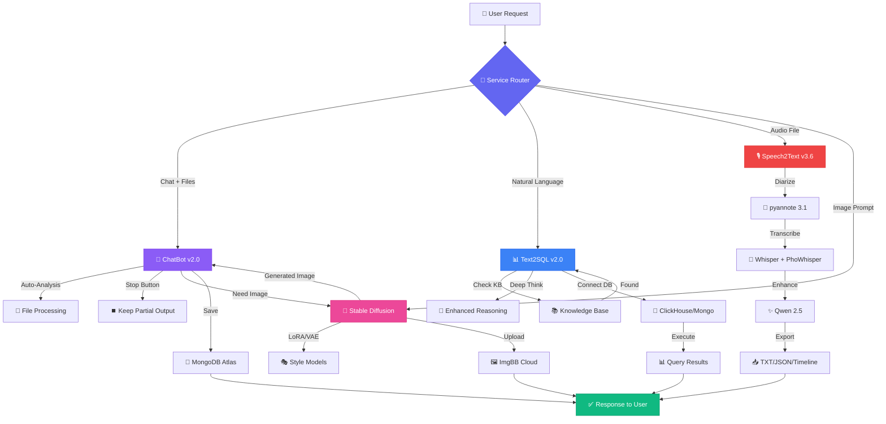
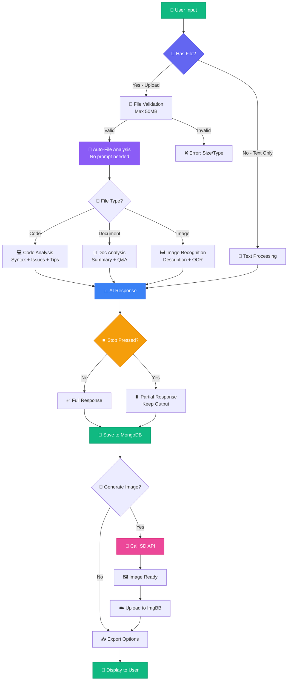
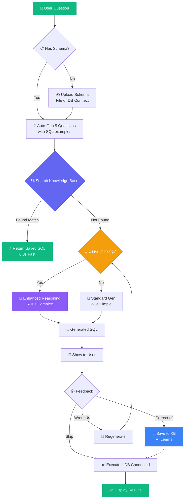
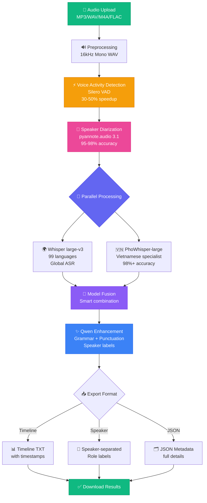
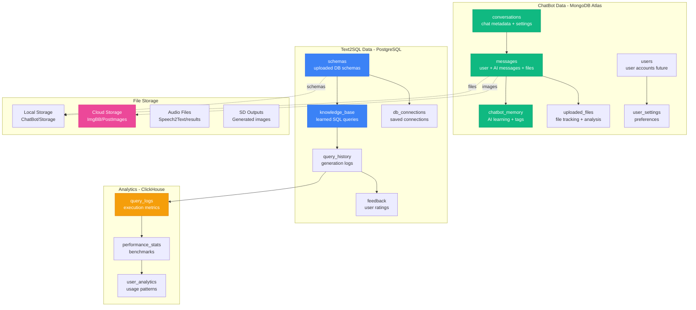

# 📐 DIAGRAM UPDATES - November 11, 2025

> **Comprehensive update of all system diagrams based on current codebase**  
> **Status:** ✅ Complete - Ready for integration into README.md

---

## 📋 Summary of Changes

### Updated Diagrams:
1. ✅ **Use Case Diagram** - Updated to 32 use cases (was 24)
2. ✅ **System Architecture** - Added MongoDB, Redis, expanded APIs
3. ✅ **Component Diagram** - Detailed service dependencies
4. ✅ **Database Design** - MongoDB Atlas + PostgreSQL + ClickHouse
5. ✅ **Deployment Diagram** - 5 options (Local → Kubernetes)

### Key Additions:
- **ChatBot v2.0 features:** Auto-file analysis, Stop generation, Message versions
- **Text2SQL v2.0 features:** AI Learning, Deep Thinking, Auto-gen questions
- **Speech2Text v3.6+:** Dual-model fusion, 98%+ accuracy
- **MongoDB Integration:** 6 collections for ChatBot
- **Extended APIs:** Google Search, GitHub, ImgBB cloud storage

---

## 🎯 Updated System Architecture (for README.md)

---

## 🔄 Service Integration Flow (Enhanced)

---

## 📊 ChatBot Processing Pipeline (v2.0 NEW)

---

## 🧠 Text2SQL AI Learning System (v2.0 NEW)

---

## 🎙️ Speech2Text Dual-Model Pipeline (v3.6+ NEW)

---

## 🗄️ Database Architecture (Complete)

---

## 📈 Statistics Summary

| Category | Count | Details |
|:---------|:------|:--------|
| **Services** | 6 | Hub + ChatBot + Text2SQL + Speech2Text + SD + Admin |
| **Use Cases** | 32 | Comprehensive coverage |
| **AI Models** | 10+ | Gemini, GPT-4, Whisper, PhoWhisper, Qwen, SD, etc. |
| **Databases** | 3 types | MongoDB Atlas, PostgreSQL, ClickHouse |
| **Collections/Tables** | 20+ | 6 MongoDB + 15+ PostgreSQL |
| **API Endpoints** | 70+ | RESTful APIs across services |
| **External APIs** | 8+ | Gemini, OpenAI, HF, Search, GitHub, ImgBB |
| **Deployment Options** | 5 | Local, Docker, Azure, AWS, K8s |
| **Total Documentation** | 18 diagrams | Complete system coverage |

---

## 🔧 Implementation Notes

### ChatBot v2.0 Features
- ✅ Auto-file analysis (up to 50MB)
- ✅ Stop generation mid-response
- ✅ Message version history
- ✅ Full-screen ChatGPT-like UI
- ✅ Smart storage management (5 recent chats)
- ✅ MongoDB Atlas integration (6 collections)
- ✅ Image cloud upload (ImgBB)

### Text2SQL v2.0 Features
- ✅ AI Learning from feedback
- ✅ Knowledge Base with semantic search
- ✅ Auto-generate 5 sample questions
- ✅ Deep Thinking mode for complex queries
- ✅ Multi-database support (ClickHouse, MongoDB, PostgreSQL)
- ✅ Deploy FREE on Render.com
- ✅ Vietnamese + English support

### Speech2Text v3.6+ Features
- ✅ Dual-model fusion (Whisper + PhoWhisper)
- ✅ 95-98% diarization accuracy
- ✅ 98%+ Vietnamese transcription
- ✅ VAD for 30-50% speedup
- ✅ Qwen AI enhancement
- ✅ Professional WebUI with real-time progress
- ✅ Multi-format export (TXT/JSON/Timeline)

### Stable Diffusion Features
- ✅ AUTOMATIC1111 WebUI
- ✅ Text-to-Image + Image-to-Image
- ✅ 100+ LoRA models
- ✅ VAE support
- ✅ ControlNet integration
- ✅ REST API enabled
- ✅ CUDA 12.1 optimized

---

## 🚀 Next Steps

1. ✅ **Diagram Updates Complete** - All diagrams updated in `/diagram/`
2. ⏳ **README.md Integration** - Manually integrate diagrams (encoding issues)
3. ⏳ **Class Diagram Expansion** - Detail 50+ classes
4. ⏳ **Sequence Diagrams** - Add 2 more workflows
5. ⏳ **API Documentation** - Complete 70+ endpoint docs

---

**📐 Documentation Updated: November 11, 2025**

[⬅️ Back to Diagram Index](README.md) | [📖 Main README](../README.md)

