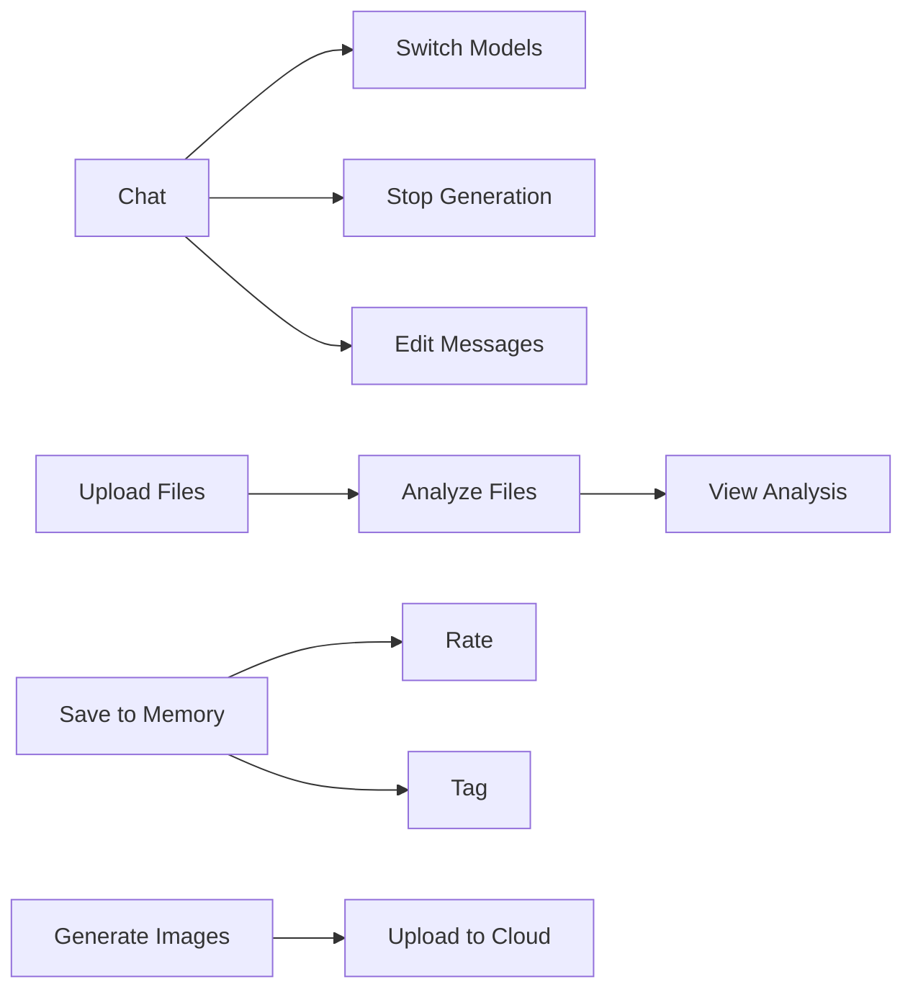
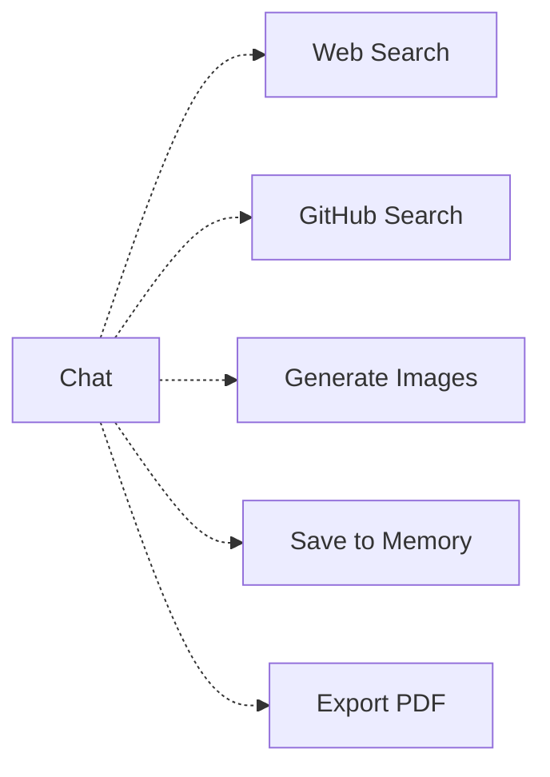

# 3️⃣ USE CASE DIAGRAM - ChatBot Service với MongoDB

> **Biểu đồ ca sử dụng hệ thống ChatBot AI-Assistant**  
> Tập trung vào ChatBot Service với MongoDB Atlas integration

---

## 📋 Mô tả

Use Case Diagram thể hiện:
- **Actors:** User (Anonymous/Registered), Admin, External APIs (Gemini, OpenAI, DeepSeek, PostImages)
- **System:** ChatBot Service với MongoDB Atlas
- **Use Cases:** 15+ chức năng chính

---

## 🎯 Biểu đồ tổng quan

```mermaid
graph TB
    subgraph Actors
        User[👤 User]
        Admin[👨‍💼 Admin]
        GeminiAPI[🤖 Gemini API]
        OpenAIAPI[🧠 OpenAI API]
        DeepSeekAPI[🔍 DeepSeek API]
        PostImagesAPI[📸 PostImages API]
        GoogleAPI[🔎 Google Search API]
        GitHubAPI[💻 GitHub API]
        SDAPI[🎨 Stable Diffusion API]
    end
    
    subgraph ChatBot Service
        subgraph Core Chat Features
            UC1[💬 Chat with AI Models]
            UC2[🔄 Switch Models]
            UC3[⚙️ Configure Settings]
            UC4[🛑 Stop Generation]
            UC5[✏️ Edit Messages]
        end
        
        subgraph File Management
            UC6[📤 Upload Files]
            UC7[🔍 Analyze Files]
            UC8[📊 View Analysis]
        end
        
        subgraph Memory & Learning
            UC9[💾 Save to Memory]
            UC10[🔍 Search Memory]
            UC11[⭐ Rate Conversations]
            UC12[🏷️ Tag Conversations]
        end
        
        subgraph Image Features
            UC13[🎨 Generate Images]
            UC14[☁️ Upload to Cloud]
            UC15[🖼️ View Image Gallery]
        end
        
        subgraph Export & Tools
            UC16[📄 Export to PDF]
            UC17[🔎 Web Search]
            UC18[💻 GitHub Search]
        end
        
        subgraph Conversation Management
            UC19[💬 Create Conversation]
            UC20[📂 Archive Conversation]
            UC21[🗑️ Delete Conversation]
            UC22[📋 View History]
        end
    end
    
    subgraph MongoDB Atlas
        DB1[(conversations)]
        DB2[(messages)]
        DB3[(chatbot_memory)]
        DB4[(uploaded_files)]
        DB5[(users)]
        DB6[(user_settings)]
    end
    
    %% User interactions
    User --> UC1
    User --> UC2
    User --> UC3
    User --> UC4
    User --> UC5
    User --> UC6
    User --> UC9
    User --> UC13
    User --> UC16
    User --> UC17
    User --> UC18
    User --> UC19
    User --> UC20
    User --> UC21
    User --> UC22
    
    %% Include relationships
    UC1 --> UC2
    UC1 --> UC4
    UC1 --> UC5
    UC6 --> UC7
    UC7 --> UC8
    UC9 --> UC11
    UC9 --> UC12
    UC13 --> UC14
    
    %% API dependencies
    UC1 --> GeminiAPI
    UC1 --> OpenAIAPI
    UC1 --> DeepSeekAPI
    UC7 --> GeminiAPI
    UC13 --> SDAPI
    UC14 --> PostImagesAPI
    UC17 --> GoogleAPI
    UC18 --> GitHubAPI
    
    %% Database connections
    UC19 --> DB1
    UC1 --> DB2
    UC5 --> DB2
    UC6 --> DB4
    UC9 --> DB3
    UC10 --> DB3
    UC3 --> DB6
    
    %% Admin functions
    Admin --> UC23[📊 View Statistics]
    Admin --> UC24[🗄️ Database Management]
    Admin --> UC25[👥 User Management]
    
    UC23 --> DB1
    UC23 --> DB2
    UC24 --> DB1
    UC24 --> DB2
    UC24 --> DB3
    UC24 --> DB4
    UC25 --> DB5
```



---

## 📊 Chi tiết Use Cases

### 1️⃣ Core Chat Features (5 use cases)

| ID | Use Case | Actor | Mô tả | MongoDB Collection |
|:---|:---------|:------|:------|:-------------------|
| **UC1** | Chat with AI Models | User | Trò chuyện với 8+ AI models (Gemini, GPT-4, DeepSeek, Qwen, etc.) | `messages` |
| **UC2** | Switch Models | User | Chuyển đổi giữa các models trong conversation | `conversations` |
| **UC3** | Configure Settings | User | Cấu hình temperature, max_tokens, system_prompt | `user_settings` |
| **UC4** | Stop Generation | User | Dừng AI generation giữa chừng và giữ output | `messages` |
| **UC5** | Edit Messages | User | Chỉnh sửa messages (versioning support) | `messages` |

**Luồng hoạt động chính:**
```
User → UC1 (Chat) → UC2 (Switch model nếu cần) → UC4 (Stop nếu muốn) → UC5 (Edit nếu muốn)
```

---

### 2️⃣ File Management (3 use cases)

| ID | Use Case | Actor | Mô tả | MongoDB Collection |
|:---|:---------|:------|:------|:-------------------|
| **UC6** | Upload Files | User | Upload PDF/Image/Code (max 50MB) | `uploaded_files` |
| **UC7** | Analyze Files | System + Gemini API | AI tự động phân tích file content | `uploaded_files` |
| **UC8** | View Analysis | User | Xem kết quả phân tích chi tiết | `uploaded_files` |

**Supported file types:**
- 📄 Documents: `.pdf`, `.docx`, `.txt`, `.md`
- 🖼️ Images: `.png`, `.jpg`, `.jpeg`, `.webp`, `.gif`
- 💻 Code: `.py`, `.js`, `.java`, `.cpp`, `.go`, etc.

**Luồng hoạt động:**
```
User → UC6 (Upload) → UC7 (Auto-analyze) → UC8 (View result)
                ↓
        Saved to MongoDB + Local Storage
```

---

### 3️⃣ Memory & Learning (4 use cases)

| ID | Use Case | Actor | Mô tả | MongoDB Collection |
|:---|:---------|:------|:------|:-------------------|
| **UC9** | Save to Memory | User | Lưu conversations quan trọng vào memory | `chatbot_memory` |
| **UC10** | Search Memory | User | Tìm kiếm trong memories đã lưu (by tags, keywords) | `chatbot_memory` |
| **UC11** | Rate Conversations | User | Đánh giá 1-5 sao cho conversations | `chatbot_memory` |
| **UC12** | Tag Conversations | User | Gắn tags để phân loại (python, work, personal, etc.) | `chatbot_memory` |

**Memory structure:**
```json
{
  "question": "User's question",
  "answer": "AI's answer",
  "rating": 5,
  "tags": ["python", "async", "programming"],
  "images": [...],
  "created_at": "2025-11-10T..."
}
```

**Luồng hoạt động:**
```
User → UC9 (Save) → UC11 (Rate) → UC12 (Add tags)
         ↓
    Saved to chatbot_memory
         ↓
User → UC10 (Search by tags/keywords)
```

---

### 4️⃣ Image Features (3 use cases)

| ID | Use Case | Actor | Mô tả | External API | Storage |
|:---|:---------|:------|:------|:------------|:--------|
| **UC13** | Generate Images | User + SD API | Generate images với Stable Diffusion (text-to-image) | Stable Diffusion API | Local + MongoDB ref |
| **UC14** | Upload to Cloud | System + PostImages | Auto-upload images to cloud (shareable URLs) | PostImages API | Cloud + MongoDB URL |
| **UC15** | View Image Gallery | User | Browse generated images trong conversation | - | MongoDB + Local |

**Image generation flow:**
```
User types prompt
    ↓
UC13: Send to Stable Diffusion API
    ↓
Generate image (5-10s)
    ↓
Save to local Storage/Image_Gen/
    ↓
UC14: Upload to PostImages cloud
    ↓
Save URLs to MongoDB messages.images[]
    ↓
UC15: Display in chat với preview
```

**Image metadata trong MongoDB:**
```json
{
  "url": "/static/Storage/Image_Gen/img_123.png",
  "cloud_url": "https://i.postimg.cc/xyz789/img_123.png",
  "delete_url": "https://postimg.cc/delete/abc123",
  "caption": "A beautiful sunset",
  "size": 245680,
  "mime_type": "image/png",
  "generated": true,
  "service": "postimages"
}
```

---

### 5️⃣ Export & Tools (3 use cases)

| ID | Use Case | Actor | Mô tả | External API |
|:---|:---------|:------|:------|:------------|
| **UC16** | Export to PDF | User | Export conversation to PDF file | - |
| **UC17** | Web Search | User + Google API | Search Google và trả kết quả trong chat | Google Custom Search API |
| **UC18** | GitHub Search | User + GitHub API | Search GitHub repositories và code | GitHub REST API |

**Tool integration:**
- ✅ Google Search: Top 10 results với snippets
- ✅ GitHub Search: Repos, issues, code với filters
- ✅ PDF Export: Markdown formatting preserved

---

### 6️⃣ Conversation Management (4 use cases)

| ID | Use Case | Actor | Mô tả | MongoDB Collection |
|:---|:---------|:------|:------|:-------------------|
| **UC19** | Create Conversation | User | Tạo conversation mới với model selection | `conversations` |
| **UC20** | Archive Conversation | User | Archive old conversations (soft delete) | `conversations` |
| **UC21** | Delete Conversation | User | Xóa conversation + messages (cascade) | `conversations` + `messages` |
| **UC22** | View History | User | Xem lịch sử conversations (latest 20) | `conversations` |

**Conversation lifecycle:**
```
UC19: Create (is_archived=False)
    ↓
UC1-UC18: Active usage
    ↓
UC20: Archive (is_archived=True) OR UC21: Delete (cascade)
```

**MongoDB operations:**
```javascript
// Create
db.conversations.insertOne({
  user_id: "session_123",
  model: "gemini-2.0-flash",
  title: "New Chat",
  total_messages: 0,
  is_archived: false
})

// Archive
db.conversations.updateOne(
  {_id: ObjectId("...")},
  {$set: {is_archived: true}}
)

// Delete (cascade)
db.messages.deleteMany({conversation_id: ObjectId("...")})
db.conversations.deleteOne({_id: ObjectId("...")})
```

---

### 7️⃣ Admin Functions (3 use cases)

| ID | Use Case | Actor | Mô tả | MongoDB Collections |
|:---|:---------|:------|:------|:-------------------|
| **UC23** | View Statistics | Admin | Xem statistics (total users, conversations, tokens, etc.) | All collections |
| **UC24** | Database Management | Admin | Backup, restore, clean old data | All collections |
| **UC25** | User Management | Admin | Manage users, roles, quotas | `users` |

**Statistics queries:**
```javascript
// Total conversations per user
db.conversations.aggregate([
  {$group: {
    _id: "$user_id",
    total: {$sum: 1},
    total_messages: {$sum: "$total_messages"},
    total_tokens: {$sum: "$total_tokens"}
  }}
])

// Most popular models
db.conversations.aggregate([
  {$group: {_id: "$model", count: {$sum: 1}}},
  {$sort: {count: -1}}
])
```

---

## 🔗 Quan hệ giữa Use Cases

### Include Relationships (bắt buộc)


### Extend Relationships (tùy chọn)


---

## 📈 Thống kê

| Metric | Số lượng |
|:-------|:---------|
| **Tổng Use Cases** | 25 |
| **Core Features** | 5 |
| **File Management** | 3 |
| **Memory & Learning** | 4 |
| **Image Features** | 3 |
| **Export & Tools** | 3 |
| **Conversation Mgmt** | 4 |
| **Admin Functions** | 3 |
| **External APIs** | 7 |
| **MongoDB Collections** | 6 |

---

## 🚀 Luồng hoạt động cơ bản

### Scenario 1: Chat đơn giản
```
1. User → UC19 (Create Conversation)
2. User → UC1 (Chat with AI)
3. AI (Gemini/GPT-4/DeepSeek) → Response
4. Save to MongoDB (conversations + messages)
5. Display to User
```

### Scenario 2: Upload file và phân tích
```
1. User → UC6 (Upload file .pdf)
2. System → Save to Storage + uploaded_files collection
3. System → UC7 (Auto-analyze with Gemini)
4. Gemini API → Analysis result
5. System → Update uploaded_files.analysis_result
6. User → UC8 (View analysis trong chat)
```

### Scenario 3: Generate image và save to memory
```
1. User → UC13 (Generate image với prompt)
2. System → Call Stable Diffusion API
3. SD API → Return image
4. System → Save to Storage/Image_Gen/
5. System → UC14 (Upload to PostImages cloud)
6. PostImages API → Return cloud URL
7. System → Save URLs to messages.images[]
8. User → UC9 (Save conversation to memory)
9. System → Save to chatbot_memory (với image URLs)
10. User → UC11 (Rate 5 stars)
11. User → UC12 (Tag: "ai-art", "stable-diffusion")
```

---

## 🔄 MongoDB Collection Usage

| Collection | Used by Use Cases | Purpose |
|:-----------|:-----------------|:--------|
| **conversations** | UC1, UC2, UC19, UC20, UC21, UC22, UC23 | Store conversation metadata |
| **messages** | UC1, UC4, UC5, UC13, UC23 | Store all messages (user + assistant) |
| **chatbot_memory** | UC9, UC10, UC11, UC12, UC23 | AI learning and memory storage |
| **uploaded_files** | UC6, UC7, UC8, UC23 | File upload tracking + analysis |
| **users** | UC25 | User management (future) |
| **user_settings** | UC3 | User preferences and settings |

---

## 📝 Ghi chú kỹ thuật

### Performance Optimizations:
- ✅ **MongoDB Indexes:** Created on frequently queried fields
- ✅ **Caching:** Response caching cho repeated queries (Redis-like)
- ✅ **Streaming:** Server-Sent Events cho real-time AI responses
- ✅ **Lazy Loading:** Load messages on-demand (pagination)

### Security:
- ✅ **Input Validation:** File size limits (50MB), type checking
- ✅ **API Rate Limiting:** Prevent abuse
- ✅ **Session Management:** User session tracking
- 🚧 **Authentication:** Future multi-user support (users collection)

### Scalability:
- ✅ **MongoDB Atlas:** Cloud-based, auto-scaling
- ✅ **PostImages CDN:** Image serving optimized
- ✅ **Modular Architecture:** Easy to add new AI models
- 🚧 **Load Balancing:** For high-traffic scenarios

---

## 🎯 Future Enhancements

| Priority | Feature | Use Cases to Add |
|:---------|:--------|:-----------------|
| **High** | Multi-user Authentication | UC26: Login/Register, UC27: Profile Management |
| **High** | Real-time Collaboration | UC28: Share Conversations, UC29: Collaborative Editing |
| **Medium** | Voice Input/Output | UC30: Speech-to-Text, UC31: Text-to-Speech |
| **Medium** | Advanced Memory Search | UC32: Semantic Search, UC33: Memory Clustering |
| **Low** | Conversation Templates | UC34: Use Templates, UC35: Create Templates |
| **Low** | API Access | UC36: Generate API Keys, UC37: API Usage Dashboard |

---

<div align="center">

**Version:** 2.0 MongoDB Edition  
**Last Updated:** 2025-11-10  
**Database:** MongoDB Atlas

[⬅️ Back to API Architecture](02_api_architecture.md) | [➡️ Next: Class Diagram](04_class_diagram.md)

</div>
