# 4️⃣ CLASS DIAGRAM - ChatBot Service với MongoDB

> **Biểu đồ lớp hệ thống ChatBot AI-Assistant**  
> Cấu trúc OOP với MongoDB integration và AI model management

---

## 📋 Mô tả

Class Diagram thể hiện:
- **Core Classes:** Flask app, MongoDB client, AI models
- **Database Helpers:** ConversationDB, MessageDB, MemoryDB, FileDB
- **Utilities:** Cache, Streaming, File upload, Image upload
- **Relationships:** Inheritance, Composition, Aggregation

---

## 🎯 Biểu đồ tổng quan

```mermaid
classDiagram
    class FlaskApp {
        -app: Flask
        -secret_key: str
        -mongodb_client: MongoDBClient
        -static_folder: Path
        +run(host, port, debug)
        +route(path, methods)
        +before_request()
        +after_request()
    }
    
    class MongoDBClient {
        -_instance: MongoDBClient
        -_client: MongoClient
        -_db: Database
        -uri: str
        +connect() bool
        +close() void
        +db: Database
        +conversations: Collection
        +messages: Collection
        +memory: Collection
        +uploaded_files: Collection
        +users: Collection
        +settings: Collection
        -_create_indexes() void
    }
    
    class ConversationDB {
        -db: Database
        -collection: Collection
        +create_conversation(user_id, model, title) ObjectId
        +get_conversation(conversation_id) dict
        +get_user_conversations(user_id, limit) List~dict~
        +update_conversation(conversation_id, data) bool
        +delete_conversation(conversation_id) bool
        +archive_conversation(conversation_id) bool
        +increment_message_count(conversation_id, tokens) bool
        +get_statistics(user_id) dict
    }
    
    class MessageDB {
        -db: Database
        -collection: Collection
        +add_message(conversation_id, role, content) ObjectId
        +get_messages(conversation_id, limit) List~dict~
        +update_message(message_id, content) bool
        +delete_message(message_id) bool
        +add_image_to_message(message_id, image_data) bool
        +add_file_to_message(message_id, file_data) bool
        +edit_message(message_id, new_content, parent_id) ObjectId
        +get_message_versions(parent_id) List~dict~
    }
    
    class MemoryDB {
        -db: Database
        -collection: Collection
        +save_memory(user_id, question, answer, tags) ObjectId
        +search_memory(user_id, query, tags) List~dict~
        +get_memory(memory_id) dict
        +update_rating(memory_id, rating) bool
        +add_tags(memory_id, tags) bool
        +delete_memory(memory_id) bool
        +get_popular_memories(user_id, limit) List~dict~
    }
    
    class FileDB {
        -db: Database
        -collection: Collection
        +save_file(user_id, conversation_id, file_info) ObjectId
        +get_file(file_id) dict
        +get_conversation_files(conversation_id) List~dict~
        +update_analysis(file_id, analysis) bool
        +delete_file(file_id) bool
        +get_file_statistics(user_id) dict
    }
    
    class UserSettingsDB {
        -db: Database
        -collection: Collection
        +get_settings(user_id) dict
        +update_settings(user_id, settings) bool
        +get_default_model(user_id) str
        +update_chatbot_settings(user_id, settings) bool
        +update_ui_settings(user_id, settings) bool
    }
    
    class AIModelManager {
        -models: dict
        -current_model: str
        -api_keys: dict
        +switch_model(model_name) bool
        +get_available_models() List~str~
        +chat(messages, model, temperature) str
        +chat_stream(messages, model) Generator
        +get_model_info(model_name) dict
        -_validate_model(model_name) bool
    }
    
    class GeminiModel {
        -api_key: str
        -model: GenerativeModel
        -generation_config: dict
        +generate_content(prompt, images) str
        +generate_content_stream(prompt) Generator
        +count_tokens(text) int
        +analyze_file(file_path) str
    }
    
    class OpenAIModel {
        -api_key: str
        -client: OpenAI
        -model: str
        +chat_completion(messages) str
        +chat_completion_stream(messages) Generator
        +count_tokens(text) int
        +create_embedding(text) List~float~
    }
    
    class DeepSeekModel {
        -api_key: str
        -base_url: str
        -client: OpenAI
        +chat_completion(messages) str
        +chat_completion_stream(messages) Generator
        +count_tokens(text) int
    }
    
    class QwenModel {
        -api_key: str
        -model: str
        +chat_completion(messages) str
        +generate(prompt) str
        +count_tokens(text) int
    }
    
    class LocalModelLoader {
        -models_dir: Path
        -loaded_models: dict
        +load_model(model_name) Model
        +unload_model(model_name) bool
        +get_loaded_models() List~str~
        +generate(model_name, prompt) str
        -_check_memory() bool
    }
    
    class CacheManager {
        -cache: dict
        -ttl: int
        -enabled: bool
        +get(key) any
        +set(key, value, ttl) void
        +delete(key) void
        +clear() void
        +get_stats() dict
    }
    
    class StreamingHandler {
        -chunk_size: int
        +stream_response(generator) Generator
        +create_sse_message(data) str
        +handle_stop_signal() void
    }
    
    class FileUploader {
        -upload_dir: Path
        -max_size: int
        -allowed_types: List~str~
        +upload_file(file) dict
        +validate_file(file) bool
        +save_file(file, filename) Path
        +delete_file(file_path) bool
        +get_file_info(file_path) dict
    }
    
    class ImageUploader {
        -storage_dir: Path
        -cloud_service: str
        -api_key: str
        +save_local(image) Path
        +upload_to_cloud(image_path) dict
        +delete_from_cloud(delete_url) bool
        +get_image_info(image_path) dict
        -_compress_image(image) Image
    }
    
    class PostImagesAPI {
        -api_key: str
        -base_url: str
        +upload(image_path) dict
        +delete(delete_url) bool
        +get_image(image_url) bytes
        -_prepare_upload(image_path) dict
    }
    
    class StableDiffusionClient {
        -api_url: str
        -timeout: int
        +text_to_image(prompt, params) bytes
        +image_to_image(image, prompt, params) bytes
        +check_status() bool
        +get_models() List~str~
        +get_loras() List~str~
    }
    
    class GoogleSearchAPI {
        -api_key: str
        -cse_id: str
        +search(query, num_results) List~dict~
        +search_images(query) List~dict~
        -_format_results(results) List~dict~
    }
    
    class GitHubAPI {
        -token: str
        -base_url: str
        +search_repositories(query) List~dict~
        +search_code(query) List~dict~
        +search_issues(query) List~dict~
        +get_repository(owner, repo) dict
        -_make_request(endpoint, params) dict
    }
    
    class Conversation {
        +id: ObjectId
        +user_id: str
        +model: str
        +title: str
        +system_prompt: str
        +total_messages: int
        +total_tokens: int
        +is_archived: bool
        +metadata: dict
        +created_at: datetime
        +updated_at: datetime
        +to_dict() dict
        +from_dict(data) Conversation
    }
    
    class Message {
        +id: ObjectId
        +conversation_id: ObjectId
        +role: str
        +content: str
        +images: List~Image~
        +files: List~File~
        +metadata: dict
        +version: int
        +parent_message_id: ObjectId
        +is_edited: bool
        +is_stopped: bool
        +created_at: datetime
        +to_dict() dict
        +from_dict(data) Message
    }
    
    class Memory {
        +id: ObjectId
        +user_id: str
        +conversation_id: ObjectId
        +question: str
        +answer: str
        +context: str
        +images: List~dict~
        +rating: int
        +tags: List~str~
        +is_public: bool
        +metadata: dict
        +created_at: datetime
        +to_dict() dict
        +from_dict(data) Memory
    }
    
    class UploadedFile {
        +id: ObjectId
        +user_id: str
        +conversation_id: ObjectId
        +original_filename: str
        +stored_filename: str
        +file_path: str
        +file_type: str
        +file_size: int
        +mime_type: str
        +analysis_result: str
        +metadata: dict
        +created_at: datetime
        +to_dict() dict
        +from_dict(data) UploadedFile
    }
    
    class Image {
        +url: str
        +cloud_url: str
        +delete_url: str
        +caption: str
        +size: int
        +mime_type: str
        +generated: bool
        +service: str
        +to_dict() dict
        +from_dict(data) Image
    }
    
    class File {
        +name: str
        +path: str
        +type: str
        +size: int
        +mime_type: str
        +analysis_result: str
        +to_dict() dict
        +from_dict(data) File
    }
    
    %% Relationships
    FlaskApp "1" -- "1" MongoDBClient : uses
    FlaskApp "1" -- "1" AIModelManager : uses
    FlaskApp "1" -- "1" CacheManager : uses
    FlaskApp "1" -- "1" StreamingHandler : uses
    
    MongoDBClient "1" -- "*" ConversationDB : provides
    MongoDBClient "1" -- "*" MessageDB : provides
    MongoDBClient "1" -- "*" MemoryDB : provides
    MongoDBClient "1" -- "*" FileDB : provides
    MongoDBClient "1" -- "*" UserSettingsDB : provides
    
    AIModelManager "1" -- "*" GeminiModel : manages
    AIModelManager "1" -- "*" OpenAIModel : manages
    AIModelManager "1" -- "*" DeepSeekModel : manages
    AIModelManager "1" -- "*" QwenModel : manages
    AIModelManager "1" -- "1" LocalModelLoader : uses
    
    ConversationDB "1" -- "*" Conversation : CRUD
    MessageDB "1" -- "*" Message : CRUD
    MemoryDB "1" -- "*" Memory : CRUD
    FileDB "1" -- "*" UploadedFile : CRUD
    
    Message "1" -- "*" Image : contains
    Message "1" -- "*" File : contains
    
    FileUploader "1" -- "1" FileDB : saves to
    ImageUploader "1" -- "1" PostImagesAPI : uploads via
    ImageUploader "1" -- "1" MessageDB : saves to
    
    FlaskApp "1" -- "1" StableDiffusionClient : uses
    FlaskApp "1" -- "1" GoogleSearchAPI : uses
    FlaskApp "1" -- "1" GitHubAPI : uses
    
    Conversation "1" -- "*" Message : has
    Memory "1" -- "0..1" Conversation : references
```



---

## 📊 Chi tiết Classes

### 1️⃣ Core Application Classes

#### FlaskApp
**Vai trò:** Main application controller

```python
class FlaskApp:
    def __init__(self):
        self.app = Flask(__name__)
        self.mongodb_client = MongoDBClient()
        self.model_manager = AIModelManager()
        self.cache = CacheManager()
        self.streaming = StreamingHandler()
        
    def setup_routes(self):
        """Register all routes"""
        @self.app.route('/')
        def index():
            return render_template('index.html')
            
        @self.app.route('/api/chat', methods=['POST'])
        def chat():
            # Handle chat request
            pass
```

**File thực tế:** `ChatBot/app.py`

---

#### MongoDBClient (Singleton)
**Vai trò:** Database connection và collection management

```python
class MongoDBClient:
    _instance = None
    
    def __new__(cls):
        if cls._instance is None:
            cls._instance = super().__new__(cls)
        return cls._instance
    
    def connect(self) -> bool:
        """Establish MongoDB connection"""
        self._client = MongoClient(MONGODB_URI, server_api=ServerApi('1'))
        self._db = self._client[DATABASE_NAME]
        self._create_indexes()
        return True
    
    def _create_indexes(self):
        """Create indexes for performance"""
        self.conversations.create_index([("user_id", 1)])
        self.conversations.create_index([("created_at", -1)])
        # ... more indexes
```

**File thực tế:** `ChatBot/config/mongodb_config.py`

---

### 2️⃣ Database Helper Classes

#### ConversationDB
**Vai trò:** CRUD operations cho conversations collection

```python
class ConversationDB:
    def create_conversation(
        self, 
        user_id: str, 
        model: str, 
        title: str = "New Chat"
    ) -> ObjectId:
        """Create new conversation"""
        doc = {
            "user_id": user_id,
            "model": model,
            "title": title,
            "total_messages": 0,
            "total_tokens": 0,
            "is_archived": False,
            "created_at": datetime.utcnow(),
            "updated_at": datetime.utcnow()
        }
        result = self.collection.insert_one(doc)
        return result.inserted_id
    
    def get_user_conversations(
        self, 
        user_id: str, 
        limit: int = 20
    ) -> List[dict]:
        """Get user's conversations (latest first)"""
        return list(
            self.collection
            .find({"user_id": user_id, "is_archived": False})
            .sort("updated_at", -1)
            .limit(limit)
        )
```

**File thực tế:** `ChatBot/config/mongodb_helpers.py`

---

#### MessageDB
**Vai trò:** CRUD operations cho messages collection

```python
class MessageDB:
    def add_message(
        self,
        conversation_id: ObjectId,
        role: str,
        content: str,
        images: List[dict] = None,
        files: List[dict] = None,
        metadata: dict = None
    ) -> ObjectId:
        """Add message to conversation"""
        doc = {
            "conversation_id": conversation_id,
            "role": role,  # 'user' or 'assistant'
            "content": content,
            "images": images or [],
            "files": files or [],
            "metadata": metadata or {},
            "version": 1,
            "is_edited": False,
            "is_stopped": False,
            "created_at": datetime.utcnow()
        }
        result = self.collection.insert_one(doc)
        return result.inserted_id
    
    def edit_message(
        self,
        message_id: ObjectId,
        new_content: str,
        parent_id: ObjectId = None
    ) -> ObjectId:
        """Edit message (create new version)"""
        # Get original message
        original = self.collection.find_one({"_id": message_id})
        
        # Create new version
        new_doc = original.copy()
        new_doc.pop("_id")
        new_doc["content"] = new_content
        new_doc["version"] = original.get("version", 1) + 1
        new_doc["parent_message_id"] = parent_id or message_id
        new_doc["is_edited"] = True
        new_doc["created_at"] = datetime.utcnow()
        
        result = self.collection.insert_one(new_doc)
        return result.inserted_id
```

**File thực tế:** `ChatBot/config/mongodb_helpers.py`

---

#### MemoryDB
**Vai trò:** AI learning và memory management

```python
class MemoryDB:
    def save_memory(
        self,
        user_id: str,
        question: str,
        answer: str,
        tags: List[str] = None,
        rating: int = 0,
        conversation_id: ObjectId = None
    ) -> ObjectId:
        """Save conversation to memory"""
        doc = {
            "user_id": user_id,
            "conversation_id": conversation_id,
            "question": question,
            "answer": answer,
            "tags": tags or [],
            "rating": rating,
            "is_public": False,
            "created_at": datetime.utcnow()
        }
        result = self.collection.insert_one(doc)
        return result.inserted_id
    
    def search_memory(
        self,
        user_id: str,
        query: str = None,
        tags: List[str] = None,
        limit: int = 10
    ) -> List[dict]:
        """Search memories by query/tags"""
        filter_query = {"user_id": user_id}
        
        if tags:
            filter_query["tags"] = {"$in": tags}
        
        if query:
            # Text search
            filter_query["$text"] = {"$search": query}
        
        return list(
            self.collection
            .find(filter_query)
            .sort("created_at", -1)
            .limit(limit)
        )
```

**File thực tế:** `ChatBot/config/mongodb_helpers.py`

---

### 3️⃣ AI Model Classes

#### AIModelManager
**Vai trò:** Manage multiple AI models

```python
class AIModelManager:
    def __init__(self):
        self.models = {
            'gemini-2.0-flash': GeminiModel(api_key=GEMINI_API_KEY),
            'gemini-1.5-pro': GeminiModel(api_key=GEMINI_API_KEY, model='gemini-1.5-pro'),
            'gpt-4o': OpenAIModel(api_key=OPENAI_API_KEY, model='gpt-4o'),
            'gpt-4o-mini': OpenAIModel(api_key=OPENAI_API_KEY, model='gpt-4o-mini'),
            'deepseek-chat': DeepSeekModel(api_key=DEEPSEEK_API_KEY),
            'qwen-turbo': QwenModel(api_key=QWEN_API_KEY),
            # Local models
            'qwen-local': LocalModelLoader().load_model('Qwen2.5-14B-Instruct'),
            'bloom-vn': LocalModelLoader().load_model('BloomVN-8B-chat')
        }
        self.current_model = 'gemini-2.0-flash'
    
    def chat(
        self,
        messages: List[dict],
        model: str = None,
        temperature: float = 0.7,
        stream: bool = False
    ) -> Union[str, Generator]:
        """Chat with specified model"""
        model_name = model or self.current_model
        model_instance = self.models.get(model_name)
        
        if not model_instance:
            raise ValueError(f"Model {model_name} not found")
        
        if stream:
            return model_instance.chat_completion_stream(messages)
        else:
            return model_instance.chat_completion(messages)
```

**File thực tế:** `ChatBot/src/model_manager.py` (cần tạo)

---

#### GeminiModel
**Vai trò:** Google Gemini API wrapper

```python
class GeminiModel:
    def __init__(self, api_key: str, model: str = 'gemini-2.0-flash-exp'):
        genai.configure(api_key=api_key)
        self.model = genai.GenerativeModel(model)
        self.generation_config = {
            'temperature': 0.7,
            'top_p': 0.95,
            'top_k': 40,
            'max_output_tokens': 8192
        }
    
    def generate_content(
        self,
        prompt: str,
        images: List[Image] = None
    ) -> str:
        """Generate content with text/images"""
        if images:
            response = self.model.generate_content([prompt] + images)
        else:
            response = self.model.generate_content(prompt)
        return response.text
    
    def generate_content_stream(self, prompt: str) -> Generator:
        """Stream generated content"""
        response = self.model.generate_content(
            prompt,
            generation_config=self.generation_config,
            stream=True
        )
        for chunk in response:
            if chunk.text:
                yield chunk.text
    
    def analyze_file(self, file_path: str) -> str:
        """Analyze uploaded file"""
        # Upload file to Gemini
        uploaded_file = genai.upload_file(file_path)
        
        # Generate analysis
        response = self.model.generate_content([
            "Analyze this file and provide a detailed summary:",
            uploaded_file
        ])
        
        return response.text
```

**File thực tế:** Integrated in `ChatBot/app.py`

---

### 4️⃣ Utility Classes

#### CacheManager
**Vai trò:** Response caching cho performance

```python
class CacheManager:
    def __init__(self, ttl: int = 3600):
        self.cache = {}
        self.ttl = ttl
        self.enabled = True
    
    def get(self, key: str) -> any:
        """Get cached value"""
        if not self.enabled:
            return None
        
        entry = self.cache.get(key)
        if not entry:
            return None
        
        # Check expiration
        if datetime.now() > entry['expires']:
            del self.cache[key]
            return None
        
        return entry['value']
    
    def set(self, key: str, value: any, ttl: int = None):
        """Set cached value"""
        if not self.enabled:
            return
        
        self.cache[key] = {
            'value': value,
            'expires': datetime.now() + timedelta(seconds=ttl or self.ttl)
        }
```

**File thực tế:** `ChatBot/src/utils/cache_manager.py`

---

#### ImageUploader
**Vai trò:** Image upload to local + cloud

```python
class ImageUploader:
    def __init__(self, storage_dir: Path):
        self.storage_dir = storage_dir
        self.cloud_service = PostImagesAPI()
    
    def save_local(self, image: bytes, filename: str) -> Path:
        """Save image to local storage"""
        file_path = self.storage_dir / filename
        with open(file_path, 'wb') as f:
            f.write(image)
        return file_path
    
    def upload_to_cloud(self, image_path: Path) -> dict:
        """Upload image to PostImages"""
        result = self.cloud_service.upload(str(image_path))
        return {
            'url': str(image_path),
            'cloud_url': result['url'],
            'delete_url': result['delete_url'],
            'service': 'postimages',
            'size': image_path.stat().st_size
        }
```

**File thực tế:** `ChatBot/src/utils/imgbb_uploader.py` (tương tự)

---

## 🔗 Relationships

### Inheritance (Kế thừa)
Không có inheritance hierarchy phức tạp - sử dụng composition instead

### Composition (Has-A - Chặt)
```
FlaskApp HAS MongoDBClient (1:1)
FlaskApp HAS AIModelManager (1:1)
FlaskApp HAS CacheManager (1:1)
MongoDBClient HAS ConversationDB (1:1)
MongoDBClient HAS MessageDB (1:1)
AIModelManager HAS GeminiModel (1:N)
Message HAS Image (1:N)
Message HAS File (1:N)
```

### Aggregation (Uses-A - Lỏng)
```
ConversationDB USES Conversation (CRUD)
MessageDB USES Message (CRUD)
MemoryDB USES Memory (CRUD)
ImageUploader USES PostImagesAPI (upload)
FlaskApp USES StableDiffusionClient (tool)
FlaskApp USES GoogleSearchAPI (tool)
```

---

## 📈 Design Patterns

| Pattern | Sử dụng ở đâu | Mục đích |
|:--------|:--------------|:---------|
| **Singleton** | MongoDBClient | Đảm bảo chỉ 1 DB connection |
| **Factory** | AIModelManager | Create AI model instances |
| **Strategy** | AI Models (Gemini/GPT/DeepSeek) | Interchangeable algorithms |
| **Repository** | ConversationDB, MessageDB, MemoryDB | Data access abstraction |
| **Facade** | FlaskApp | Simplified interface to complex subsystems |
| **Decorator** | Flask @route decorators | Add functionality to routes |
| **Observer** | StreamingHandler | Real-time updates (SSE) |

---

## 🚀 Class Interaction Example

### Scenario: User chats với AI và save to memory

```python
# 1. User sends message
@app.route('/api/chat', methods=['POST'])
def chat():
    # 2. Get or create conversation
    conv_db = ConversationDB(mongodb_client.db)
    conversation_id = conv_db.create_conversation(
        user_id=session['user_id'],
        model='gemini-2.0-flash',
        title='AI Chat'
    )
    
    # 3. Save user message
    msg_db = MessageDB(mongodb_client.db)
    msg_db.add_message(
        conversation_id=conversation_id,
        role='user',
        content=request.json['message']
    )
    
    # 4. Get AI response
    model_manager = AIModelManager()
    response = model_manager.chat(
        messages=[{'role': 'user', 'content': request.json['message']}],
        model='gemini-2.0-flash'
    )
    
    # 5. Save AI response
    msg_db.add_message(
        conversation_id=conversation_id,
        role='assistant',
        content=response
    )
    
    # 6. Update conversation stats
    conv_db.increment_message_count(
        conversation_id=conversation_id,
        tokens=count_tokens(response)
    )
    
    # 7. Save to memory (if user clicks "Save")
    memory_db = MemoryDB(mongodb_client.db)
    memory_db.save_memory(
        user_id=session['user_id'],
        question=request.json['message'],
        answer=response,
        tags=['ai-chat'],
        conversation_id=conversation_id
    )
    
    return jsonify({'response': response})
```

---

<div align="center">

**Total Classes:** 30+  
**Design Patterns:** 7  
**Database Collections:** 6

[⬅️ Back: Use Case Diagram](03_usecase_diagram.md) | [➡️ Next: ER Diagram](05_er_diagram.md)

</div>
