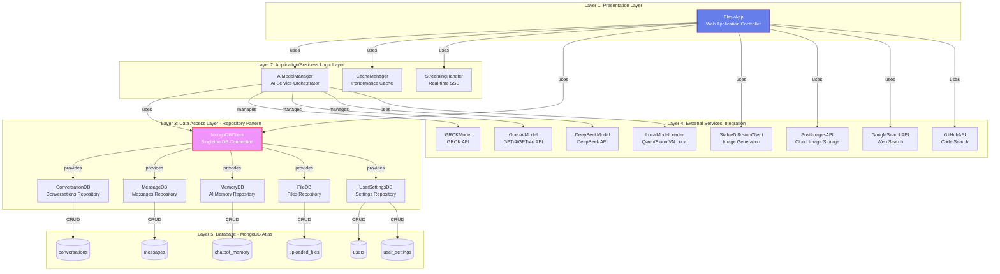
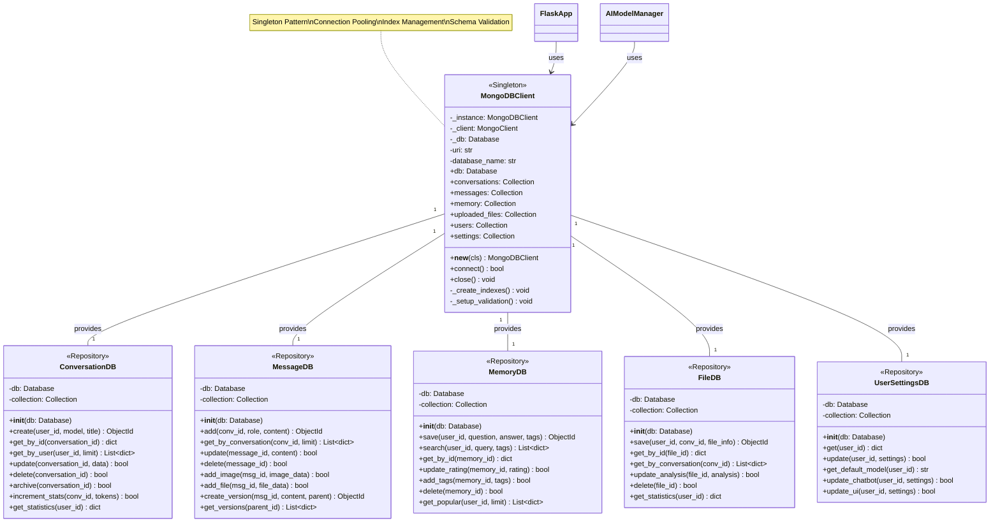
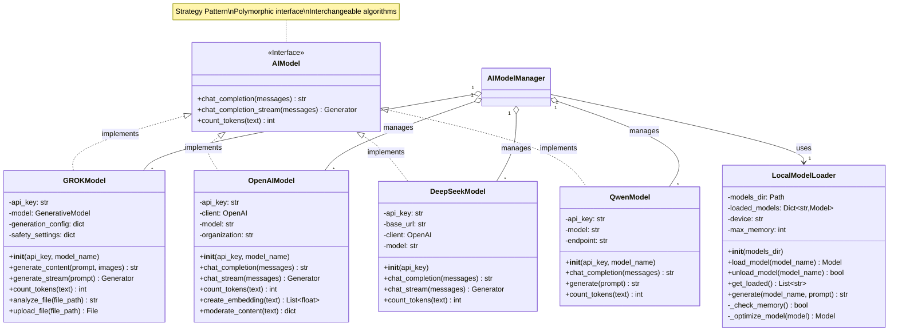
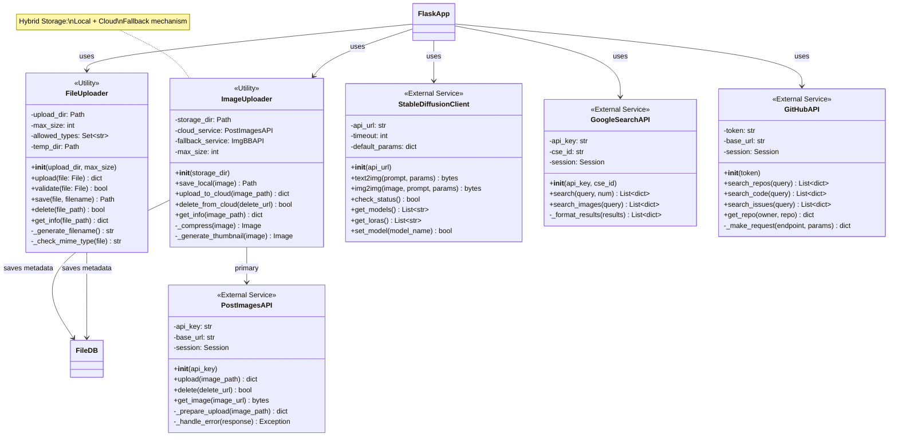
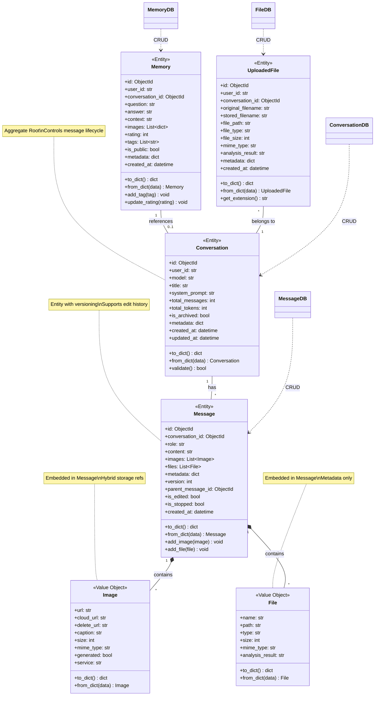

# 4️⃣ CLASS DIAGRAM - ChatBot Service với MongoDB

> **Biểu đồ lớp hệ thống ChatBot AI-Assistant**  
> Cấu trúc OOP với MongoDB integration và AI model management

---

## 📋 Mô tả

Class Diagram thể hiện:
- **Core Classes:** Flask app, MongoDB client, AI models
- **Database Helpers:** ConversationDB, MessageDB, MemoryDB, FileDB
- **Utilities:** Cache, Streaming, File upload, Image upload
- **Relationships:** Inheritance, Composition, Aggregation

---

## 🎯 Kiến trúc phân lớp (Layered Architecture)

```
┌─────────────────────────────────────────────────────────────────┐
│                   PRESENTATION LAYER                            │
│                     (Flask Web App)                             │
└─────────────────────────────────────────────────────────────────┘
                              ↓
┌─────────────────────────────────────────────────────────────────┐
│                   APPLICATION LAYER                             │
│          (Business Logic & Service Orchestration)               │
└─────────────────────────────────────────────────────────────────┘
                              ↓
┌─────────────────────────────────────────────────────────────────┐
│                   DATA ACCESS LAYER                             │
│              (Repository Pattern - MongoDB)                     │
└─────────────────────────────────────────────────────────────────┘
                              ↓
┌─────────────────────────────────────────────────────────────────┐
│                   DATABASE LAYER                                │
│                  (MongoDB Atlas - 6 Collections)                │
└─────────────────────────────────────────────────────────────────┘
```

---

## 📊 ROOT LEVEL - System Architecture Overview

### Tổng quan hệ thống theo các layer



---

## 🔷 LEVEL 1 - Presentation Layer (Flask Web App)

### FlaskApp - Main Application Controller

```mermaid
classDiagram
    class FlaskApp {
        <<Controller>>
        -app: Flask
        -secret_key: str
        -mongodb_client: MongoDBClient
        -model_manager: AIModelManager
        -cache: CacheManager
        -streaming: StreamingHandler
        -static_folder: Path
        
        +__init__()
        +setup_routes() void
        +run(host: str, port: int, debug: bool) void
        +before_request() void
        +after_request(response) Response
        
        %% Route handlers
        +index() str
        +chat() dict
        +upload_file() dict
        +generate_image() dict
        +save_memory() dict
        +export_pdf() bytes
    }
    
    class Flask {
        <<Framework>>
        +route(path, methods)
        +before_request(func)
        +after_request(func)
        +run(host, port, debug)
    }
    
    FlaskApp --> Flask : inherits/uses
    
    note for FlaskApp "Entry point của application\nXử lý HTTP requests/responses\nOrchestrate business logic"
```



**Vai trò:**
- ✅ Entry point của toàn bộ hệ thống
- ✅ Route HTTP requests đến đúng handlers
- ✅ Orchestrate các services (AI, DB, Cache)
- ✅ Return JSON responses cho frontend

**File thực tế:** `ChatBot/app.py`

---

## 🔷 LEVEL 1.1 - Application Layer (Business Logic & Services)

### Core Services

```mermaid
classDiagram
    class AIModelManager {
        <<Service>>
        -models: Dict~str,AIModel~
        -current_model: str
        -api_keys: Dict~str,str~
        
        +__init__()
        +switch_model(model_name: str) bool
        +get_available_models() List~str~
        +chat(messages: List, model: str, temp: float) str
        +chat_stream(messages: List, model: str) Generator
        +get_model_info(model_name: str) dict
        -_validate_model(model_name: str) bool
    }
    
    class CacheManager {
        <<Service>>
        -cache: Dict~str,CacheEntry~
        -ttl: int
        -enabled: bool
        -max_size: int
        
        +__init__(ttl: int)
        +get(key: str) any
        +set(key: str, value: any, ttl: int) void
        +delete(key: str) void
        +clear() void
        +get_stats() dict
        -_cleanup_expired() void
    }
    
    class StreamingHandler {
        <<Service>>
        -chunk_size: int
        -active_streams: Dict~str,Stream~
        
        +__init__(chunk_size: int)
        +stream_response(generator: Generator) Generator
        +create_sse_message(data: dict) str
        +handle_stop_signal(stream_id: str) void
        +get_active_count() int
    }
    
    FlaskApp --> AIModelManager : uses
    FlaskApp --> CacheManager : uses
    FlaskApp --> StreamingHandler : uses
    
    note for AIModelManager "Factory Pattern\nQuản lý 8+ AI models\nDynamic model switching"
    note for CacheManager "Singleton Pattern\nReduce API latency\nTTL-based expiration"
    note for StreamingHandler "Observer Pattern\nServer-Sent Events\nReal-time streaming"
```



---

## 🔷 LEVEL 2 - Data Access Layer (Repository Pattern)

### MongoDB Client & Repositories



**File thực tế:** 
- `ChatBot/config/mongodb_config.py`
- `ChatBot/config/mongodb_helpers.py`

---

## 🔷 LEVEL 3 - AI Models Integration Layer

### AI Service Providers



**Supported Models:**
- GROK: `grok-3`
- OpenAI: `gpt-4o`, `gpt-4o-mini`, `gpt-4-turbo`
- DeepSeek: `deepseek-chat`, `deepseek-coder`
- Qwen: `qwen-turbo`, `qwen-plus`
- Local: `Qwen2.5-14B-Instruct`, `BloomVN-8B-chat`

---

## 🔷 LEVEL 4 - Utility & Helper Services

### File Management & Cloud Services



---

## 🔷 LEVEL 5 - Domain Models (Data Entities)

### MongoDB Document Models



---

## 📊 Chi tiết Classes

### 1️⃣ Core Application Classes

#### FlaskApp
**Vai trò:** Main application controller

```python
class FlaskApp:
    def __init__(self):
        self.app = Flask(__name__)
        self.mongodb_client = MongoDBClient()
        self.model_manager = AIModelManager()
        self.cache = CacheManager()
        self.streaming = StreamingHandler()
        
    def setup_routes(self):
        """Register all routes"""
        @self.app.route('/')
        def index():
            return render_template('index.html')
            
        @self.app.route('/api/chat', methods=['POST'])
        def chat():
            # Handle chat request
            pass
```

**File thực tế:** `ChatBot/app.py`

---

#### MongoDBClient (Singleton)
**Vai trò:** Database connection và collection management

```python
class MongoDBClient:
    _instance = None
    
    def __new__(cls):
        if cls._instance is None:
            cls._instance = super().__new__(cls)
        return cls._instance
    
    def connect(self) -> bool:
        """Establish MongoDB connection"""
        self._client = MongoClient(MONGODB_URI, server_api=ServerApi('1'))
        self._db = self._client[DATABASE_NAME]
        self._create_indexes()
        return True
    
    def _create_indexes(self):
        """Create indexes for performance"""
        self.conversations.create_index([("user_id", 1)])
        self.conversations.create_index([("created_at", -1)])
        # ... more indexes
```

**File thực tế:** `ChatBot/config/mongodb_config.py`

---

### 2️⃣ Database Helper Classes

#### ConversationDB
**Vai trò:** CRUD operations cho conversations collection

```python
class ConversationDB:
    def create_conversation(
        self, 
        user_id: str, 
        model: str, 
        title: str = "New Chat"
    ) -> ObjectId:
        """Create new conversation"""
        doc = {
            "user_id": user_id,
            "model": model,
            "title": title,
            "total_messages": 0,
            "total_tokens": 0,
            "is_archived": False,
            "created_at": datetime.utcnow(),
            "updated_at": datetime.utcnow()
        }
        result = self.collection.insert_one(doc)
        return result.inserted_id
    
    def get_user_conversations(
        self, 
        user_id: str, 
        limit: int = 20
    ) -> List[dict]:
        """Get user's conversations (latest first)"""
        return list(
            self.collection
            .find({"user_id": user_id, "is_archived": False})
            .sort("updated_at", -1)
            .limit(limit)
        )
```

**File thực tế:** `ChatBot/config/mongodb_helpers.py`

---

#### MessageDB
**Vai trò:** CRUD operations cho messages collection

```python
class MessageDB:
    def add_message(
        self,
        conversation_id: ObjectId,
        role: str,
        content: str,
        images: List[dict] = None,
        files: List[dict] = None,
        metadata: dict = None
    ) -> ObjectId:
        """Add message to conversation"""
        doc = {
            "conversation_id": conversation_id,
            "role": role,  # 'user' or 'assistant'
            "content": content,
            "images": images or [],
            "files": files or [],
            "metadata": metadata or {},
            "version": 1,
            "is_edited": False,
            "is_stopped": False,
            "created_at": datetime.utcnow()
        }
        result = self.collection.insert_one(doc)
        return result.inserted_id
    
    def edit_message(
        self,
        message_id: ObjectId,
        new_content: str,
        parent_id: ObjectId = None
    ) -> ObjectId:
        """Edit message (create new version)"""
        # Get original message
        original = self.collection.find_one({"_id": message_id})
        
        # Create new version
        new_doc = original.copy()
        new_doc.pop("_id")
        new_doc["content"] = new_content
        new_doc["version"] = original.get("version", 1) + 1
        new_doc["parent_message_id"] = parent_id or message_id
        new_doc["is_edited"] = True
        new_doc["created_at"] = datetime.utcnow()
        
        result = self.collection.insert_one(new_doc)
        return result.inserted_id
```

**File thực tế:** `ChatBot/config/mongodb_helpers.py`

---

#### MemoryDB
**Vai trò:** AI learning và memory management

```python
class MemoryDB:
    def save_memory(
        self,
        user_id: str,
        question: str,
        answer: str,
        tags: List[str] = None,
        rating: int = 0,
        conversation_id: ObjectId = None
    ) -> ObjectId:
        """Save conversation to memory"""
        doc = {
            "user_id": user_id,
            "conversation_id": conversation_id,
            "question": question,
            "answer": answer,
            "tags": tags or [],
            "rating": rating,
            "is_public": False,
            "created_at": datetime.utcnow()
        }
        result = self.collection.insert_one(doc)
        return result.inserted_id
    
    def search_memory(
        self,
        user_id: str,
        query: str = None,
        tags: List[str] = None,
        limit: int = 10
    ) -> List[dict]:
        """Search memories by query/tags"""
        filter_query = {"user_id": user_id}
        
        if tags:
            filter_query["tags"] = {"$in": tags}
        
        if query:
            # Text search
            filter_query["$text"] = {"$search": query}
        
        return list(
            self.collection
            .find(filter_query)
            .sort("created_at", -1)
            .limit(limit)
        )
```

**File thực tế:** `ChatBot/config/mongodb_helpers.py`

---

### 3️⃣ AI Model Classes

#### AIModelManager
**Vai trò:** Manage multiple AI models

```python
class AIModelManager:
    def __init__(self):
        self.models = {
            'grok-3': GROKModel(api_key=GROK_API_KEY),
            'grok-3-pro': GROKModel(api_key=GROK_API_KEY, model='grok-3'),,
            'gpt-4o': OpenAIModel(api_key=OPENAI_API_KEY, model='gpt-4o'),
            'gpt-4o-mini': OpenAIModel(api_key=OPENAI_API_KEY, model='gpt-4o-mini'),
            'deepseek-chat': DeepSeekModel(api_key=DEEPSEEK_API_KEY),
            'qwen-turbo': QwenModel(api_key=QWEN_API_KEY),
            # Local models
            'qwen-local': LocalModelLoader().load_model('Qwen2.5-14B-Instruct'),
            'bloom-vn': LocalModelLoader().load_model('BloomVN-8B-chat')
        }
        self.current_model = 'grok-3'
    
    def chat(
        self,
        messages: List[dict],
        model: str = None,
        temperature: float = 0.7,
        stream: bool = False
    ) -> Union[str, Generator]:
        """Chat with specified model"""
        model_name = model or self.current_model
        model_instance = self.models.get(model_name)
        
        if not model_instance:
            raise ValueError(f"Model {model_name} not found")
        
        if stream:
            return model_instance.chat_completion_stream(messages)
        else:
            return model_instance.chat_completion(messages)
```

**File thực tế:** `ChatBot/src/model_manager.py` (cần tạo)

---

#### GROKModel
**Vai trò:** GROK API wrapper

```python
class GROKModel:
    def __init__(self, api_key: str, model: str = 'grok-3'):
        genai.configure(api_key=api_key)
        self.model = genai.GenerativeModel(model)
        self.generation_config = {
            'temperature': 0.7,
            'top_p': 0.95,
            'top_k': 40,
            'max_output_tokens': 8192
        }
    
    def generate_content(
        self,
        prompt: str,
        images: List[Image] = None
    ) -> str:
        """Generate content with text/images"""
        if images:
            response = self.model.generate_content([prompt] + images)
        else:
            response = self.model.generate_content(prompt)
        return response.text
    
    def generate_content_stream(self, prompt: str) -> Generator:
        """Stream generated content"""
        response = self.model.generate_content(
            prompt,
            generation_config=self.generation_config,
            stream=True
        )
        for chunk in response:
            if chunk.text:
                yield chunk.text
    
    def analyze_file(self, file_path: str) -> str:
        """Analyze uploaded file"""
        # Upload file to GROK
        uploaded_file = genai.upload_file(file_path)
        
        # Generate analysis
        response = self.model.generate_content([
            "Analyze this file and provide a detailed summary:",
            uploaded_file
        ])
        
        return response.text
```

**File thực tế:** Integrated in `ChatBot/app.py`

---

### 4️⃣ Utility Classes

#### CacheManager
**Vai trò:** Response caching cho performance

```python
class CacheManager:
    def __init__(self, ttl: int = 3600):
        self.cache = {}
        self.ttl = ttl
        self.enabled = True
    
    def get(self, key: str) -> any:
        """Get cached value"""
        if not self.enabled:
            return None
        
        entry = self.cache.get(key)
        if not entry:
            return None
        
        # Check expiration
        if datetime.now() > entry['expires']:
            del self.cache[key]
            return None
        
        return entry['value']
    
    def set(self, key: str, value: any, ttl: int = None):
        """Set cached value"""
        if not self.enabled:
            return
        
        self.cache[key] = {
            'value': value,
            'expires': datetime.now() + timedelta(seconds=ttl or self.ttl)
        }
```

**File thực tế:** `ChatBot/src/utils/cache_manager.py`

---

#### ImageUploader
**Vai trò:** Image upload to local + cloud

```python
class ImageUploader:
    def __init__(self, storage_dir: Path):
        self.storage_dir = storage_dir
        self.cloud_service = PostImagesAPI()
    
    def save_local(self, image: bytes, filename: str) -> Path:
        """Save image to local storage"""
        file_path = self.storage_dir / filename
        with open(file_path, 'wb') as f:
            f.write(image)
        return file_path
    
    def upload_to_cloud(self, image_path: Path) -> dict:
        """Upload image to PostImages"""
        result = self.cloud_service.upload(str(image_path))
        return {
            'url': str(image_path),
            'cloud_url': result['url'],
            'delete_url': result['delete_url'],
            'service': 'postimages',
            'size': image_path.stat().st_size
        }
```

**File thực tế:** `ChatBot/src/utils/imgbb_uploader.py` (tương tự)

---

## 🔗 Relationships

### Inheritance (Kế thừa)
Không có inheritance hierarchy phức tạp - sử dụng composition instead

### Composition (Has-A - Chặt)
```
FlaskApp HAS MongoDBClient (1:1)
FlaskApp HAS AIModelManager (1:1)
FlaskApp HAS CacheManager (1:1)
MongoDBClient HAS ConversationDB (1:1)
MongoDBClient HAS MessageDB (1:1)
AIModelManager HAS GROKModel (1:N)
Message HAS Image (1:N)
Message HAS File (1:N)
```

### Aggregation (Uses-A - Lỏng)
```
ConversationDB USES Conversation (CRUD)
MessageDB USES Message (CRUD)
MemoryDB USES Memory (CRUD)
ImageUploader USES PostImagesAPI (upload)
FlaskApp USES StableDiffusionClient (tool)
FlaskApp USES GoogleSearchAPI (tool)
```

---

## 📈 Design Patterns

| Pattern | Sử dụng ở đâu | Mục đích |
|:--------|:--------------|:---------|
| **Singleton** | MongoDBClient | Đảm bảo chỉ 1 DB connection |
| **Factory** | AIModelManager | Create AI model instances |
| **Strategy** | AI Models (GROK/GPT/DeepSeek) | Interchangeable algorithms |
| **Repository** | ConversationDB, MessageDB, MemoryDB | Data access abstraction |
| **Facade** | FlaskApp | Simplified interface to complex subsystems |
| **Decorator** | Flask @route decorators | Add functionality to routes |
| **Observer** | StreamingHandler | Real-time updates (SSE) |

---

## 🚀 Class Interaction Example

### Scenario: User chats với AI và save to memory

```python
# 1. User sends message
@app.route('/api/chat', methods=['POST'])
def chat():
    # 2. Get or create conversation
    conv_db = ConversationDB(mongodb_client.db)
    conversation_id = conv_db.create_conversation(
        user_id=session['user_id'],
        model='grok-3',
        title='AI Chat'
    )
    
    # 3. Save user message
    msg_db = MessageDB(mongodb_client.db)
    msg_db.add_message(
        conversation_id=conversation_id,
        role='user',
        content=request.json['message']
    )
    
    # 4. Get AI response
    model_manager = AIModelManager()
    response = model_manager.chat(
        messages=[{'role': 'user', 'content': request.json['message']}],
        model='grok-3'
    )
    
    # 5. Save AI response
    msg_db.add_message(
        conversation_id=conversation_id,
        role='assistant',
        content=response
    )
    
    # 6. Update conversation stats
    conv_db.increment_message_count(
        conversation_id=conversation_id,
        tokens=count_tokens(response)
    )
    
    # 7. Save to memory (if user clicks "Save")
    memory_db = MemoryDB(mongodb_client.db)
    memory_db.save_memory(
        user_id=session['user_id'],
        question=request.json['message'],
        answer=response,
        tags=['ai-chat'],
        conversation_id=conversation_id
    )
    
    return jsonify({'response': response})
```

---

<div align="center">

**Total Classes:** 30+  
**Design Patterns:** 7  
**Database Collections:** 6

[⬅️ Back: Use Case Diagram](03_usecase_diagram.md) | [➡️ Next: ER Diagram](05_er_diagram.md)

</div>
