# 6️⃣ MONGODB DATA STRUCTURE - NoSQL Schema Design

> **Cấu trúc dữ liệu NoSQL cho ChatBot Database**  
> Document schema, embedding strategies, và best practices

---

## 📋 Mô tả

Document này thể hiện:
- **Collection Schemas:** Chi tiết structure của 6 collections
- **Embedding vs Referencing:** Khi nào dùng embedded, khi nào dùng reference
- **Sample Documents:** Ví dụ thực tế với data
- **Schema Evolution:** Cách update schema khi có thay đổi

---

## 🎯 NoSQL vs SQL Comparison

| Aspect | SQL (PostgreSQL) | NoSQL (MongoDB) |
|:-------|:-----------------|:----------------|
| **Data Model** | Tables with rows | Collections with documents |
| **Schema** | Strict, predefined | Flexible, dynamic |
| **Relationships** | Foreign Keys | References or Embedding |
| **Joins** | Complex JOINs | $lookup aggregation |
| **Scalability** | Vertical (scale up) | Horizontal (scale out) |
| **Best For** | Complex transactions | Flexible, evolving schemas |

**Tại sao chọn MongoDB cho ChatBot:**
- ✅ Flexible schema - AI responses có structure khác nhau
- ✅ Easy scaling - Cloud-native MongoDB Atlas
- ✅ JSON-like documents - Dễ làm việc với APIs
- ✅ Rich query language - Aggregation pipeline
- ✅ Built-in replication - High availability

---

## 📊 Collection Schemas Chi Tiết

### 1️⃣ CONVERSATIONS Collection

**Purpose:** Lưu metadata của conversations (không chứa messages)

```javascript
{
  // Auto-generated
  "_id": ObjectId("673e5f8a9b1d2c3f4a5b6c7d"),
  
  // User identification (FK to USERS or session ID)
  "user_id": "anonymous_session_abc123",
  
  // Model configuration
  "model": "gemini-2.0-flash-thinking-exp",
  "system_prompt": "You are a helpful AI assistant...",
  
  // Conversation metadata
  "title": "Python Async Programming Tutorial",  // Auto-generated
  "total_messages": 24,
  "total_tokens": 12500,
  "is_archived": false,
  
  // Model parameters (embedded document)
  "metadata": {
    "temperature": 0.7,
    "max_tokens": 2048,
    "top_p": 0.95,
    "top_k": 40,
    "custom_settings": {
      "enable_tools": true,
      "enable_memory": true,
      "enable_image_gen": true
    }
  },
  
  // Timestamps
  "created_at": ISODate("2025-11-10T10:30:00.000Z"),
  "updated_at": ISODate("2025-11-10T12:45:00.000Z")
}
```

**Indexes:**
```javascript
db.conversations.createIndex({"user_id": 1})
db.conversations.createIndex({"created_at": -1})
db.conversations.createIndex({"is_archived": 1})
db.conversations.createIndex({"user_id": 1, "updated_at": -1})  // Compound
```

**Size estimation:** ~500 bytes/document

**Design decisions:**
- ❌ **NOT embedding messages** - Conversations có thể có 100+ messages
- ✅ **Embedding metadata** - Nhỏ, rarely queried separately
- ✅ **Reference user_id** - Flexible (session ID or real user)

---

### 2️⃣ MESSAGES Collection

**Purpose:** Lưu tất cả messages (user + assistant) với images/files

```javascript
{
  "_id": ObjectId("673e5f8a9b1d2c3f4a5b6c7e"),
  
  // Reference to conversation
  "conversation_id": ObjectId("673e5f8a9b1d2c3f4a5b6c7d"),
  
  // Message content
  "role": "assistant",  // 'user', 'assistant', 'system'
  "content": "Here's how to use async/await in Python:\n\n```python\nimport asyncio\n\nasync def fetch_data():\n    await asyncio.sleep(1)\n    return 'Data'\n```",
  
  // Embedded images array (0-N images per message)
  "images": [
    {
      "url": "/static/Storage/Image_Gen/img_20251110_abc123.png",
      "cloud_url": "https://i.postimg.cc/xyz789/img_20251110_abc123.png",
      "delete_url": "https://postimg.cc/delete/abc123xyz",
      "caption": "Python async diagram",
      "size": 245680,  // bytes
      "mime_type": "image/png",
      "generated": true,  // AI-generated vs uploaded
      "service": "postimages"  // 'postimages', 'imgbb', 'local'
    }
  ],
  
  // Embedded files array (0-N files per message)
  "files": [
    {
      "name": "async_example.py",
      "path": "/Storage/uploads/upload_20251110_def456_async_example.py",
      "type": "py",
      "size": 2048,
      "mime_type": "text/x-python",
      "analysis_result": "This Python file demonstrates async/await usage..."
    }
  ],
  
  // Generation metadata (embedded document)
  "metadata": {
    "model": "gemini-2.0-flash-thinking-exp",
    "tokens": 450,
    "temperature": 0.7,
    "finish_reason": "stop",  // 'stop', 'length', 'interrupted'
    "generation_time_ms": 2350,
    "thinking_time_ms": 800  // For thinking models
  },
  
  // Message versioning (for edit feature)
  "version": 1,
  "parent_message_id": null,  // ObjectId if this is edited version
  "is_edited": false,
  "is_stopped": false,  // User stopped generation
  
  // Timestamp
  "created_at": ISODate("2025-11-10T10:31:15.000Z")
}
```

**Indexes:**
```javascript
db.messages.createIndex({"conversation_id": 1})
db.messages.createIndex({"created_at": -1})
db.messages.createIndex({"role": 1})
db.messages.createIndex({"parent_message_id": 1})  // For versioning
```

**Size estimation:** ~1 KB/message (without images), ~2 KB (with images)

**Design decisions:**
- ✅ **Embedding images** - Images thuộc về message, luôn query cùng nhau
- ✅ **Embedding files** - File metadata nhỏ, content ở disk
- ✅ **Embedding metadata** - Thông tin generation không query riêng
- ✅ **Reference conversation_id** - Messages có thể rất nhiều (100+)
- ✅ **Message versioning** - parent_message_id cho edit history

---

### 3️⃣ CHATBOT_MEMORY Collection

**Purpose:** AI learning storage - lưu conversations quan trọng với tags

```javascript
{
  "_id": ObjectId("673e5f8a9b1d2c3f4a5b6c7f"),
  
  // User & conversation reference
  "user_id": "anonymous_session_abc123",
  "conversation_id": ObjectId("673e5f8a9b1d2c3f4a5b6c7d"),  // Optional
  
  // Q&A pair
  "question": "How to optimize Python async code for performance?",
  "answer": "Here are 5 techniques to optimize async Python code:\n1. Use asyncio.gather() for parallel tasks...",
  "context": "Discussion about Python asyncio performance optimization",
  
  // Embedded images (references to cloud URLs)
  "images": [
    {
      "url": "https://i.postimg.cc/xyz789/img_20251110_abc123.png",
      "caption": "Python async benchmark results",
      "relevance": "Shows performance comparison between sync vs async"
    }
  ],
  
  // User feedback
  "rating": 5,  // 1-5 stars
  "tags": ["python", "async", "performance", "optimization"],  // Array for filtering
  "is_public": false,  // Share with other users?
  
  // AI metadata (embedded)
  "metadata": {
    "model_used": "gemini-2.0-flash",
    "tokens": 380,
    "confidence_score": 0.95  // AI's confidence in answer
  },
  
  // Timestamp
  "created_at": ISODate("2025-11-10T10:35:00.000Z")
}
```

**Indexes:**
```javascript
db.chatbot_memory.createIndex({"user_id": 1})
db.chatbot_memory.createIndex({"conversation_id": 1})
db.chatbot_memory.createIndex({"tags": 1})  // Array index
db.chatbot_memory.createIndex({"created_at": -1})
db.chatbot_memory.createIndex({"rating": -1})

// Text search index for question/answer
db.chatbot_memory.createIndex({
  "question": "text",
  "answer": "text",
  "context": "text"
})
```

**Size estimation:** ~2 KB/memory

**Design decisions:**
- ✅ **Embedding images** - Ít images, query cùng memory
- ✅ **Array of tags** - Efficient filtering, indexable
- ✅ **Text search index** - Semantic search trong Q&A
- ✅ **Optional conversation_id** - Có thể lưu standalone memories

---

### 4️⃣ UPLOADED_FILES Collection

**Purpose:** Track uploaded files và AI analysis results

```javascript
{
  "_id": ObjectId("673e5f8a9b1d2c3f4a5b6c80"),
  
  // User & conversation reference
  "user_id": "anonymous_session_abc123",
  "conversation_id": ObjectId("673e5f8a9b1d2c3f4a5b6c7d"),
  
  // File identification
  "original_filename": "financial_report_Q4_2024.pdf",
  "stored_filename": "upload_20251110_abc123_financial_report_Q4_2024.pdf",
  "file_path": "ChatBot/Storage/uploads/upload_20251110_abc123_financial_report_Q4_2024.pdf",
  
  // File properties
  "file_type": "pdf",
  "file_size": 2456789,  // bytes
  "mime_type": "application/pdf",
  
  // AI analysis result (can be very long)
  "analysis_result": "This PDF contains a financial report for Q4 2024...\n\n**Key Findings:**\n- Revenue: $5.2M (+15% YoY)\n- Expenses: $3.1M (+8% YoY)...",
  
  // Processing metadata (embedded)
  "metadata": {
    "upload_time_ms": 450,
    "analysis_time_ms": 3200,
    "model_used": "gemini-2.0-flash",
    "extracted_text": "Q4 2024 Financial Report\n\nRevenue: $5,200,000...",  // Full OCR text
    "page_count": 5,
    "dimensions": null,  // For images: {width: 1920, height: 1080}
    "language": "en"
  },
  
  // Timestamp
  "created_at": ISODate("2025-11-10T10:32:00.000Z")
}
```

**Indexes:**
```javascript
db.uploaded_files.createIndex({"user_id": 1})
db.uploaded_files.createIndex({"conversation_id": 1})
db.uploaded_files.createIndex({"created_at": -1})
db.uploaded_files.createIndex({"file_type": 1})
```

**Size estimation:** ~5-10 KB/file (với extracted_text)

**Design decisions:**
- ✅ **Embedding metadata** - All file info query cùng nhau
- ✅ **Storing analysis_result** - Để reuse, không generate lại
- ⚠️ **extracted_text có thể rất lớn** - Consider GridFS cho files >16MB
- ✅ **Reference to conversation** - Files belong to specific chat

---

### 5️⃣ USERS Collection (Optional - Future)

**Purpose:** User authentication và profile management

```javascript
{
  "_id": ObjectId("673e5f8a9b1d2c3f4a5b6c81"),
  
  // Authentication
  "username": "john_doe",  // Unique
  "email": "john@example.com",  // Unique
  "password_hash": "$2b$12$KIXvZ8bZ...",  // Bcrypt hashed
  
  // Profile
  "full_name": "John Doe",
  "avatar_url": "https://i.postimg.cc/avatar_john.png",
  
  // Role & permissions
  "role": "user",  // 'user', 'admin', 'developer'
  "is_active": true,
  "api_quota_daily": 100,  // API calls per day
  
  // User preferences (embedded)
  "preferences": {
    "default_model": "gemini-2.0-flash",
    "theme": "dark",  // 'dark', 'light'
    "language": "vi",  // 'vi', 'en'
    "auto_save": true,
    "notifications_enabled": true
  },
  
  // Timestamps & tracking
  "created_at": ISODate("2025-11-01T08:00:00.000Z"),
  "last_login": ISODate("2025-11-10T10:30:00.000Z"),
  "last_ip": "192.168.1.100"
}
```

**Indexes:**
```javascript
db.users.createIndex({"username": 1}, {unique: true})
db.users.createIndex({"email": 1}, {unique: true})
db.users.createIndex({"created_at": -1})
```

**Size estimation:** ~500 bytes/user

**Design decisions:**
- ✅ **Embedding preferences** - Always queried together
- ✅ **Unique indexes** - Ensure username/email uniqueness
- 🚧 **Currently optional** - Using session IDs instead

---

### 6️⃣ USER_SETTINGS Collection

**Purpose:** User-specific settings và configurations

```javascript
{
  "_id": ObjectId("673e5f8a9b1d2c3f4a5b6c82"),
  
  // Reference to user (1:1 relationship)
  "user_id": "john_doe",  // Unique
  
  // ChatBot settings (embedded)
  "chatbot_settings": {
    "default_model": "gemini-2.0-flash-thinking-exp",
    "temperature": 0.7,
    "max_tokens": 2048,
    "system_prompt": "You are a helpful AI assistant...",
    "enable_memory": true,
    "enable_tools": true,
    "enable_image_gen": true,
    "auto_save_conversations": true
  },
  
  // UI settings (embedded)
  "ui_settings": {
    "theme": "dark",
    "font_size": "medium",  // 'small', 'medium', 'large'
    "code_theme": "dracula",
    "show_tokens": true,
    "auto_scroll": true,
    "compact_mode": false
  },
  
  // Notification settings (embedded)
  "notification_settings": {
    "enable_notifications": true,
    "email_notifications": false,
    "desktop_notifications": true
  },
  
  // Timestamp
  "updated_at": ISODate("2025-11-10T12:00:00.000Z")
}
```

**Indexes:**
```javascript
db.user_settings.createIndex({"user_id": 1}, {unique: true})
```

**Size estimation:** ~300 bytes/settings

**Design decisions:**
- ✅ **Embedding all settings** - Always loaded together
- ✅ **Unique user_id** - 1:1 relationship with USERS
- ✅ **Flexible structure** - Easy to add new settings

---

## 🔄 Embedding vs Referencing Decision Tree

```mermaid
graph TD
    Start[Data Relationship] --> Question1{Data size?}
    Question1 -->|Small <1KB| Embed
    Question1 -->|Large >16MB| GridFS
    Question1 -->|Medium 1KB-1MB| Question2{Query pattern?}
    
    Question2 -->|Always together| Embed
    Question2 -->|Separately| Reference
    
    Question3{Cardinality?}
    Question3 -->|1:Few| Embed
    Question3 -->|1:Many| Reference
    
    Question4{Update frequency?}
    Question4 -->|Rarely| Embed
    Question4 -->|Frequently| Reference
    
    Embed[✅ Embed Document]
    Reference[✅ Use Reference ObjectId]
    GridFS[✅ Use GridFS]
```



### Examples trong ChatBot:

| Relationship | Decision | Reason |
|:-------------|:---------|:-------|
| **Conversation → Messages** | ❌ Reference | 1:Many (100+ messages), large size |
| **Message → Images** | ✅ Embed | 1:Few (0-5 images), always query together |
| **Message → Metadata** | ✅ Embed | 1:1, small, rarely updated |
| **User → Settings** | ✅ Embed (in USERS) hoặc Reference | Both valid, trade-offs |
| **Memory → Tags** | ✅ Embed (array) | 1:Few, need indexing |
| **Conversation → User** | ❌ Reference | Many:1 relationship |

---

## 📈 Schema Evolution Strategy

### Scenario 1: Thêm field mới vào existing documents

**Problem:** Muốn thêm `language` field vào CONVERSATIONS

**Solution:**
```javascript
// 1. Update schema validation (optional)
db.runCommand({
  collMod: "conversations",
  validator: {
    $jsonSchema: {
      properties: {
        language: {bsonType: "string", enum: ["vi", "en", "ja"]}
      }
    }
  }
})

// 2. Update existing documents với default value
db.conversations.updateMany(
  {language: {$exists: false}},  // Documents không có language field
  {$set: {language: "en"}}  // Set default
)

// 3. New documents sẽ có field này từ app code
```

**Impact:** ✅ Minimal - MongoDB flexible schema

---

### Scenario 2: Rename field

**Problem:** Đổi `total_messages` → `message_count`

**Solution:**
```javascript
db.conversations.updateMany(
  {},
  {$rename: {"total_messages": "message_count"}}
)
```

---

### Scenario 3: Change embedded structure

**Problem:** Muốn chuyển `metadata` từ flat → nested

**Before:**
```javascript
{
  "metadata": {
    "temperature": 0.7,
    "max_tokens": 2048
  }
}
```

**After:**
```javascript
{
  "metadata": {
    "generation": {
      "temperature": 0.7,
      "max_tokens": 2048
    }
  }
}
```

**Solution:**
```javascript
db.conversations.updateMany(
  {},
  [{
    $set: {
      "metadata.generation": {
        temperature: "$metadata.temperature",
        max_tokens: "$metadata.max_tokens"
      }
    }
  }]
)
```

---

### Scenario 4: Split collection

**Problem:** MESSAGES collection quá lớn, muốn tách images sang riêng

**Solution:**
```javascript
// 1. Create new IMAGES collection
db.createCollection("images")

// 2. Extract images from messages
db.messages.aggregate([
  {$unwind: "$images"},
  {$project: {
    message_id: "$_id",
    url: "$images.url",
    cloud_url: "$images.cloud_url",
    // ... other image fields
  }},
  {$out: "images"}
])

// 3. Update messages to reference images
db.messages.updateMany(
  {},
  {$set: {image_ids: []}}  // Replace images array with ObjectId array
)
```

**Trade-offs:**
- ✅ Smaller message documents
- ❌ Need $lookup to fetch images
- ❌ More complex queries

**Recommendation:** ⚠️ Chỉ làm khi thực sự cần thiết!

---

## 🎯 Best Practices Summary

### ✅ DO:

1. **Embed when:**
   - Data always accessed together
   - Small, bounded arrays (< 100 items)
   - Rarely updated independently

2. **Reference when:**
   - Data can grow unbounded (messages, files)
   - Accessed separately
   - Many-to-many relationships

3. **Index wisely:**
   - Fields used in queries
   - Fields used in sorting
   - Compound indexes for common query patterns

4. **Use projections:**
   - Only fetch needed fields
   - Reduce network transfer

5. **Monitor performance:**
   - Use `explain()` to analyze queries
   - Check index usage with `hint()`

### ❌ DON'T:

1. **Embed large arrays** (>100 items)
2. **Create too many indexes** (slows writes)
3. **Store large files in documents** (use GridFS)
4. **Normalize like SQL** (embrace denormalization)
5. **Forget to validate user input** (prevent injection)

---

<div align="center">

**Schema Version:** 1.0  
**Last Updated:** 2025-11-10  
**MongoDB Version:** 7.0+

[⬅️ Back: ER Diagram](05_er_diagram.md) | [➡️ Next: Image Storage](07_image_storage_design.md)

</div>
