# 📊 Flowchart Drawing Standards & Guidelines

> **Comprehensive guide for creating professional flowcharts**  
> **Version:** 1.0.0  
> **Updated:** November 6, 2025

---

## 📋 Table of Contents

1. [Introduction](#-introduction)
2. [Basic Flowchart Symbols](#-basic-flowchart-symbols)
3. [Design Principles](#-design-principles)
4. [Naming Conventions](#-naming-conventions)
5. [Layout Guidelines](#-layout-guidelines)
6. [Mermaid Syntax Guide](#-mermaid-syntax-guide)
7. [Best Practices](#-best-practices)
8. [Common Patterns](#-common-patterns)
9. [Anti-Patterns (What to Avoid)](#-anti-patterns-what-to-avoid)
10. [Tools & Resources](#-tools--resources)

---

## 🎯 Introduction

### Purpose

Flowcharts are visual representations of processes, workflows, and algorithms. This guide establishes standards for creating clear, consistent, and professional flowcharts in the AI-Assistant project.

### When to Use Flowcharts

- ✅ **Process Documentation** - Business workflows, approval processes
- ✅ **Algorithm Design** - Decision trees, logical flows
- ✅ **System Architecture** - Data flow, component interactions
- ✅ **Troubleshooting** - Debugging paths, error handling
- ✅ **Onboarding** - User journeys, feature walkthroughs

### When NOT to Use Flowcharts

- ❌ **Simple Linear Processes** - Use bullet lists instead
- ❌ **Complex Data Structures** - Use ER diagrams or class diagrams
- ❌ **Time-based Sequences** - Use sequence diagrams
- ❌ **Organizational Structure** - Use org charts

---

## 🔷 Basic Flowchart Symbols

### Standard Shapes & Their Meanings

| Shape | Symbol | Purpose | Usage |
|-------|--------|---------|-------|
| **Terminal** |  | Start/End points | Begin/terminate process |
| **Process** |  | Operations/Actions | Any processing step |
| **Decision** |  | Conditional branches | Yes/No, True/False |
| **Input/Output** |  | Data I/O | User input, file read/write |
| **Subprocess** |  | Predefined process | Call to another flowchart |
| **Document** |  | Document/Report | Generate report, print |
| **Database** |  | Database operation | Query, insert, update |
| **Connector** |  | On-page connector | Link separated flows |
| **Off-page** |  | Off-page connector | Continue on another page |

### Arrows & Flow Lines

```
→   Normal flow (left to right)
↓   Sequential flow (top to bottom)
⤴   Return/Loop back
--→ Dotted line (optional or error path)
==→ Bold line (primary path)
```

---

## 🎨 Design Principles

### 1. **Clarity Over Complexity**

**Good:**
```
Start → Process → Decision → End
```

**Bad:**
```
Start → Process1 → Process2 → Process3 → SubProcess1 → SubProcess2 → Decision1 → Decision2 → Decision3 → ...
```

**Rule:** If flowchart has more than 15 nodes, split into multiple diagrams.

---

### 2. **Consistent Flow Direction**

**Top to Bottom (Preferred):**
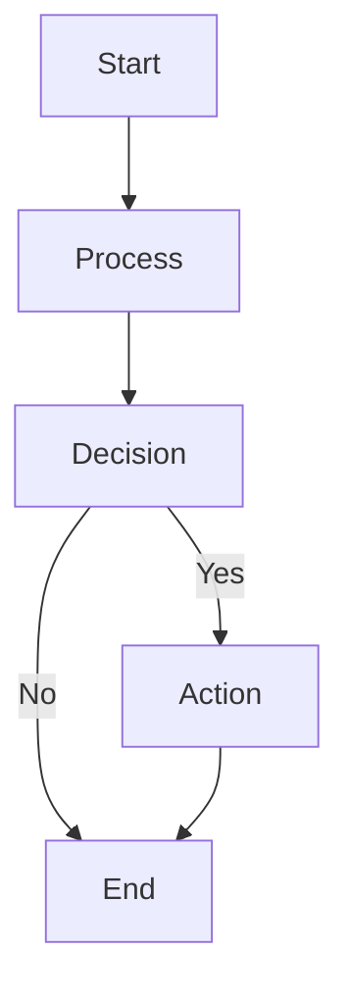

**Left to Right (Alternative):**
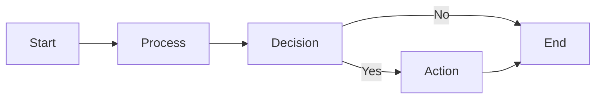

**Rule:** Choose ONE direction per diagram. Don't mix.

---

### 3. **Decision Nodes Always Binary**

**Good:**
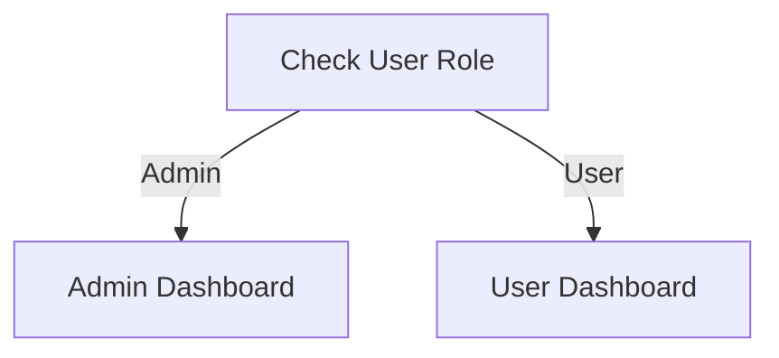

**Bad:**
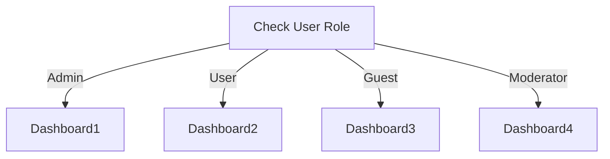

**Rule:** Use multiple decision nodes for multi-way branching.

**Better:**
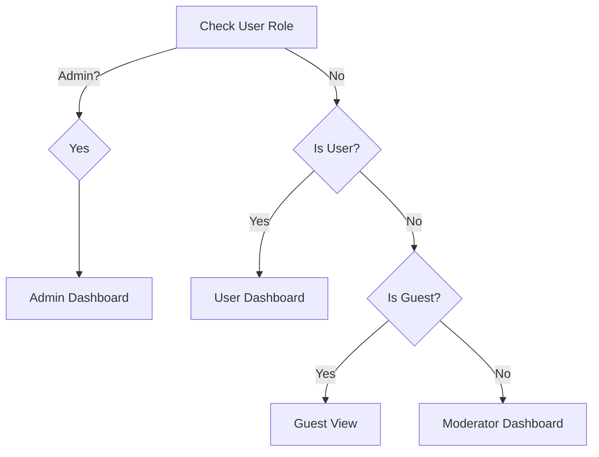

---

### 4. **Labels Must Be Actionable**

**Good:**
```
✅ "Validate Input"
✅ "Send Email Notification"
✅ "Calculate Total Price"
✅ "Query Database"
```

**Bad:**
```
❌ "Validation"
❌ "Email"
❌ "Price"
❌ "Database"
```

**Rule:** Use **Verb + Noun** format for action nodes.

---

### 5. **Color Coding (Optional but Recommended)**

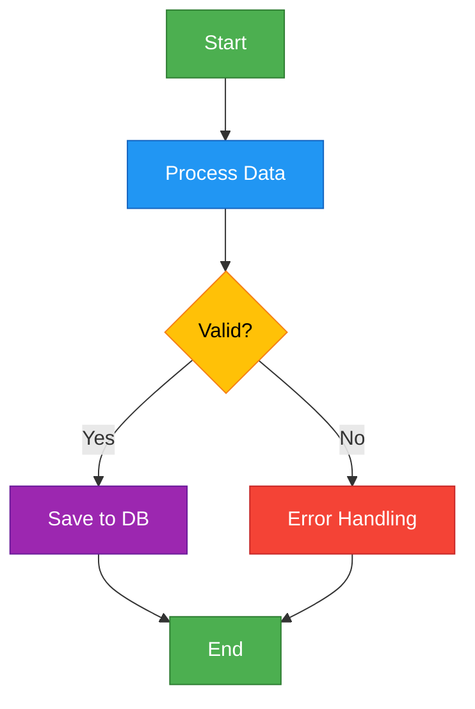

**Color Scheme:**
- 🟢 **Green** - Start/End
- 🔵 **Blue** - Process/Action
- 🟡 **Yellow** - Decision
- 🔴 **Red** - Error/Exception
- 🟣 **Purple** - Database/Storage
- 🟠 **Orange** - External API/Service

---

## 📝 Naming Conventions

### Node Labels

#### **Start/End Nodes**
```
✅ Start
✅ End
✅ Begin Process
✅ Terminate Workflow

❌ S, E
❌ Start Here!!!
❌ The Beginning
```

#### **Process Nodes**
```
Format: [Verb] + [Object] + [Context (optional)]

✅ Validate User Input
✅ Calculate Invoice Total
✅ Send Confirmation Email
✅ Update Database Record
✅ Generate PDF Report

❌ Validating...
❌ Calculation
❌ Email
```

#### **Decision Nodes**
```
Format: Question ending with "?"

✅ Is User Authenticated?
✅ Payment Successful?
✅ Age > 18?
✅ Has Permission?

❌ User Auth
❌ Check Payment
❌ Age Check
```

#### **Decision Branches**
```
✅ Yes/No
✅ True/False
✅ Success/Failure
✅ Valid/Invalid
✅ Found/Not Found

❌ Y/N
❌ 1/0
❌ OK/Error
```

---

## 📐 Layout Guidelines

### Spacing & Alignment

```
Minimum spacing between nodes: 20px
Vertical spacing: 40px
Horizontal spacing: 60px

Grid alignment: Snap to 10px grid
```

### Maximum Complexity per Diagram

| Element | Maximum | Recommendation |
|---------|---------|----------------|
| Total Nodes | 20 | 10-15 |
| Decision Nodes | 5 | 3-4 |
| Nesting Levels | 4 | 2-3 |
| Branches per Decision | 2 | Always 2 |
| Connectors | 30 | 20 |

**If exceeding limits:** Split into multiple diagrams with subprocesses.

---

### Swimlanes (for Multi-Actor Processes)

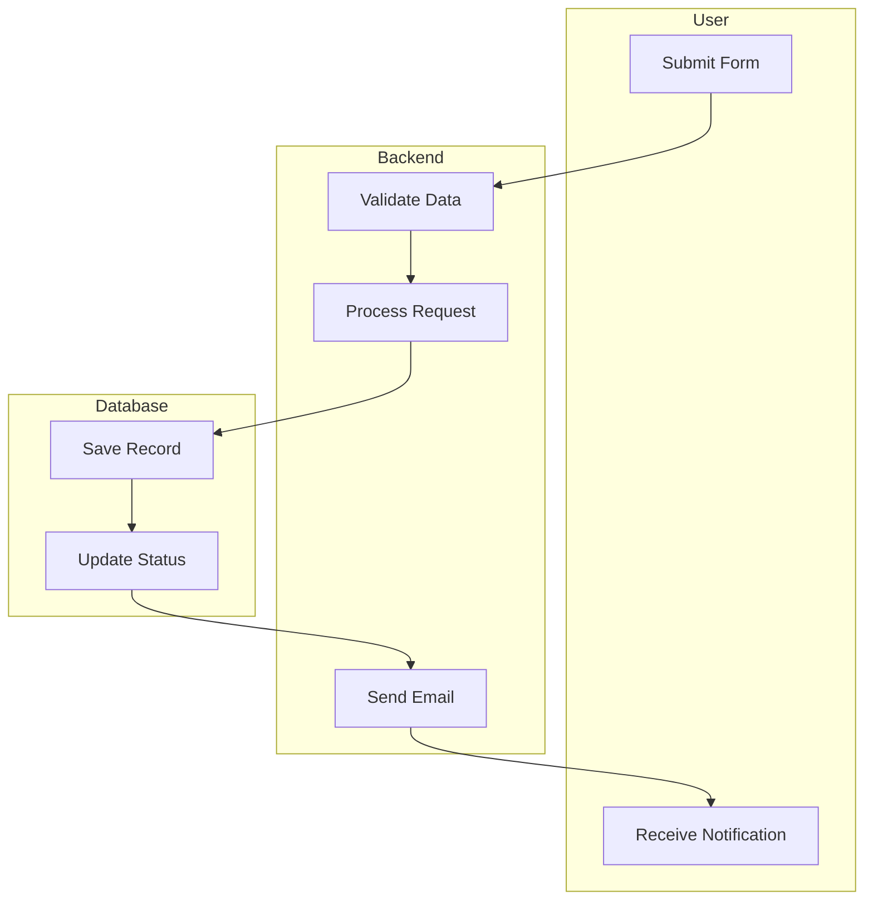

**Use swimlanes when:**
- Process involves multiple departments/actors
- Showing responsibility boundaries
- Illustrating system interactions

---

## 🛠️ Mermaid Syntax Guide

### Basic Flowchart Structure

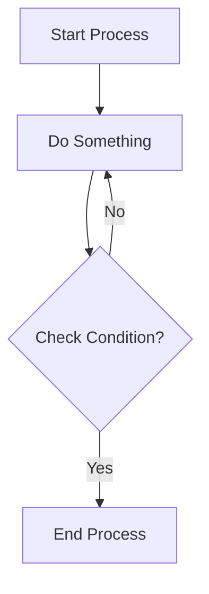

**Code:**
```markdown
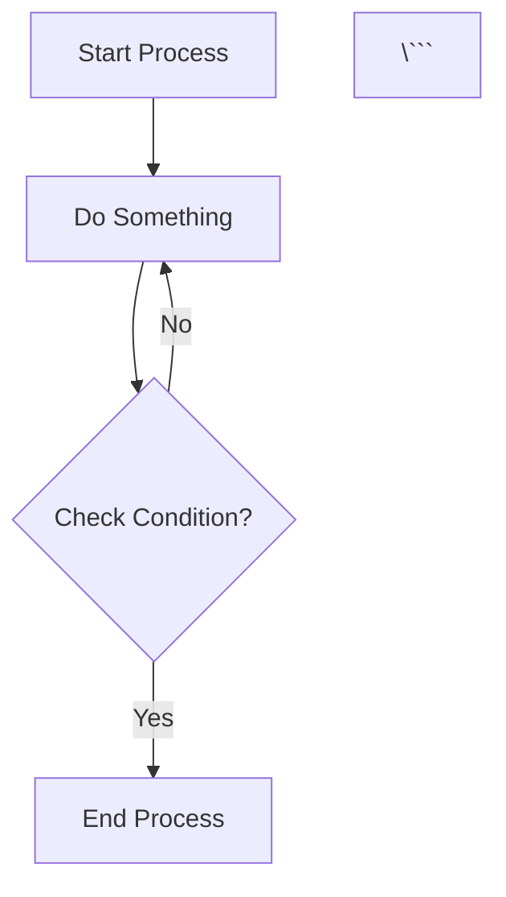

---

### Node Shapes

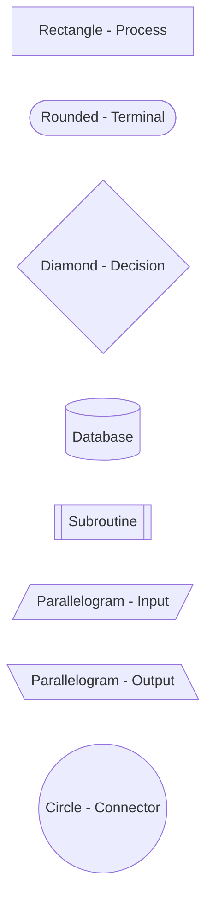

**Syntax:**
```markdown
[Text]          Rectangle
([Text])        Rounded rectangle
{Text}          Diamond
[(Text)]        Database
[[Text]]        Subroutine
[/Text/]        Input (parallelogram)
[\Text\]        Output (parallelogram)
((Text))        Circle
```

---

### Arrow Types

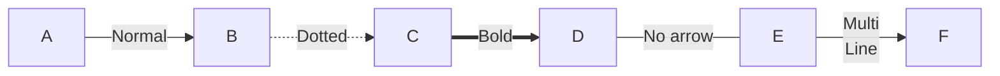

**Syntax:**
```markdown
A --> B          Normal arrow
A -.-> B         Dotted arrow
A ==> B          Bold arrow
A --- B          Line without arrow
A -->|Label| B   Arrow with label
A -->|Line1<br/>Line2| B   Multi-line label
```

---

### Styling & Colors

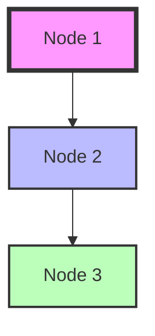

**Syntax:**
```markdown
style NodeID fill:#color,stroke:#color,stroke-width:Xpx
```

---

### Using Classes (Reusable Styles)


**Syntax:**
```markdown
classDef className fill:#color,stroke:#color,color:#color
NodeID:::className
```

---

### Subgraphs (Grouping)

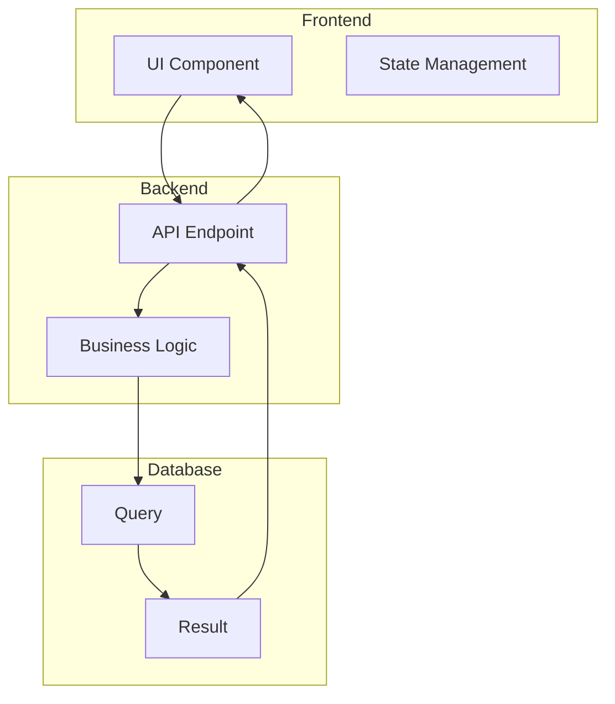

**Syntax:**
```markdown
subgraph GroupName
    Node1
    Node2
end
```

---

## ✅ Best Practices

### 1. **Start with Pen & Paper**

Before coding Mermaid, sketch the flow manually:
```
1. List all steps
2. Identify decision points
3. Mark start/end
4. Draw arrows
5. Review & simplify
6. Code in Mermaid
```

---

### 2. **Use Consistent Terminology**

**Good - Consistent:**
```
Login → Authenticate → Authorize → Access Dashboard
```

**Bad - Inconsistent:**
```
Log in → Auth Check → Give Permission → Show Main Page
```

**Rule:** Pick one vocabulary and stick to it.

---

### 3. **Handle Errors Explicitly**

**Good:**
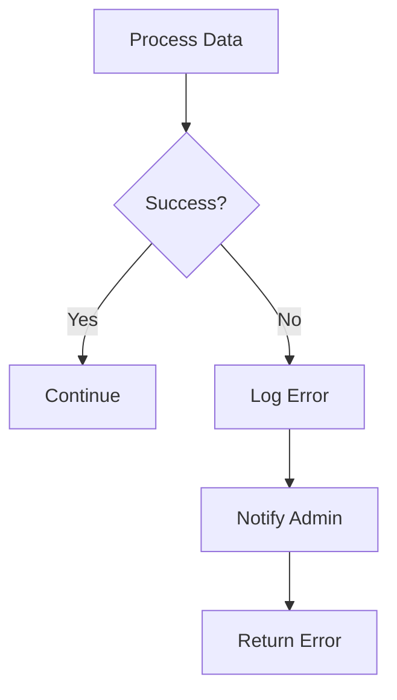

**Bad:**
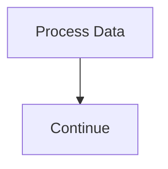

**Rule:** Always show error paths.

---

### 4. **Avoid Crossing Lines**

**Good:**
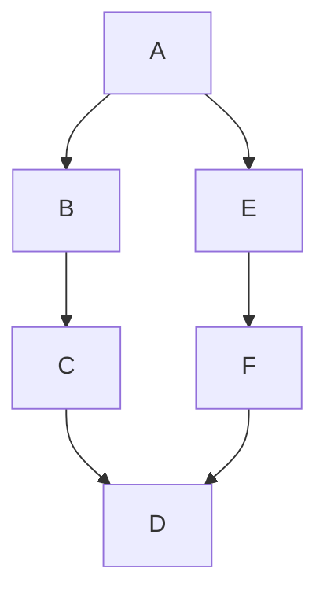

**Bad:**
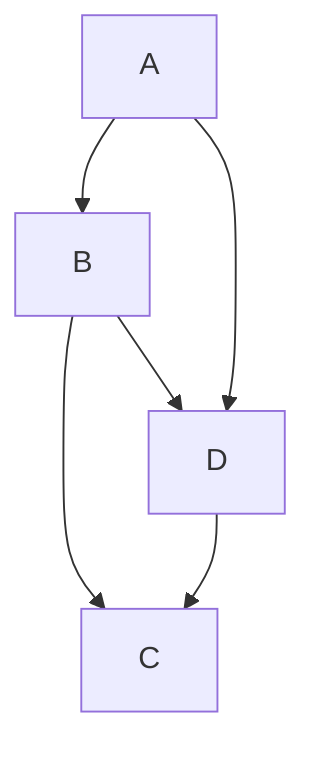

**Rule:** Rearrange nodes to minimize line crossings.

---

### 5. **Document Assumptions**

Add notes for complex flows:

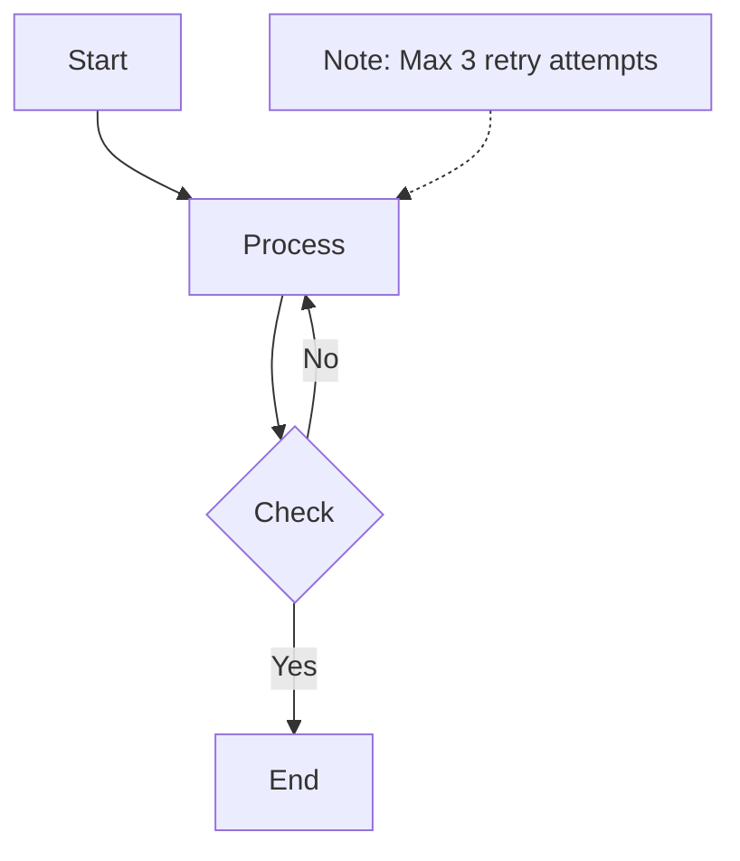

---

### 6. **Version Control Flowcharts**

```markdown
# Flowchart Header Template

---
title: User Authentication Flow
version: 1.2.0
author: Development Team
date: 2025-11-06
reviewed: Security Team
status: Approved
---
```

---

## 🔁 Common Patterns

### Pattern 1: Error Handling with Retry

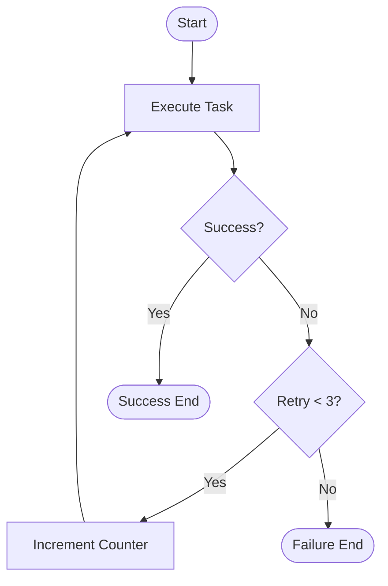

---

### Pattern 2: Validation Pipeline

```mermaid
flowchart TD
    Start([Receive Data])
    V1{Valid Format?}
    V2{Valid Range?}
    V3{Valid Business Rules?}
    Process[Process Data]
    Error[Return Error]
    Success([Success])
    
    Start --> V1
    V1 -->|No| Error
    V1 -->|Yes| V2
    V2 -->|No| Error
    V2 -->|Yes| V3
    V3 -->|No| Error
    V3 -->|Yes| Process
    Process --> Success
```

---

### Pattern 3: Async Processing

```mermaid
flowchart TD
    Start([Receive Request])
    Queue[Add to Queue]
    Response[Return Job ID]
    
    subgraph Async Processing
        Worker[Worker Picks Job]
        Process[Process Data]
        Notify[Send Notification]
    end
    
    Start --> Queue
    Queue --> Response
    Queue -.-> Worker
    Worker --> Process
    Process --> Notify
```

---

### Pattern 4: State Machine

```mermaid
flowchart LR
    Draft[Draft]
    Review[Under Review]
    Approved[Approved]
    Rejected[Rejected]
    Published[Published]
    
    Draft -->|Submit| Review
    Review -->|Approve| Approved
    Review -->|Reject| Rejected
    Rejected -->|Revise| Draft
    Approved -->|Publish| Published
    Published -->|Unpublish| Draft
```

---

## ⚠️ Anti-Patterns (What to Avoid)

### 1. **Spaghetti Flow**

**Bad:**
```mermaid
flowchart TD
    A --> B
    B --> C
    C --> D
    D --> A
    A --> E
    E --> C
    C --> F
    F --> B
    B --> G
    G --> D
```

**Fix:** Break into logical subprocesses.

---

### 2. **God Node (Too Many Connections)**

**Bad:**
```mermaid
flowchart TD
    Central[Central Process]
    A --> Central
    B --> Central
    C --> Central
    D --> Central
    Central --> E
    Central --> F
    Central --> G
    Central --> H
```

**Fix:** Use subgraphs or split into smaller flows.

---

### 3. **Ambiguous Decisions**

**Bad:**
```mermaid
flowchart TD
    A{Check Status}
    A -->|Maybe| B
    A -->|Sometimes| C
```

**Fix:** Use clear binary decisions.

```mermaid
flowchart TD
    A{Status == Active?}
    A -->|Yes| B
    A -->|No| C
```

---

### 4. **Missing End States**

**Bad:**
```mermaid
flowchart TD
    A[Start]
    B[Process]
    A --> B
```

**Fix:** Always include end nodes.

```mermaid
flowchart TD
    A([Start])
    B[Process]
    C([End])
    A --> B --> C
```

---

### 5. **Inconsistent Styling**

**Bad:** Different colors for same types of nodes.

**Fix:** Use consistent color scheme throughout project.

---

## 🛠️ Tools & Resources

### Recommended Tools

| Tool | Purpose | Link |
|------|---------|------|
| **Mermaid Live Editor** | Online editor | https://mermaid.live |
| **Draw.io** | Desktop flowcharts | https://draw.io |
| **Lucidchart** | Professional diagrams | https://lucidchart.com |
| **PlantUML** | Text-based UML | https://plantuml.com |
| **Visual Paradigm** | Enterprise modeling | https://visual-paradigm.com |

---

### VS Code Extensions

```bash
# Markdown Preview Mermaid Support
code --install-extension bierner.markdown-mermaid

# Mermaid Editor
code --install-extension tomoyukim.vscode-mermaid-editor

# Draw.io Integration
code --install-extension hediet.vscode-drawio
```

---

### CLI Tools

```bash
# Mermaid CLI (Convert to PNG/SVG)
npm install -g @mermaid-js/mermaid-cli

# Usage
mmdc -i flowchart.md -o flowchart.png

# High resolution
mmdc -i flowchart.md -o flowchart.png -w 2400 -H 1800 -s 2
```

---

### Online Resources

- **Mermaid Documentation:** https://mermaid.js.org/
- **Flowchart Best Practices:** https://creately.com/guides/flowchart-best-practices/
- **ISO 5807 Standard:** International standard for flowchart symbols
- **BPMN 2.0:** Business Process Model and Notation

---

## 📚 Examples from AI-Assistant Project

### Example 1: User Authentication Flow

```mermaid
flowchart TD
    classDef success fill:#4CAF50,stroke:#2E7D32,color:#fff
    classDef error fill:#F44336,stroke:#C62828,color:#fff
    classDef process fill:#2196F3,stroke:#1565C0,color:#fff
    
    Start([User Login Request]):::success
    ValidateInput[Validate Credentials]:::process
    CheckUser{User Exists?}
    CheckPass{Password Correct?}
    Generate[Generate JWT Token]:::process
    Return[Return Token]:::process
    ErrorUser[Error: User Not Found]:::error
    ErrorPass[Error: Invalid Password]:::error
    End([Success]):::success
    
    Start --> ValidateInput
    ValidateInput --> CheckUser
    CheckUser -->|No| ErrorUser
    CheckUser -->|Yes| CheckPass
    CheckPass -->|No| ErrorPass
    CheckPass -->|Yes| Generate
    Generate --> Return
    Return --> End
```

---

### Example 2: Text2SQL Query Processing

```mermaid
flowchart TD
    classDef input fill:#9C27B0,stroke:#6A1B9A,color:#fff
    classDef process fill:#2196F3,stroke:#1565C0,color:#fff
    classDef decision fill:#FFC107,stroke:#F57F17,color:#000
    classDef database fill:#795548,stroke:#5D4037,color:#fff
    
    Start([Receive Natural Language Query]):::input
    Parse[Parse Query with LangChain]:::process
    Validate{Valid SQL?}:::decision
    Generate[Generate SQL]:::process
    Execute[Execute Query]:::database
    Check{Results Found?}:::decision
    Format[Format Response]:::process
    Error[Return Error Message]:::process
    End([Return Results]):::input
    
    Start --> Parse
    Parse --> Generate
    Generate --> Validate
    Validate -->|No| Error
    Validate -->|Yes| Execute
    Execute --> Check
    Check -->|No| Error
    Check -->|Yes| Format
    Format --> End
    Error --> End
```

---

### Example 3: Document Intelligence OCR

```mermaid
flowchart TD
    subgraph Upload
        A([Upload File])
        B[Validate File Type]
        C{Supported?}
    end
    
    subgraph Processing
        D[Extract Text - PaddleOCR]
        E[Analyze Layout]
        F[Extract Entities]
    end
    
    subgraph Storage
        G[(Save to Database)]
        H[Generate Summary]
    end
    
    I([Return Results])
    Error[Reject File]
    
    A --> B
    B --> C
    C -->|No| Error
    C -->|Yes| D
    D --> E
    E --> F
    F --> G
    G --> H
    H --> I
```

---

## 🎓 Learning Path

### Beginner
1. Learn basic shapes (rectangle, diamond, oval)
2. Practice simple linear flows
3. Add one decision node
4. Use Mermaid Live Editor

### Intermediate
1. Add error handling
2. Use subgraphs
3. Implement swimlanes
4. Apply color coding

### Advanced
1. Design complex state machines
2. Create reusable templates
3. Optimize for performance
4. Integrate with CI/CD

---

## ✅ Checklist for New Flowcharts

Before committing a flowchart, verify:

- [ ] Start and End nodes clearly marked
- [ ] All decision nodes have exactly 2 outputs
- [ ] All processes use "Verb + Noun" format
- [ ] No crossing lines (or minimized)
- [ ] Consistent flow direction (TD or LR)
- [ ] Error paths included
- [ ] Color scheme applied (if applicable)
- [ ] Maximum 15 nodes (or split into subprocesses)
- [ ] Mermaid syntax validated on mermaid.live
- [ ] Comments/notes for complex logic
- [ ] Version info in header
- [ ] Exported to PNG/SVG for documentation

---

## 🤝 Contributing

To add a new flowchart to AI-Assistant project:

1. **Create file:** `docs/chart_guide/examples/your-flow.md`
2. **Follow template:**
   ```markdown
   # Flow Name
   
   **Purpose:** Brief description
   **Last Updated:** YYYY-MM-DD
   **Author:** Your Name
   
   ## Diagram
   
   ```mermaid
   flowchart TD
       ...
   \```
   
   ## Description
   
   Detailed explanation...
   ```

3. **Validate:** Test on https://mermaid.live
4. **Export:** Generate PNG/SVG
5. **Commit:** Use semantic commit message
6. **PR:** Submit for review

---

## 📞 Support

For questions or suggestions:
- Create an issue: https://github.com/SkastVnT/AI-Assistant/issues
- Check examples: `./docs/chart_guide/examples/`
- Review existing diagrams: `./diagram/`

---

*Last Updated: November 6, 2025*  
*Maintained by: Development Team*
