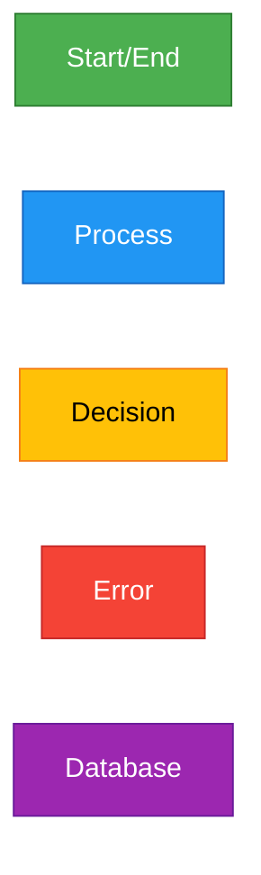

# 📖 Chart Guide - README

Welcome to the **Chart Guide** directory for the AI-Assistant project.

---

## 📂 Directory Structure

```
docs/chart_guide/
├── README.md                      # This file
├── FLOWCHART_STANDARDS.md         # Comprehensive flowchart guide
├── DIAGRAM_CONVENTIONS.md         # General diagramming rules (coming soon)
├── MERMAID_QUICK_REFERENCE.md     # Mermaid syntax cheatsheet (coming soon)
├── examples/                      # Example diagrams
│   ├── authentication-flow.md
│   ├── data-processing-flow.md
│   └── error-handling-pattern.md
└── templates/                     # Reusable templates
    ├── basic-process-template.md
    ├── decision-tree-template.md
    └── state-machine-template.md
```

---

## 📚 Available Guides

### 1. **FLOWCHART_STANDARDS.md**
Complete guide for creating professional flowcharts:
- Basic symbols and their meanings
- Design principles and best practices
- Mermaid syntax reference
- Common patterns and anti-patterns
- Tool recommendations
- Real examples from AI-Assistant

**Use when:** Creating process flows, algorithms, workflows

---

### 2. **DIAGRAM_CONVENTIONS.md** (Coming Soon)
General rules for all diagram types:
- UML conventions
- ER diagram standards
- Class diagram guidelines
- Sequence diagram patterns

---

### 3. **MERMAID_QUICK_REFERENCE.md** (Coming Soon)
Quick syntax reference:
- All Mermaid diagram types
- Syntax cheatsheet
- Common patterns
- Troubleshooting tips

---

## 🎯 Quick Start

### For Beginners

1. **Read:** [FLOWCHART_STANDARDS.md](FLOWCHART_STANDARDS.md) (Section: Introduction & Basic Symbols)
2. **Try:** Open https://mermaid.live and paste example code
3. **Practice:** Create a simple 5-node flowchart
4. **Review:** Check against the standards

### For Experienced Developers

1. **Reference:** [FLOWCHART_STANDARDS.md](FLOWCHART_STANDARDS.md) (Section: Mermaid Syntax Guide)
2. **Templates:** Use files in `templates/` directory
3. **Examples:** Review `examples/` for patterns
4. **Contribute:** Add your own examples via PR

---

## 🛠️ Tools Setup

### 1. VS Code Extensions

```bash
# Markdown Preview Mermaid Support
code --install-extension bierner.markdown-mermaid

# Mermaid Editor
code --install-extension tomoyukim.vscode-mermaid-editor
```

### 2. CLI Tools

```bash
# Mermaid CLI (for PNG/SVG export)
npm install -g @mermaid-js/mermaid-cli

# Usage
mmdc -i flowchart.md -o flowchart.png -w 2400 -s 2
```

### 3. Online Editor

https://mermaid.live - Test and validate diagrams

---

## 📋 Diagram Type Reference

| Type | File | Use Case |
|------|------|----------|
| **Flowchart** | `.md` with `flowchart TD` | Process flows, algorithms |
| **Sequence** | `.md` with `sequenceDiagram` | API interactions, message flows |
| **Class** | `.md` with `classDiagram` | Object-oriented design |
| **ER Diagram** | `.md` with `erDiagram` | Database schema |
| **State** | `.md` with `stateDiagram-v2` | State machines, workflows |
| **Gantt** | `.md` with `gantt` | Project timelines |

---

## ✅ Best Practices Summary

1. **Start Simple** - Begin with 5-10 nodes, expand if needed
2. **Consistent Direction** - Top-to-bottom or left-to-right, not both
3. **Clear Labels** - "Verb + Noun" format (e.g., "Validate Input")
4. **Binary Decisions** - Always 2 outputs (Yes/No, True/False)
5. **Show Errors** - Include error handling paths
6. **Use Colors** - Apply consistent color scheme
7. **Add Comments** - Document complex logic
8. **Version Control** - Include version info in diagrams

---

## 🎨 Color Scheme Standard



**Colors:**
- 🟢 Green `#4CAF50` - Start/End points
- 🔵 Blue `#2196F3` - Process/Action steps
- 🟡 Yellow `#FFC107` - Decision points
- 🔴 Red `#F44336` - Error/Exception handling
- 🟣 Purple `#9C27B0` - Database operations

---

## 📖 Related Documentation

- **Project Diagrams:** `../../diagram/` - All UML & ER diagrams
- **API Docs:** `../API_DOCUMENTATION.md` - API reference
- **Architecture:** `../PROJECT_STRUCTURE.md` - System design
- **Security:** `../../SECURITY.md` - Security policies

---

## 🤝 Contributing

### Adding a New Example

1. Create file in `examples/` directory
2. Follow template structure
3. Include:
   - Title and description
   - Mermaid code block
   - Explanation of flow
   - Use case
4. Test on https://mermaid.live
5. Submit PR with descriptive commit message

### Improving Documentation

1. Fork repository
2. Make changes in `chart_guide/`
3. Test all code examples
4. Update version numbers
5. Submit PR with clear description

---

## 📞 Support

**Questions?**
- Check [FLOWCHART_STANDARDS.md](FLOWCHART_STANDARDS.md) FAQ section
- Review examples in `examples/` directory
- Create issue: https://github.com/SkastVnT/AI-Assistant/issues

**Found an Error?**
- Report via GitHub Issues
- Include: File name, line number, description
- Suggest correction if possible

---

## 📅 Roadmap

- [x] Flowchart Standards Guide
- [ ] Diagram Conventions Guide
- [ ] Mermaid Quick Reference
- [ ] 10+ Example Diagrams
- [ ] Interactive Tutorial
- [ ] Video Walkthrough
- [ ] Auto-validation Tool

---

*Last Updated: November 6, 2025*  
*Maintained by: Development Team*
