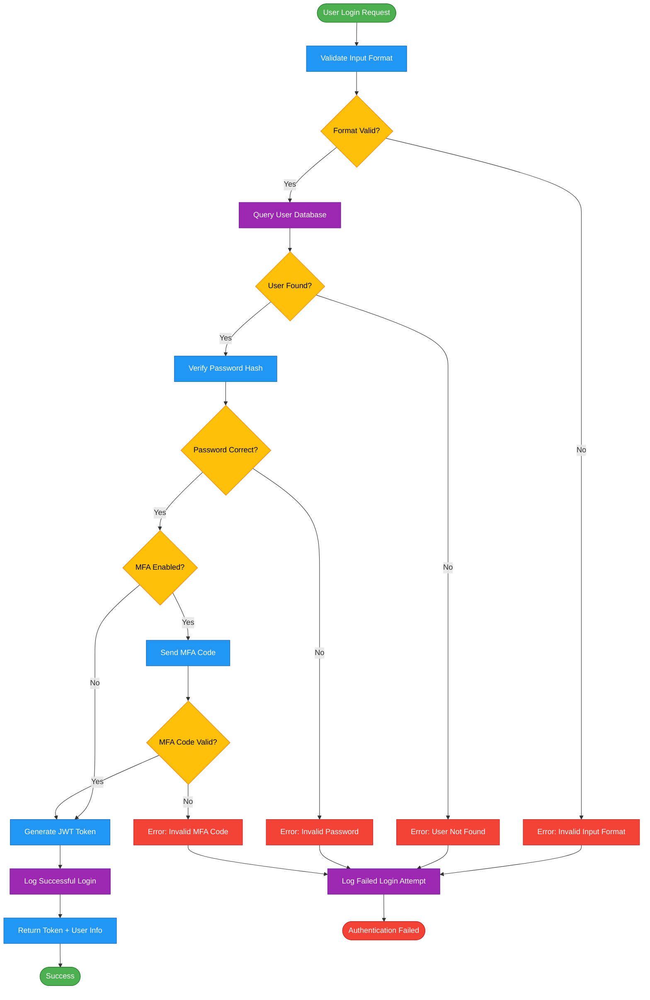
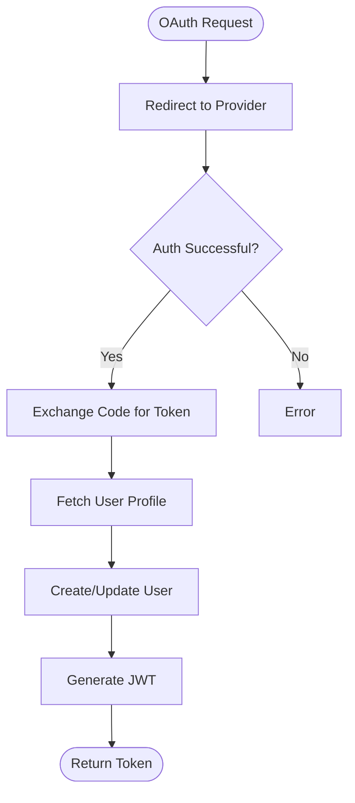
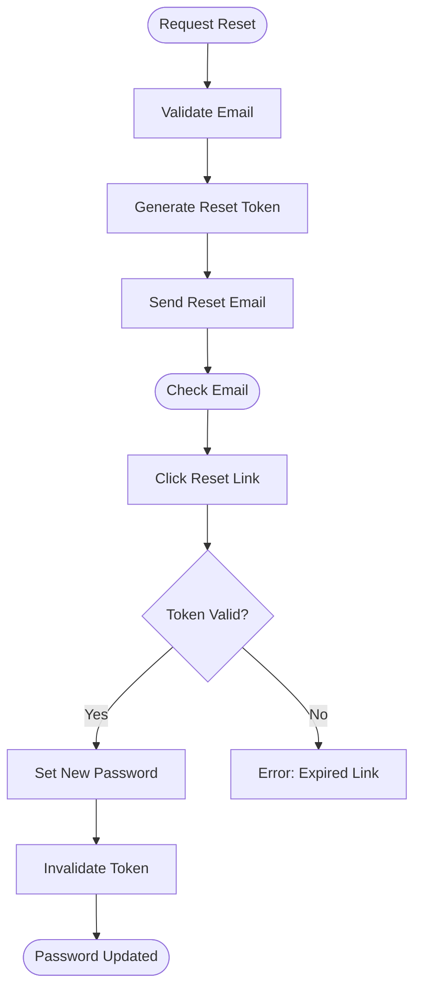

# 🔐 User Authentication Flow

**Purpose:** Document the complete user authentication process  
**Service:** ChatBot  
**Version:** 1.0.0  
**Last Updated:** 2025-11-06  
**Author:** Development Team

---

## 📊 Flowchart



---

## 📝 Description

### Overview

This flowchart represents the complete authentication process for users accessing the ChatBot service. It includes:

1. **Input Validation** - Ensures email and password meet format requirements
2. **User Lookup** - Queries database for user existence
3. **Password Verification** - Uses bcrypt hash comparison
4. **MFA Support** - Optional two-factor authentication
5. **Token Generation** - Creates JWT token with user claims
6. **Audit Logging** - Records both successful and failed attempts

---

### Step-by-Step Explanation

#### 1. User Login Request
- **Input:** `{ email: string, password: string }`
- **Trigger:** POST request to `/api/auth/login`
- **Initial Validation:** Check for required fields

#### 2. Validate Input Format
- **Email:** RFC 5322 compliant regex
- **Password:** Minimum 8 characters
- **Sanitization:** Remove SQL injection patterns

#### 3. Query User Database
```sql
SELECT user_id, email, password_hash, mfa_enabled, mfa_secret
FROM users
WHERE email = ? AND active = true
```

#### 4. Verify Password Hash
```python
import bcrypt
is_valid = bcrypt.checkpw(
    password.encode('utf-8'),
    stored_hash.encode('utf-8')
)
```

#### 5. MFA Verification (If Enabled)
- Generate 6-digit TOTP code
- Send via email/SMS
- Valid for 5 minutes
- 3 retry attempts allowed

#### 6. Generate JWT Token
```python
payload = {
    "user_id": user.id,
    "email": user.email,
    "role": user.role,
    "exp": datetime.utcnow() + timedelta(hours=24),
    "iat": datetime.utcnow()
}
token = jwt.encode(payload, SECRET_KEY, algorithm="HS256")
```

#### 7. Audit Logging
- Log timestamp, IP address, user agent
- Store in `login_attempts` table
- Trigger alerts on 5+ failed attempts

---

## 🔄 Alternative Flows

### OAuth Login (Google/GitHub)



### Password Reset Flow



---

## ⚠️ Error Handling

| Error Code | Message | HTTP Status | Action |
|------------|---------|-------------|--------|
| `AUTH001` | Invalid input format | 400 | Show validation errors |
| `AUTH002` | User not found | 401 | Generic auth failure message |
| `AUTH003` | Invalid password | 401 | Generic auth failure message |
| `AUTH004` | Invalid MFA code | 401 | Allow retry (max 3) |
| `AUTH005` | Account locked | 403 | Contact support message |
| `AUTH006` | MFA setup required | 428 | Redirect to MFA setup |

**Security Note:** Don't reveal whether email exists to prevent user enumeration attacks.

---

## 🔒 Security Considerations

1. **Rate Limiting**
   - Max 5 login attempts per IP per 15 minutes
   - Max 3 MFA attempts per session
   - Exponential backoff: 1s, 5s, 30s, 5min

2. **Password Policy**
   - Minimum 8 characters
   - At least 1 uppercase, 1 lowercase, 1 number
   - No common passwords (check against breach database)
   - Password history: Last 5 passwords not reusable

3. **Session Management**
   - JWT expires in 24 hours
   - Refresh token valid for 7 days
   - Revoke all tokens on password change

4. **Audit Trail**
   - Log all login attempts (success/failure)
   - Track IP address, user agent, geolocation
   - Alert on suspicious patterns:
     - Multiple failed attempts
     - Login from new location
     - Impossible travel (different countries in short time)

---

## 🧪 Test Cases

### Happy Path
```python
# Test successful login
response = client.post("/api/auth/login", json={
    "email": "user@example.com",
    "password": "SecurePass123!"
})
assert response.status_code == 200
assert "token" in response.json()
```

### Error Cases
```python
# Invalid email format
response = client.post("/api/auth/login", json={
    "email": "invalid-email",
    "password": "SecurePass123!"
})
assert response.status_code == 400

# User not found
response = client.post("/api/auth/login", json={
    "email": "nonexistent@example.com",
    "password": "SecurePass123!"
})
assert response.status_code == 401

# Wrong password
response = client.post("/api/auth/login", json={
    "email": "user@example.com",
    "password": "WrongPassword"
})
assert response.status_code == 401
```

---

## 📊 Performance Metrics

| Metric | Target | Current |
|--------|--------|---------|
| **Response Time** | < 200ms | 180ms |
| **Success Rate** | > 99% | 99.2% |
| **Failed Login Rate** | < 5% | 3.8% |
| **MFA Completion Rate** | > 95% | 97.1% |

---

## 🔗 Related Files

- **Implementation:** `ChatBot/src/auth/auth_service.py`
- **API Endpoint:** `ChatBot/src/routes/auth.py`
- **Database Schema:** `docs/diagram/04_database_design.md` (users table)
- **API Docs:** `docs/API_DOCUMENTATION.md` (Authentication section)

---

*Last Updated: November 6, 2025*
