# 9️⃣ DEPLOYMENT DIAGRAM

> **Biểu đồ triển khai hệ thống AI-Assistant**  
> Mô tả infrastructure, deployment options, và cloud architecture

---

## 📋 Mô tả

Deployment Diagram thể hiện:
- **Physical Infrastructure:** Servers, containers, networks
- **Deployment Options:** Local, Docker, Cloud (Azure/AWS/GCP)
- **Network Architecture:** Load balancers, CDNs, firewalls
- **Scalability & High Availability:** Clustering, replication

---

## 🎯 Deployment Options

1. **Option 1: Local Development** (Current)
2. **Option 2: Docker Compose** (Recommended)
3. **Option 3: Azure Cloud** (Production - Recommended)
4. **Option 4: AWS Cloud** (Production - Alternative)
5. **Option 5: Kubernetes** (Enterprise)

---

## 1️⃣ Option 1: Local Development (Current)

```mermaid
graph TB
    subgraph Local Machine - Windows 10/11
        subgraph Python Virtual Environments
            venv1[venv_chatbot_3113<br/>Python 3.11.3]
            venv2[Text2SQL<br/>Python 3.10]
            venv3[venv_s2t<br/>Python 3.10]
            venv4[venv_sd<br/>Python 3.10]
            venv5[venv_hub<br/>Python 3.10]
        end
        
        subgraph Running Processes
            P1[ChatBot<br/>:5001<br/>Flask]
            P2[Text2SQL<br/>:5002<br/>Flask]
            P3[Speech2Text<br/>:7860<br/>Gradio]
            P4[Stable Diffusion<br/>:7861<br/>Gradio]
            P5[Hub Gateway<br/>:3000<br/>Flask]
        end
        
        subgraph Local Storage
            FS1[ChatBot/Storage/<br/>conversations, files, images]
            FS2[Text2SQL/data/<br/>knowledge_base, schemas]
            FS3[Speech2Text/output/<br/>transcriptions]
            FS4[SD/outputs/<br/>generated images]
        end
        
        subgraph GPU
            CUDA[NVIDIA GPU<br/>CUDA 12.1<br/>RTX 3060+]
        end
        
        venv1 --> P1
        venv2 --> P2
        venv3 --> P3
        venv4 --> P4
        venv5 --> P5
        
        P1 --> FS1
        P2 --> FS2
        P3 --> FS3
        P4 --> FS4
        
        P3 --> CUDA
        P4 --> CUDA
    end
    
    subgraph External Services
        MongoDB[(MongoDB Atlas<br/>M0 Free Tier<br/>512MB)]
        GeminiAPI[Google Gemini API]
        OpenAI[OpenAI API]
        DeepSeek[DeepSeek API]
        HuggingFace[HuggingFace Hub]
        ImgBB[ImgBB Cloud Storage]
    end
    
    P1 --> MongoDB
    P1 --> GeminiAPI
    P1 --> OpenAI
    P1 --> DeepSeek
    P1 --> ImgBB
    
    P2 --> GeminiAPI
    
    P3 --> HuggingFace
    P4 --> HuggingFace
    
    Browser[🌐 Browser<br/>localhost] --> P5
    P5 --> P1
    P5 --> P2
    P5 --> P3
    P5 --> P4
    
    style P1 fill:#8B5CF6,color:#fff
    style P2 fill:#3B82F6,color:#fff
    style P3 fill:#EF4444,color:#fff
    style P4 fill:#EC4899,color:#fff
    style P5 fill:#6366F1,color:#fff
```



### Specifications:

**Hardware Requirements:**
- **CPU:** Intel i5/AMD Ryzen 5 (4+ cores)
- **RAM:** 16GB minimum, 32GB recommended
- **GPU:** NVIDIA RTX 3060 (6GB VRAM) or better
- **Storage:** 100GB SSD (for models + data)

**Network:**
- **Ports:** 3000, 5001, 5002, 7860, 7861
- **Internet:** Required for API calls

**Pros:**
- ✅ Full control over environment
- ✅ Easy debugging
- ✅ No deployment costs
- ✅ Fast iteration

**Cons:**
- ❌ Not accessible from internet
- ❌ No high availability
- ❌ Manual process management
- ❌ Not scalable

---

## 2️⃣ Option 2: Docker Compose (Recommended for Dev/Test)

```mermaid
graph TB
    subgraph Docker Host - Linux/Windows with Docker
        subgraph Docker Network - ai_assistant_network
            C1[chatbot:5001<br/>Docker Container]
            C2[text2sql:5002<br/>Docker Container]
            C3[speech2text:7860<br/>Docker Container]
            C4[stable-diffusion:7861<br/>Docker Container]
            C5[hub:3000<br/>Docker Container]
            C6[nginx:80<br/>Reverse Proxy]
            C7[redis:6379<br/>Cache & Queue]
        end
        
        subgraph Docker Volumes
            V1[(chatbot_data<br/>conversations, files)]
            V2[(text2sql_data<br/>knowledge_base)]
            V3[(speech2text_data<br/>transcriptions)]
            V4[(sd_models<br/>checkpoints, LoRAs)]
            V5[(redis_data)]
        end
        
        C1 -.-> V1
        C2 -.-> V2
        C3 -.-> V3
        C4 -.-> V4
        C7 -.-> V5
        
        C6 --> C5
        C5 --> C1
        C5 --> C2
        C5 --> C3
        C5 --> C4
        
        C1 --> C7
        C2 --> C7
    end
    
    subgraph External Services
        MongoDB[(MongoDB Atlas)]
        APIs[External APIs<br/>Gemini, OpenAI, etc.]
    end
    
    C1 --> MongoDB
    C1 --> APIs
    C2 --> APIs
    
    Internet[🌐 Internet] --> C6
    
    style C1 fill:#8B5CF6,color:#fff
    style C2 fill:#3B82F6,color:#fff
    style C3 fill:#EF4444,color:#fff
    style C4 fill:#EC4899,color:#fff
    style C5 fill:#6366F1,color:#fff
    style C6 fill:#10B981,color:#fff
    style C7 fill:#F59E0B,color:#fff
```



### docker-compose.yml:

```yaml
version: '3.8'

services:
  # Hub Gateway
  hub:
    build: ./src
    container_name: ai_hub
    ports:
      - "3000:3000"
    environment:
      - FLASK_ENV=production
      - CHATBOT_URL=http://chatbot:5001
      - TEXT2SQL_URL=http://text2sql:5002
      - SPEECH2TEXT_URL=http://speech2text:7860
      - SD_URL=http://stable-diffusion:7861
    depends_on:
      - chatbot
      - text2sql
      - redis
    networks:
      - ai_network
    restart: unless-stopped

  # ChatBot Service
  chatbot:
    build: ./ChatBot
    container_name: ai_chatbot
    ports:
      - "5001:5001"
    environment:
      - GEMINI_API_KEY=${GEMINI_API_KEY}
      - OPENAI_API_KEY=${OPENAI_API_KEY}
      - DEEPSEEK_API_KEY=${DEEPSEEK_API_KEY}
      - MONGODB_URI=${MONGODB_URI}
      - REDIS_URL=redis://redis:6379
    volumes:
      - chatbot_data:/app/Storage
    depends_on:
      - redis
    networks:
      - ai_network
    restart: unless-stopped

  # Text2SQL Service
  text2sql:
    build: ./Text2SQL Services
    container_name: ai_text2sql
    ports:
      - "5002:5002"
    environment:
      - GEMINI_API_KEY_1=${GEMINI_API_KEY_1}
      - REDIS_URL=redis://redis:6379
    volumes:
      - text2sql_data:/app/data
    depends_on:
      - redis
    networks:
      - ai_network
    restart: unless-stopped

  # Speech2Text Service
  speech2text:
    build: ./Speech2Text Services
    container_name: ai_speech2text
    ports:
      - "7860:7860"
    environment:
      - HF_TOKEN=${HF_TOKEN}
    volumes:
      - speech2text_data:/app/output
      - speech2text_models:/app/models
    networks:
      - ai_network
    restart: unless-stopped
    deploy:
      resources:
        reservations:
          devices:
            - driver: nvidia
              count: 1
              capabilities: [gpu]

  # Stable Diffusion Service
  stable-diffusion:
    build: ./stable-diffusion-webui
    container_name: ai_stable_diffusion
    ports:
      - "7861:7861"
    volumes:
      - sd_models:/app/models
      - sd_outputs:/app/outputs
    networks:
      - ai_network
    restart: unless-stopped
    deploy:
      resources:
        reservations:
          devices:
            - driver: nvidia
              count: 1
              capabilities: [gpu]

  # Nginx Reverse Proxy
  nginx:
    image: nginx:alpine
    container_name: ai_nginx
    ports:
      - "80:80"
      - "443:443"
    volumes:
      - ./nginx.conf:/etc/nginx/nginx.conf:ro
      - ./ssl:/etc/nginx/ssl:ro
    depends_on:
      - hub
    networks:
      - ai_network
    restart: unless-stopped

  # Redis Cache & Queue
  redis:
    image: redis:7-alpine
    container_name: ai_redis
    ports:
      - "6379:6379"
    volumes:
      - redis_data:/data
    networks:
      - ai_network
    restart: unless-stopped
    command: redis-server --appendonly yes

volumes:
  chatbot_data:
  text2sql_data:
  speech2text_data:
  speech2text_models:
  sd_models:
  sd_outputs:
  redis_data:

networks:
  ai_network:
    driver: bridge
```

### Deployment Commands:

```bash
# Build all images
docker-compose build

# Start all services
docker-compose up -d

# View logs
docker-compose logs -f

# Stop all services
docker-compose down

# Remove volumes (WARNING: data loss)
docker-compose down -v
```

**Pros:**
- ✅ Easy deployment (one command)
- ✅ Isolated environments
- ✅ Portable (run anywhere)
- ✅ Reproducible builds
- ✅ Resource management

**Cons:**
- ⚠️ Overhead (~1-2GB RAM)
- ⚠️ Learning curve
- ⚠️ GPU passthrough can be tricky

---

## 3️⃣ Option 3: Azure Cloud (Production - Recommended)

```mermaid
graph TB
    subgraph Internet
        Users[🌍 Users Worldwide]
        CDN[Azure CDN<br/>Static Assets]
    end
    
    subgraph Azure Front Door
        AFD[Azure Front Door<br/>Global Load Balancer<br/>WAF + DDoS Protection]
    end
    
    subgraph Azure Region - East US
        subgraph App Services
            AS1[App Service<br/>ChatBot<br/>Premium v3]
            AS2[App Service<br/>Text2SQL<br/>Standard S2]
        end
        
        subgraph Virtual Machines
            VM1[VM - Speech2Text<br/>NC6 GPU VM<br/>1x Tesla K80]
            VM2[VM - Stable Diffusion<br/>NC12 GPU VM<br/>2x Tesla K80]
        end
        
        subgraph Container Instances
            ACI[Azure Container Instances<br/>Hub Gateway]
        end
        
        subgraph Data Services
            PG[(Azure Database<br/>for PostgreSQL<br/>Flexible Server)]
            Redis[(Azure Cache<br/>for Redis<br/>Standard C1)]
            Blob[Azure Blob Storage<br/>Hot tier]
        end
        
        subgraph Monitoring
            AppInsights[Application Insights]
            LogAnalytics[Log Analytics]
        end
        
        AFD --> ACI
        ACI --> AS1
        ACI --> AS2
        ACI --> VM1
        ACI --> VM2
        
        AS1 --> PG
        AS1 --> Redis
        AS1 --> Blob
        
        AS2 --> PG
        AS2 --> Redis
        
        VM1 --> Blob
        VM2 --> Blob
        
        AS1 --> AppInsights
        AS2 --> AppInsights
        VM1 --> AppInsights
        VM2 --> AppInsights
        
        AppInsights --> LogAnalytics
    end
    
    subgraph External Services
        APIs[External APIs<br/>Gemini, OpenAI, etc.]
    end
    
    AS1 --> APIs
    AS2 --> APIs
    
    Users --> CDN
    Users --> AFD
    
    style AFD fill:#0078D4,color:#fff
    style AS1 fill:#8B5CF6,color:#fff
    style AS2 fill:#3B82F6,color:#fff
    style VM1 fill:#EF4444,color:#fff
    style VM2 fill:#EC4899,color:#fff
```



### Azure Resources & Pricing:

| Resource | SKU | Specs | Monthly Cost (USD) |
|:---------|:----|:------|:-------------------|
| **App Service - ChatBot** | Premium v3 P1v3 | 2 vCPU, 8GB RAM | $146 |
| **App Service - Text2SQL** | Standard S2 | 2 vCPU, 3.5GB RAM | $146 |
| **VM - Speech2Text** | NC6 (GPU) | 6 vCPU, 56GB RAM, Tesla K80 | $900 |
| **VM - Stable Diffusion** | NC12 (GPU) | 12 vCPU, 112GB RAM, 2x K80 | $1,800 |
| **PostgreSQL** | Flexible Server - General Purpose | 2 vCPU, 8GB RAM, 128GB storage | $187 |
| **Redis Cache** | Standard C1 | 1GB | $69 |
| **Blob Storage** | Hot tier | 500GB | $10 |
| **Azure Front Door** | Standard | - | $35 |
| **CDN** | Standard Microsoft | 100GB egress | $8 |
| **Application Insights** | Pay-as-you-go | 10GB/month | $23 |
| **Bandwidth** | Egress | 500GB/month | $43 |
| **TOTAL** | | | **~$3,367/month** |

### Cost Optimization:

**Budget Option (~$500/month):**
- Use **Reserved Instances** (1-year): Save 30-40%
- Use **Spot VMs** for GPU: Save 60-90%
- Use **Basic App Service** instead of Premium
- Use **Azure SQL Database** serverless
- **Total:** ~$500-700/month

**Minimal Option (~$200/month):**
- **App Service:** Basic B2 ($73)
- **PostgreSQL:** Burstable B1ms ($15)
- **Redis:** Basic C0 ($16)
- **Blob Storage:** $10
- No GPU VMs (CPU only for Speech2Text/SD)
- **Total:** ~$200/month

### Deployment Script:

```bash
# Login to Azure
az login

# Create Resource Group
az group create --name rg-ai-assistant --location eastus

# Create App Service Plan
az appservice plan create \
  --name asp-ai-assistant \
  --resource-group rg-ai-assistant \
  --sku P1v3 \
  --is-linux

# Deploy ChatBot
az webapp create \
  --name app-chatbot \
  --resource-group rg-ai-assistant \
  --plan asp-ai-assistant \
  --runtime "PYTHON:3.11" \
  --deployment-container-image-name chatbot:latest

# Create PostgreSQL
az postgres flexible-server create \
  --name pg-ai-assistant \
  --resource-group rg-ai-assistant \
  --location eastus \
  --admin-user pgadmin \
  --admin-password <password> \
  --sku-name Standard_D2s_v3 \
  --tier GeneralPurpose \
  --storage-size 128

# Create Redis Cache
az redis create \
  --name redis-ai-assistant \
  --resource-group rg-ai-assistant \
  --location eastus \
  --sku Standard \
  --vm-size C1

# Create Storage Account
az storage account create \
  --name staiassistant \
  --resource-group rg-ai-assistant \
  --location eastus \
  --sku Standard_LRS

# Create GPU VM for Stable Diffusion
az vm create \
  --name vm-stable-diffusion \
  --resource-group rg-ai-assistant \
  --image UbuntuLTS \
  --size Standard_NC6 \
  --admin-username azureuser \
  --generate-ssh-keys
```

---

## 4️⃣ Option 4: AWS Cloud (Production - Alternative)

```mermaid
graph TB
    subgraph Internet
        Users[🌍 Users Worldwide]
    end
    
    subgraph AWS CloudFront CDN
        CF[CloudFront Distribution<br/>Edge Locations Worldwide]
    end
    
    subgraph AWS Region - us-east-1
        subgraph Elastic Load Balancer
            ALB[Application Load Balancer<br/>WAF Enabled]
        end
        
        subgraph ECS Fargate Cluster
            ECS1[Fargate Task<br/>ChatBot<br/>2 vCPU, 4GB]
            ECS2[Fargate Task<br/>Text2SQL<br/>2 vCPU, 4GB]
            ECS3[Fargate Task<br/>Hub Gateway<br/>1 vCPU, 2GB]
        end
        
        subgraph EC2 GPU Instances
            EC2_1[EC2 g4dn.xlarge<br/>Speech2Text<br/>NVIDIA T4 GPU]
            EC2_2[EC2 g4dn.2xlarge<br/>Stable Diffusion<br/>NVIDIA T4 GPU]
        end
        
        subgraph Data Services
            RDS[(RDS PostgreSQL<br/>db.t3.medium<br/>Multi-AZ)]
            ElastiCache[(ElastiCache Redis<br/>cache.t3.medium)]
            S3[(S3 Bucket<br/>Standard Storage)]
        end
        
        subgraph Monitoring
            CW[CloudWatch<br/>Metrics + Logs]
            XRay[X-Ray<br/>Distributed Tracing]
        end
        
        ALB --> ECS3
        ECS3 --> ECS1
        ECS3 --> ECS2
        ECS3 --> EC2_1
        ECS3 --> EC2_2
        
        ECS1 --> RDS
        ECS1 --> ElastiCache
        ECS1 --> S3
        
        ECS2 --> RDS
        ECS2 --> ElastiCache
        
        EC2_1 --> S3
        EC2_2 --> S3
        
        ECS1 --> CW
        ECS2 --> CW
        EC2_1 --> CW
        EC2_2 --> CW
        
        ECS1 --> XRay
        ECS2 --> XRay
    end
    
    Users --> CF
    CF --> ALB
    
    style ALB fill:#FF9900,color:#fff
    style ECS1 fill:#8B5CF6,color:#fff
    style ECS2 fill:#3B82F6,color:#fff
    style EC2_1 fill:#EF4444,color:#fff
    style EC2_2 fill:#EC4899,color:#fff
```



### AWS Resources & Pricing:

| Resource | Type | Specs | Monthly Cost (USD) |
|:---------|:-----|:------|:-------------------|
| **ECS Fargate - ChatBot** | 2 tasks | 2 vCPU, 4GB RAM each | $88 |
| **ECS Fargate - Text2SQL** | 2 tasks | 2 vCPU, 4GB RAM each | $88 |
| **ECS Fargate - Hub** | 2 tasks | 1 vCPU, 2GB RAM each | $44 |
| **EC2 - Speech2Text** | g4dn.xlarge | 4 vCPU, 16GB, T4 GPU | $392 |
| **EC2 - Stable Diffusion** | g4dn.2xlarge | 8 vCPU, 32GB, T4 GPU | $752 |
| **RDS PostgreSQL** | db.t3.medium (Multi-AZ) | 2 vCPU, 4GB RAM, 100GB | $129 |
| **ElastiCache Redis** | cache.t3.medium | 2 vCPU, 3.2GB RAM | $84 |
| **S3 Storage** | Standard | 500GB | $12 |
| **ALB** | Application Load Balancer | - | $23 |
| **CloudFront** | CDN | 100GB transfer | $8 |
| **CloudWatch** | Logs + Metrics | 10GB logs | $15 |
| **Data Transfer** | Egress | 500GB | $45 |
| **TOTAL** | | | **~$1,680/month** |

### Cost Optimization (AWS):

**Budget Option (~$400/month):**
- Use **Spot Instances** for GPU EC2: Save 70%
- Use **RDS Aurora Serverless**: Pay per use
- Use **S3 Intelligent-Tiering**: Auto-optimize
- **Total:** ~$400-500/month

---

## 5️⃣ Option 5: Kubernetes (Enterprise)

```mermaid
graph TB
    subgraph Kubernetes Cluster - AKS/EKS/GKE
        subgraph Ingress Layer
            Ingress[Ingress Controller<br/>NGINX/Traefik<br/>SSL Termination]
        end
        
        subgraph Control Plane Namespace
            K8sDash[Kubernetes Dashboard]
            Prometheus[Prometheus<br/>Metrics Collection]
            Grafana[Grafana<br/>Visualization]
        end
        
        subgraph AI-Assistant Namespace
            subgraph ChatBot Deployment
                CB1[chatbot-pod-1<br/>Replica 1]
                CB2[chatbot-pod-2<br/>Replica 2]
                CB3[chatbot-pod-3<br/>Replica 3]
            end
            
            subgraph Text2SQL Deployment
                T2S1[text2sql-pod-1<br/>Replica 1]
                T2S2[text2sql-pod-2<br/>Replica 2]
            end
            
            subgraph Speech2Text StatefulSet
                S2T[speech2text-pod<br/>GPU Node]
            end
            
            subgraph Stable Diffusion StatefulSet
                SD[stable-diffusion-pod<br/>GPU Node]
            end
            
            subgraph Hub Deployment
                Hub1[hub-pod-1]
                Hub2[hub-pod-2]
            end
            
            CBSvc[ChatBot Service<br/>ClusterIP]
            T2SSvc[Text2SQL Service<br/>ClusterIP]
            S2TSvc[Speech2Text Service<br/>ClusterIP]
            SDSvc[Stable Diffusion Service<br/>ClusterIP]
            HubSvc[Hub Service<br/>LoadBalancer]
            
            CB1 --> CBSvc
            CB2 --> CBSvc
            CB3 --> CBSvc
            T2S1 --> T2SSvc
            T2S2 --> T2SSvc
            S2T --> S2TSvc
            SD --> SDSvc
            Hub1 --> HubSvc
            Hub2 --> HubSvc
            
            HubSvc --> CBSvc
            HubSvc --> T2SSvc
            HubSvc --> S2TSvc
            HubSvc --> SDSvc
        end
        
        subgraph Persistent Storage
            PVC1[(PVC - ChatBot<br/>Azure Disk/EBS)]
            PVC2[(PVC - Text2SQL<br/>Azure Disk/EBS)]
            PVC3[(PVC - Models<br/>Azure Files/EFS)]
        end
        
        CB1 -.-> PVC1
        CB2 -.-> PVC1
        CB3 -.-> PVC1
        T2S1 -.-> PVC2
        T2S2 -.-> PVC2
        S2T -.-> PVC3
        SD -.-> PVC3
        
        Ingress --> HubSvc
        
        CB1 --> Prometheus
        CB2 --> Prometheus
        T2S1 --> Prometheus
        S2T --> Prometheus
        SD --> Prometheus
        
        Prometheus --> Grafana
    end
    
    Internet[🌐 Internet] --> Ingress
    
    style Ingress fill:#10B981,color:#fff
    style CB1 fill:#8B5CF6,color:#fff
    style T2S1 fill:#3B82F6,color:#fff
    style S2T fill:#EF4444,color:#fff
    style SD fill:#EC4899,color:#fff
```



### Kubernetes Manifests:

**ChatBot Deployment:**
```yaml
apiVersion: apps/v1
kind: Deployment
metadata:
  name: chatbot
  namespace: ai-assistant
spec:
  replicas: 3
  selector:
    matchLabels:
      app: chatbot
  template:
    metadata:
      labels:
        app: chatbot
    spec:
      containers:
      - name: chatbot
        image: ai-assistant/chatbot:latest
        ports:
        - containerPort: 5001
        env:
        - name: GEMINI_API_KEY
          valueFrom:
            secretKeyRef:
              name: api-keys
              key: gemini
        resources:
          requests:
            memory: "2Gi"
            cpu: "1000m"
          limits:
            memory: "4Gi"
            cpu: "2000m"
        volumeMounts:
        - name: storage
          mountPath: /app/Storage
      volumes:
      - name: storage
        persistentVolumeClaim:
          claimName: chatbot-pvc
---
apiVersion: v1
kind: Service
metadata:
  name: chatbot-service
  namespace: ai-assistant
spec:
  selector:
    app: chatbot
  ports:
  - port: 5001
    targetPort: 5001
  type: ClusterIP
```

**Horizontal Pod Autoscaler:**
```yaml
apiVersion: autoscaling/v2
kind: HorizontalPodAutoscaler
metadata:
  name: chatbot-hpa
  namespace: ai-assistant
spec:
  scaleTargetRef:
    apiVersion: apps/v1
    kind: Deployment
    name: chatbot
  minReplicas: 2
  maxReplicas: 10
  metrics:
  - type: Resource
    resource:
      name: cpu
      target:
        type: Utilization
        averageUtilization: 70
  - type: Resource
    resource:
      name: memory
      target:
        type: Utilization
        averageUtilization: 80
```

**Pros:**
- ✅ Auto-scaling (horizontal + vertical)
- ✅ Self-healing (restarts failed pods)
- ✅ Rolling updates (zero downtime)
- ✅ Service discovery
- ✅ Load balancing
- ✅ Declarative configuration

**Cons:**
- ❌ Steep learning curve
- ❌ Complex setup
- ❌ Overhead (control plane resources)
- ❌ Requires DevOps expertise

---

## 📊 Deployment Comparison

| Aspect | Local | Docker Compose | Azure Cloud | AWS Cloud | Kubernetes |
|:-------|:------|:---------------|:------------|:----------|:-----------|
| **Setup Time** | 30 min | 1 hour | 4 hours | 4 hours | 8+ hours |
| **Cost/Month** | $0 | $0 | $3,367 | $1,680 | $2,000+ |
| **Scalability** | ❌ | ⚠️ Limited | ✅ Excellent | ✅ Excellent | ✅ Best |
| **High Availability** | ❌ | ❌ | ✅ Multi-region | ✅ Multi-AZ | ✅ Multi-zone |
| **Maintenance** | 😊 Easy | 😊 Easy | 😐 Moderate | 😐 Moderate | 😰 Complex |
| **Monitoring** | ⚠️ Basic | ⚠️ Basic | ✅ AppInsights | ✅ CloudWatch | ✅ Prometheus |
| **Auto-scaling** | ❌ | ❌ | ✅ | ✅ | ✅ Best |
| **SSL/HTTPS** | ❌ | ⚠️ Manual | ✅ Auto | ✅ Auto | ✅ Auto |
| **Backup** | ⚠️ Manual | ⚠️ Manual | ✅ Auto | ✅ Auto | ✅ Auto |
| **Recommended For** | Dev | Dev/Test | Production | Production | Enterprise |

---

## 🔐 Security Best Practices

### Network Security:

```mermaid
graph TB
    Internet[🌐 Internet] --> Firewall[🛡️ Firewall/WAF]
    Firewall --> LB[Load Balancer]
    
    subgraph DMZ Zone
        LB --> WebApp[Web Applications]
    end
    
    subgraph Private Subnet
        WebApp --> API[API Services]
        API --> DB[(Database)]
        API --> Cache[(Cache)]
    end
    
    subgraph Isolated Subnet
        GPU[GPU VMs<br/>Speech2Text/SD]
    end
    
    API --> GPU
    
    style Firewall fill:#EF4444,color:#fff
    style DMZ Zone fill:#FEF3C7
    style Private Subnet fill:#DBEAFE
    style Isolated Subnet fill:#FCE7F3
```



### Security Checklist:

- ✅ **Secrets Management:** Azure Key Vault / AWS Secrets Manager
- ✅ **SSL/TLS:** HTTPS everywhere with auto-renewal
- ✅ **Firewall:** Only allow ports 80/443 from internet
- ✅ **VPN:** Admin access via VPN only
- ✅ **Database:** No public IP, use private endpoints
- ✅ **API Keys:** Environment variables, never commit
- ✅ **RBAC:** Role-based access control
- ✅ **Audit Logs:** Enable all audit logging
- ✅ **DDoS Protection:** CloudFlare or cloud-native
- ✅ **WAF:** Web Application Firewall for API protection

---

## 📈 Monitoring & Alerting

### Metrics to Monitor:

```yaml
Infrastructure:
  - CPU Usage: Alert if > 80% for 5 min
  - Memory Usage: Alert if > 85% for 5 min
  - Disk Usage: Alert if > 90%
  - Network Latency: Alert if > 500ms
  
Application:
  - Request Rate: Track requests/sec
  - Error Rate: Alert if > 1% for 5 min
  - Response Time: Alert if p95 > 2s
  - Active Users: Track concurrent users
  
AI Models:
  - GPU Usage: Track VRAM usage
  - Model Inference Time: Track per request
  - API Quota Usage: Alert at 80% quota
  - API Errors: Alert on 429/500 errors
  
Database:
  - Connection Pool: Alert if > 80% used
  - Query Performance: Slow query log
  - Storage: Alert if > 80% full
  - Replication Lag: Alert if > 10s
```

### Alerting Channels:

- **Email:** Critical alerts to admin
- **Slack:** All alerts to #ai-assistant-alerts
- **PagerDuty:** On-call rotation for production
- **SMS:** Critical only (downtime, security)

---

## 🎯 Deployment Recommendation

### For Different Scenarios:

| Scenario | Recommended Option | Cost | Reason |
|:---------|:-------------------|:-----|:-------|
| **Personal Project** | Local Development | $0 | Full control, no costs |
| **Team Development** | Docker Compose | $0 | Easy collaboration, reproducible |
| **Small Business** | Azure App Service | ~$500/mo | Managed, easy to start |
| **Medium Business** | AWS ECS Fargate | ~$400/mo | Cost-effective, scalable |
| **Large Business** | Azure/AWS Full Stack | $1,500+/mo | High availability, multi-region |
| **Enterprise** | Kubernetes (AKS/EKS) | $2,000+/mo | Best scalability, control |

### Our Choice: **Docker Compose** → **Azure Cloud**

**Phase 1 (Now):** Docker Compose for development  
**Phase 2 (3 months):** Azure App Service for ChatBot + Text2SQL  
**Phase 3 (6 months):** Full Azure deployment with GPU VMs  
**Phase 4 (1 year):** Migrate to AKS (Kubernetes) if needed

---

<div align="center">

[⬅️ Previous: State Diagram](08_state_diagram.md) | [Back to Index](README.md)

---

**🎉 ALL DEPLOYMENT OPTIONS DOCUMENTED!**

Ready for production deployment 🚀

</div>
