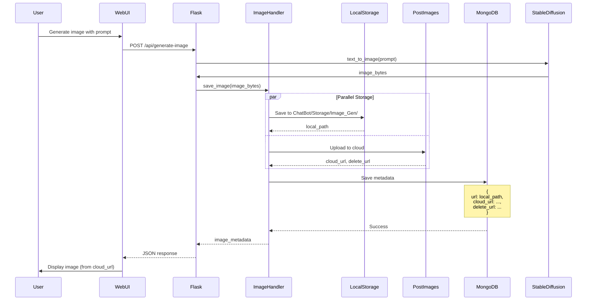
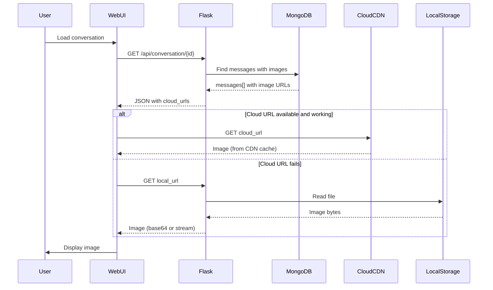

# 7️⃣ IMAGE STORAGE DESIGN - Giải pháp lưu trữ hình ảnh

> **Hybrid Image Storage Solution**  
> Local storage + Cloud CDN (PostImages/ImgBB) cho reliability và performance

---

## 📋 Tổng quan

### Vấn đề cần giải quyết:
1. ❌ **Local storage không reliable:** Server restart → mất images
2. ❌ **Sharing khó khăn:** Local paths không access từ bên ngoài
3. ❌ **Bandwidth cao:** Serve images từ Flask app
4. ❌ **No backup:** Xóa nhầm file = mất vĩnh viễn

### Giải pháp:
✅ **Hybrid Storage:**
- **Primary:** Cloud CDN (PostImages/ImgBB) - permanent, shareable
- **Secondary:** Local backup - fast access, offline support
- **Database:** MongoDB references với full URLs

---

## 🏗️ Architecture Diagram

```mermaid
graph TB
    subgraph "User Layer"
        User[👤 User]
        WebUI[🌐 Web Interface]
    end
    
    subgraph "ChatBot Application"
        Flask[🐍 Flask App]
        ImageHandler[🖼️ Image Handler]
        LocalStorage[💾 Local Storage]
    end
    
    subgraph "Cloud Layer"
        PostImages[☁️ PostImages CDN]
        ImgBB[☁️ ImgBB CDN]
        Fallback[🔄 Fallback Logic]
    end
    
    subgraph "Database Layer"
        MongoDB[(🗄️ MongoDB Atlas)]
        ImagesCollection[images array in messages]
    end
    
    subgraph "Storage Locations"
        LocalDir[📁 ChatBot/Storage/Image_Gen/]
        CDN1[🌍 PostImages CDN Servers]
        CDN2[🌍 ImgBB CDN Servers]
    end
    
    %% Upload flow
    User -->|1. Generate/Upload Image| WebUI
    WebUI -->|2. Send to server| Flask
    Flask -->|3. Process| ImageHandler
    
    %% Storage flow
    ImageHandler -->|4a. Save locally| LocalStorage
    ImageHandler -->|4b. Upload to cloud| Fallback
    
    Fallback -->|Primary| PostImages
    Fallback -->|If fails| ImgBB
    
    PostImages -->|Store| CDN1
    ImgBB -->|Store| CDN2
    
    LocalStorage -->|Save to| LocalDir
    
    %% Database flow
    ImageHandler -->|5. Save metadata| MongoDB
    MongoDB -->|Store references| ImagesCollection
    
    %% Retrieval flow
    WebUI -->|6. Request image| Flask
    Flask -->|7a. Check MongoDB| MongoDB
    MongoDB -->|7b. Return URL| Flask
    Flask -->|8a. Try cloud URL| CDN1
    CDN1 -.->|If fails| LocalDir
    Flask -->|8b. Send to user| WebUI
    
    style PostImages fill:#4CAF50,stroke:#2E7D32,color:#fff
    style ImgBB fill:#2196F3,stroke:#1565C0,color:#fff
    style MongoDB fill:#47A248,stroke:#116149,color:#fff
    style LocalStorage fill:#FF9800,stroke:#E65100,color:#fff
```



---

## 📊 Storage Strategy Comparison

| Aspect | Local Only | Cloud Only | **Hybrid (Ours)** |
|:-------|:-----------|:-----------|:------------------|
| **Reliability** | ❌ Low | ✅ High | ✅✅ Very High |
| **Speed (First load)** | ✅ Fast | ⚠️ Medium | ⚠️ Medium |
| **Speed (Cached)** | ✅ Fast | ✅ Fast | ✅✅ Very Fast |
| **Sharing** | ❌ No | ✅ Yes | ✅ Yes |
| **Bandwidth** | ❌ High | ✅ Low | ✅ Low |
| **Backup** | ❌ Manual | ✅ Auto | ✅✅ Dual |
| **Offline Support** | ✅ Yes | ❌ No | ✅ Yes |
| **Cost** | ✅ Free | ⚠️ Paid (some free tier) | ✅ Free + Free tier |

**Winner:** ✅ Hybrid approach - best of both worlds!

---

## 🔧 Implementation Details

### 1️⃣ Image Upload Flow



**Total time:** ~5-10 seconds
- Image generation: 3-5s (Stable Diffusion)
- Local save: 50-100ms
- Cloud upload: 1-3s (PostImages)
- Database save: 10-20ms

---

### 2️⃣ Image Retrieval Flow



**Loading time:**
- From cloud CDN: 100-300ms (cached globally)
- From local: 10-50ms (same server)

---

### 3️⃣ Fallback Logic

```python
class ImageUploader:
    def __init__(self):
        self.primary_service = PostImagesAPI()
        self.fallback_service = ImgBBAPI()
        self.local_storage = Path("ChatBot/Storage/Image_Gen")
    
    def save_image(self, image_bytes: bytes, filename: str) -> dict:
        """
        Save image to local + cloud với fallback logic
        
        Returns:
            {
                'url': '/static/Storage/Image_Gen/img_123.png',
                'cloud_url': 'https://i.postimg.cc/...',
                'delete_url': 'https://postimg.cc/delete/...',
                'service': 'postimages',
                'size': 245680
            }
        """
        result = {}
        
        # 1. Save to local (always succeeds)
        local_path = self.local_storage / filename
        with open(local_path, 'wb') as f:
            f.write(image_bytes)
        
        result['url'] = f'/static/Storage/Image_Gen/{filename}'
        result['size'] = len(image_bytes)
        
        # 2. Try cloud upload with fallback
        try:
            # Try primary service (PostImages)
            cloud_result = self.primary_service.upload(str(local_path))
            result['cloud_url'] = cloud_result['url']
            result['delete_url'] = cloud_result['delete_url']
            result['service'] = 'postimages'
            logger.info(f"✅ Uploaded to PostImages: {cloud_result['url']}")
            
        except Exception as e:
            logger.warning(f"⚠️ PostImages failed: {e}, trying ImgBB...")
            
            try:
                # Fallback to ImgBB
                cloud_result = self.fallback_service.upload(str(local_path))
                result['cloud_url'] = cloud_result['url']
                result['delete_url'] = cloud_result.get('delete_url')
                result['service'] = 'imgbb'
                logger.info(f"✅ Uploaded to ImgBB: {cloud_result['url']}")
                
            except Exception as e2:
                logger.error(f"❌ Both cloud services failed: {e2}")
                # Use local URL only
                result['cloud_url'] = result['url']
                result['delete_url'] = None
                result['service'] = 'local'
        
        return result
```

---

## 🌐 Cloud Service Comparison

### PostImages (Primary)

**Pros:**
- ✅ **Free tier:** Unlimited images, 24MB/image
- ✅ **No expiration:** Images stored permanently
- ✅ **Delete support:** Delete URLs cho cleanup
- ✅ **Fast CDN:** Cloudflare-backed
- ✅ **No registration:** API key optional

**Cons:**
- ⚠️ Rate limiting: ~100 uploads/hour
- ⚠️ Downtime occasional

**API Example:**
```python
import requests

def upload_to_postimages(image_path: str) -> dict:
    """Upload image to PostImages"""
    url = "https://api.postimages.org/json/upload"
    
    with open(image_path, 'rb') as f:
        files = {'file': f}
        data = {'key': POSTIMAGES_API_KEY}  # Optional
        
        response = requests.post(url, files=files, data=data)
        result = response.json()
    
    return {
        'url': result['url'],  # Display URL
        'delete_url': result['delete']  # Delete URL
    }
```

---

### ImgBB (Fallback)

**Pros:**
- ✅ **Free tier:** 32MB/image, stable API
- ✅ **Easy API:** Simple JSON response
- ✅ **Expiration control:** Set custom expiry
- ✅ **Gallery support:** Organize images

**Cons:**
- ⚠️ **Requires API key:** Must register
- ⚠️ **Rate limiting:** 5000 uploads/month (free)

**API Example:**
```python
import requests
import base64

def upload_to_imgbb(image_path: str) -> dict:
    """Upload image to ImgBB"""
    url = "https://api.imgbb.com/1/upload"
    
    with open(image_path, 'rb') as f:
        image_base64 = base64.b64encode(f.read()).decode()
    
    data = {
        'key': IMGBB_API_KEY,
        'image': image_base64,
        'expiration': 0  # Never expire
    }
    
    response = requests.post(url, data=data)
    result = response.json()['data']
    
    return {
        'url': result['url'],
        'delete_url': result['delete_url']
    }
```

---

## 📁 Local Storage Structure

```
ChatBot/
└── Storage/
    ├── Image_Gen/           # AI-generated images
    │   ├── img_20251110_abc123.png
    │   ├── img_20251110_def456.png
    │   └── ...
    │
    ├── uploads/             # User-uploaded files
    │   ├── upload_20251110_ghi789_report.pdf
    │   ├── upload_20251110_jkl012_diagram.png
    │   └── ...
    │
    └── thumbnails/          # Image thumbnails (optional)
        ├── thumb_img_20251110_abc123.png
        └── ...
```

**Naming convention:**
```python
def generate_filename(prefix: str = "img") -> str:
    """Generate unique filename with timestamp + hash"""
    timestamp = datetime.now().strftime("%Y%m%d_%H%M%S")
    random_hash = secrets.token_hex(4)
    return f"{prefix}_{timestamp}_{random_hash}.png"

# Example: img_20251110_143025_a3f2.png
```

**Cleanup strategy:**
```python
def cleanup_old_images(days: int = 30):
    """Delete local images older than N days (cloud copies remain)"""
    cutoff = datetime.now() - timedelta(days=days)
    
    for img_path in Path("ChatBot/Storage/Image_Gen").glob("*.png"):
        if img_path.stat().st_mtime < cutoff.timestamp():
            img_path.unlink()
            logger.info(f"🗑️ Deleted old image: {img_path.name}")
```

---

## 🗄️ MongoDB Schema

```javascript
// In messages collection
{
  "_id": ObjectId("..."),
  "conversation_id": ObjectId("..."),
  "role": "assistant",
  "content": "Here's the generated image:",
  
  // Images array (embedded)
  "images": [
    {
      // Local path (always available)
      "url": "/static/Storage/Image_Gen/img_20251110_abc123.png",
      
      // Cloud URLs (preferred for display)
      "cloud_url": "https://i.postimg.cc/xyz789/img_20251110_abc123.png",
      "delete_url": "https://postimg.cc/delete/abc123xyz",
      
      // Metadata
      "caption": "A beautiful AI-generated sunset",
      "size": 245680,
      "mime_type": "image/png",
      "width": 1024,
      "height": 1024,
      "generated": true,
      "service": "postimages",  // or 'imgbb', 'local'
      
      // Timestamps
      "uploaded_at": ISODate("2025-11-10T14:30:00.000Z")
    }
  ]
}
```

**Query example:**
```javascript
// Find all messages with AI-generated images
db.messages.find({
  "images.generated": true,
  "images.service": "postimages"
})

// Find images larger than 1MB
db.messages.find({
  "images.size": {$gt: 1048576}
})
```

---

## ⚡ Performance Optimizations

### 1️⃣ Image Compression

```python
from PIL import Image
import io

def compress_image(image_bytes: bytes, max_size_kb: int = 500) -> bytes:
    """Compress image to target size"""
    img = Image.open(io.BytesIO(image_bytes))
    
    # Convert to RGB if necessary
    if img.mode in ('RGBA', 'LA', 'P'):
        img = img.convert('RGB')
    
    # Calculate compression quality
    quality = 95
    output = io.BytesIO()
    
    while quality > 10:
        output.seek(0)
        img.save(output, format='JPEG', quality=quality, optimize=True)
        
        if output.tell() / 1024 <= max_size_kb:
            break
        
        quality -= 5
    
    return output.getvalue()
```

---

### 2️⃣ Lazy Loading

```javascript
// Frontend: Load images on-demand
function loadImage(imageUrl) {
  const img = new Image();
  img.loading = 'lazy';  // Native lazy loading
  img.src = imageUrl;
  
  // Show loading spinner while loading
  img.onload = () => {
    // Hide spinner, show image
  };
  
  img.onerror = () => {
    // Fallback to local URL
    img.src = imageUrl.replace('i.postimg.cc', 'localhost:5000/static');
  };
}
```

---

### 3️⃣ Thumbnail Generation

```python
def create_thumbnail(image_path: Path, thumb_size: tuple = (256, 256)) -> Path:
    """Create thumbnail for preview"""
    img = Image.open(image_path)
    img.thumbnail(thumb_size, Image.Resampling.LANCZOS)
    
    thumb_path = Path("ChatBot/Storage/thumbnails") / f"thumb_{image_path.name}"
    img.save(thumb_path, optimize=True, quality=85)
    
    return thumb_path
```

**MongoDB update:**
```javascript
{
  "images": [
    {
      "url": "/static/Storage/Image_Gen/img_123.png",
      "cloud_url": "https://i.postimg.cc/xyz789/img_123.png",
      "thumbnail_url": "/static/Storage/thumbnails/thumb_img_123.png",  // ← Add this
      // ...
    }
  ]
}
```

---

## 🔒 Security Considerations

### 1. File Upload Validation

```python
ALLOWED_EXTENSIONS = {'png', 'jpg', 'jpeg', 'gif', 'webp'}
MAX_FILE_SIZE = 50 * 1024 * 1024  # 50 MB

def validate_image(file):
    """Validate uploaded image"""
    # Check file extension
    filename = file.filename.lower()
    if not any(filename.endswith(ext) for ext in ALLOWED_EXTENSIONS):
        raise ValueError(f"Invalid file type. Allowed: {ALLOWED_EXTENSIONS}")
    
    # Check file size
    file.seek(0, 2)  # Seek to end
    size = file.tell()
    file.seek(0)  # Reset
    
    if size > MAX_FILE_SIZE:
        raise ValueError(f"File too large. Max: {MAX_FILE_SIZE / 1024 / 1024} MB")
    
    # Verify it's actually an image
    try:
        img = Image.open(file)
        img.verify()
    except Exception:
        raise ValueError("Invalid image file")
```

---

### 2. Access Control

```python
@app.route('/static/Storage/<path:filename>')
def serve_image(filename):
    """Serve images with access control"""
    # Check if user has permission to view this image
    # (check conversation ownership, etc.)
    
    if not user_has_access(filename):
        abort(403, "Access denied")
    
    return send_from_directory('Storage', filename)
```

---

### 3. Delete URL Protection

```python
def delete_image(delete_url: str, user_id: str):
    """Delete image from cloud (with authorization)"""
    # Verify user owns this image
    image = db.messages.find_one({
        "images.delete_url": delete_url,
        "user_id": user_id  # ← Check ownership
    })
    
    if not image:
        raise PermissionError("Not authorized to delete this image")
    
    # Delete from cloud
    requests.get(delete_url)
    
    # Delete from local
    local_path = Path(image['url'])
    if local_path.exists():
        local_path.unlink()
    
    # Update MongoDB
    db.messages.update_one(
        {"_id": image['_id']},
        {"$pull": {"images": {"delete_url": delete_url}}}
    )
```

---

## 📊 Storage Statistics

### Capacity Planning

**Assumptions:**
- Average image size: 500 KB (after compression)
- Users: 100 active
- Images per user per month: 20
- Retention: 6 months

**Calculations:**

| Storage | Capacity | Usage (1 month) | Usage (6 months) |
|:--------|:---------|:----------------|:-----------------|
| **Local** | Unlimited (disk) | 1 GB | 6 GB |
| **PostImages** | Unlimited | Free | Free |
| **ImgBB** | 5000/month | 2000 images | 12000 images |
| **MongoDB** | 512 MB (free tier) | 10 MB (refs only) | 60 MB |

**Conclusion:** ✅ All within free tiers!

---

## 🔄 Backup Strategy

### Auto-backup to cloud ensures:
1. ✅ **Disaster recovery:** Server failure → images safe on cloud
2. ✅ **Migration:** Move to new server → download from cloud
3. ✅ **Sharing:** Send conversation links → images accessible
4. ✅ **Archival:** Old images auto-cleanup locally, remain on cloud

### Restore procedure:
```python
def restore_images_from_mongodb():
    """Download all cloud images to local storage"""
    messages = db.messages.find({"images": {"$exists": True, "$ne": []}})
    
    for msg in messages:
        for img in msg['images']:
            cloud_url = img.get('cloud_url')
            if cloud_url:
                # Download from cloud
                response = requests.get(cloud_url)
                
                # Save to local
                local_path = Path(img['url'])
                local_path.parent.mkdir(parents=True, exist_ok=True)
                
                with open(local_path, 'wb') as f:
                    f.write(response.content)
                
                logger.info(f"✅ Restored: {local_path.name}")
```

---

<div align="center">

**Storage:** Hybrid (Local + Cloud)  
**Primary CDN:** PostImages  
**Fallback CDN:** ImgBB  
**Database:** MongoDB (references only)

[⬅️ Back: Data Structure](06_mongodb_data_structure.md) | [➡️ Next: UI Design](08_ui_design.md)

</div>
