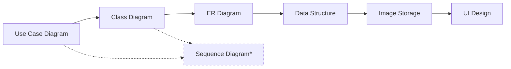

# 📚 DIAGRAM DOCUMENTATION - ChatBot Service

> **Comprehensive Design Documentation**  
> MongoDB-based AI ChatBot với modern architecture

---

## 📋 Mục lục

### Phần 1: MongoDB Schema & API (Đã hoàn thành)
1. [MongoDB Schema Design](01_mongodb_schema.md) - Chi tiết 6 collections
2. [API Architecture](02_api_architecture.md) - RESTful API design

### Phần 2: System Design (Mới - 2025-11-10)
3. [Use Case Diagram](03_usecase_diagram.md) - 25 use cases
4. [Class Diagram](04_class_diagram.md) - 30+ classes
5. [ER Diagram](05_er_diagram.md) - MongoDB relationships
6. [Data Structure](06_mongodb_data_structure.md) - NoSQL schema design
7. [Image Storage Design](07_image_storage_design.md) - Hybrid storage solution
8. [UI Design](08_ui_design.md) - Modern web interface

---

## 🎯 Quick Overview

### Database: MongoDB Atlas

| Collection | Documents | Purpose |
|:-----------|:----------|:--------|
| **conversations** | ~3,000 | Chat metadata (model, settings, stats) |
| **messages** | ~45,000 | All messages (user + AI) với images/files |
| **chatbot_memory** | ~5,000 | AI learning storage với tags |
| **uploaded_files** | ~1,000 | File upload tracking + analysis |
| **users** | ~100 | User accounts (future) |
| **user_settings** | ~100 | User preferences |

**Total Storage:** ~70 MB (1 year, 100 users)

---

### Architecture Highlights

#### 1️⃣ Use Cases (25 total)
- ✅ **Core Features:** Chat, Switch models, Configure settings, Stop/Edit
- ✅ **File Management:** Upload, Analyze, View
- ✅ **Memory & Learning:** Save, Search, Rate, Tag
- ✅ **Image Features:** Generate, Upload to cloud, Gallery
- ✅ **Tools:** Export PDF, Web search, GitHub search

#### 2️⃣ Class Design (30+ classes)
- **Core:** FlaskApp, MongoDBClient, AIModelManager
- **Database:** ConversationDB, MessageDB, MemoryDB, FileDB
- **AI Models:** GeminiModel, OpenAIModel, DeepSeekModel, QwenModel
- **Utilities:** CacheManager, StreamingHandler, ImageUploader

#### 3️⃣ Data Storage
- **MongoDB:** Document references (ObjectId)
- **Embedding:** Images, files, metadata trong messages
- **Indexes:** 15+ indexes cho performance
- **Hybrid Storage:** Local + Cloud (PostImages/ImgBB)

#### 4️⃣ UI Design
- **Layout:** Sidebar + Main chat + Controls
- **Theme:** Dark/Light mode toggle
- **Responsive:** Mobile-first design
- **Components:** Message bubbles, Input box, Modals

---

## 📊 Diagram Relationships



**Note:** Sequence Diagram đã có sẵn ở `../03_sequence_diagrams.md` (3 flows: Chat upload, Text2SQL, Speech2Text)

---

## 🔗 Cross-references

### Use Case → Class Mapping

| Use Case | Implemented by Classes |
|:---------|:----------------------|
| **UC1: Chat with AI** | FlaskApp, AIModelManager, GeminiModel, MessageDB |
| **UC6: Upload Files** | FileUploader, FileDB, GeminiModel (analysis) |
| **UC9: Save to Memory** | MemoryDB, ConversationDB |
| **UC13: Generate Images** | StableDiffusionClient, ImageUploader, PostImagesAPI |

### Class → Database Mapping

| Class | MongoDB Collection |
|:------|:------------------|
| **ConversationDB** | conversations |
| **MessageDB** | messages |
| **MemoryDB** | chatbot_memory |
| **FileDB** | uploaded_files |
| **UserSettingsDB** | user_settings |

### ER → Data Structure

| Entity | Document Structure | Embedding/Reference |
|:-------|:------------------|:-------------------|
| **CONVERSATIONS** | Flat document | Reference to messages (1:N) |
| **MESSAGES** | Embedded images[], files[] | Reference to conversation |
| **CHATBOT_MEMORY** | Embedded tags[], images[] | Reference to conversation |

---

## 🚀 Implementation Status

### ✅ Completed (v2.0)
- [x] MongoDB Atlas integration
- [x] 6 collections với indexes
- [x] ConversationDB, MessageDB helpers
- [x] Image upload to PostImages/ImgBB
- [x] Dark/Light theme UI
- [x] Message edit với versioning
- [x] AI Memory với tags

### 🚧 In Progress
- [ ] User authentication (users collection)
- [ ] Advanced memory search (semantic)
- [ ] Thumbnail generation
- [ ] Voice input/output

### 📅 Future Enhancements
- [ ] Multi-user support
- [ ] Real-time collaboration
- [ ] Conversation templates
- [ ] API access với keys
- [ ] Advanced analytics dashboard

---

## 📖 How to Use These Diagrams

### For Developers:
1. **Start with Use Case Diagram** - Understand what the system does
2. **Read Class Diagram** - Learn the code structure
3. **Study ER Diagram** - Understand data relationships
4. **Check Data Structure** - Learn MongoDB schema design
5. **Review Image Storage** - Understand hybrid storage approach
6. **Explore UI Design** - Build/customize the interface

### For System Architects:
1. **Use Case** → Requirements gathering
2. **Class** → System design
3. **ER** → Database design
4. **Data Structure** → NoSQL optimization
5. **Image Storage** → Scalability planning
6. **UI Design** → User experience design

### For New Contributors:
1. Read **Use Case Diagram** first - Get overview
2. Pick a feature to implement
3. Find related **Classes** in Class Diagram
4. Check **Database schema** in ER + Data Structure
5. Implement following **UI Design** guidelines

---

## 📝 Naming Conventions

### MongoDB Collections:
- Lowercase, plural: `conversations`, `messages`, `chatbot_memory`
- Underscores for multi-word: `uploaded_files`, `user_settings`

### Python Classes:
- PascalCase: `ConversationDB`, `MessageDB`, `AIModelManager`
- Suffix `DB` for database helpers
- Suffix `API` for external services: `PostImagesAPI`

### JavaScript:
- camelCase: `messageInput`, `darkModeBtn`, `generateImage()`
- IDs with hash: `#messageInput`, `#darkModeBtn`

### CSS:
- kebab-case: `.message-content`, `.user-message`, `.action-btn`
- BEM for complex: `.message__content--user`

---

## 🎨 Visual Style Guide

### Colors (Dark Mode)
```css
Primary Background:   #121212
Secondary Background: #1e1e1e
Tertiary Background:  #2a2a2a
Accent Color:         #667eea (Gradient: #667eea → #764ba2)
Text Primary:         #ffffff
Text Secondary:       #888888
Border:               #333333
Success:              #28a745
Error:                #dc3545
```

### Typography
```css
Headings:  'Segoe UI', 'Roboto', sans-serif
Body:      'Segoe UI', 'Roboto', sans-serif
Code:      'Consolas', 'Monaco', monospace
```

### Spacing
```css
Base Unit:    8px
Small Gap:    8px
Medium Gap:   12px
Large Gap:    20px
Section Gap:  32px
```

---

## 🔍 Common Queries

### Find all messages in a conversation
```javascript
db.messages.find({
  conversation_id: ObjectId("...")
}).sort({created_at: 1})
```

### Search memory by tags
```javascript
db.chatbot_memory.find({
  tags: {$in: ["python", "async"]}
}).sort({rating: -1})
```

### Get conversation with messages (aggregation)
```javascript
db.conversations.aggregate([
  {$match: {_id: ObjectId("...")}},
  {$lookup: {
    from: "messages",
    localField: "_id",
    foreignField: "conversation_id",
    as: "messages"
  }}
])
```

---

## 📚 Related Documentation

### Main Project Docs:
- [Project README](../../README.md)
- [ChatBot README](../../ChatBot/README.md)
- [Quick Start Guide](../../docs/QUICKSTART.md)

### Old Diagrams (PostgreSQL-based):
- [Old Use Case](../01_usecase_diagram.md) - SQL version
- [Old Class Diagram](../02_class_diagram.md) - SQL version
- [Old Database Design](../04_database_design.md) - PostgreSQL schema

### API Documentation:
- [API Reference](../../docs/API_DOCUMENTATION.md)
- [MongoDB Setup](../../ChatBot/docs/MONGODB_SETUP.md)

---

## 🤝 Contributing

Nếu bạn muốn thêm/sửa diagrams:

1. **Use Mermaid syntax** - Dễ version control
2. **Follow naming conventions** - Consistent với existing docs
3. **Add examples** - Code snippets, queries
4. **Cross-reference** - Link to related diagrams
5. **Update this README** - Thêm vào mục lục

### Template for new diagrams:
```markdown
# X️⃣ DIAGRAM_NAME

> **Short description**  
> One-line summary

## 📋 Mô tả
...

## 🎯 Diagram
```mermaid
...
```

## 📊 Details
...

## 🔗 Related
[Link to other diagrams]
```

---

## 📈 Statistics

| Metric | Count |
|:-------|:------|
| **Total Diagrams** | 8 |
| **Use Cases** | 25 |
| **Classes** | 30+ |
| **Collections** | 6 |
| **Indexes** | 15+ |
| **UI Components** | 7 |
| **Lines of Docs** | ~5,000 |

---

## 🎯 Goals Achieved

✅ **Complete system documentation** cho ChatBot service  
✅ **MongoDB schema design** với best practices  
✅ **Class hierarchy** rõ ràng, dễ extend  
✅ **Image storage solution** reliable và scalable  
✅ **Modern UI design** responsive và accessible  
✅ **Cross-referenced** tất cả diagrams  

---

<div align="center">

**Documentation Version:** 2.0  
**Last Updated:** 2025-11-10  
**Author:** AI-Assistant Team  
**Database:** MongoDB Atlas (chatbot_db)

[⬅️ Back to Main Diagram Index](../README.md) | [🏠 Project Home](../../README.md)

---

**Made with ❤️ using Mermaid, MongoDB, and Markdown**

</div>
