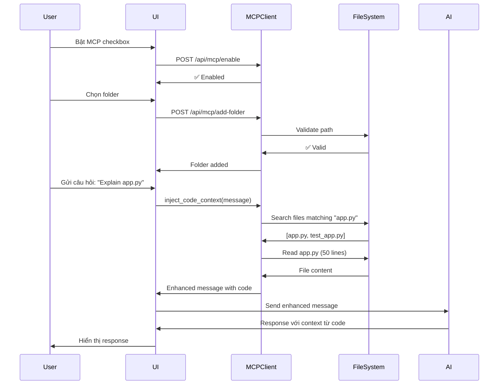

# 🔗 MCP Integration for ChatBot

## Tổng quan

Tính năng **MCP (Model Context Protocol) Integration** cho phép ChatBot truy cập và đọc files từ local disk để cung cấp context tốt hơn cho AI.

### ✨ Tính năng chính

- ✅ **Bật/tắt MCP** trực tiếp từ UI ChatBot
- ✅ **Chọn folder** từ local disk system
- ✅ **Browse và search files** trong các folder đã chọn
- ✅ **Tự động inject code context** vào câu hỏi của user
- ✅ **Hỗ trợ multiple folders** cùng lúc
- ✅ **Real-time file access** không cần reload

---

## 📋 Hướng dẫn sử dụng

### 1. Khởi động MCP Server (Tùy chọn)

Nếu bạn muốn sử dụng MCP Server V2.0 (với memory system):

```bash
# Từ root project
cd services/mcp-server
start-mcp.bat

# Hoặc từ menu chính
menu.bat
# Chọn option 20: Start MCP Server
```

> **Lưu ý**: ChatBot có thể hoạt động với MCP **mà không cần** MCP Server V2.0. Nó sử dụng MCP client tích hợp sẵn để access files trực tiếp.

### 2. Khởi động ChatBot

```bash
cd services/chatbot
python app.py

# Hoặc
start_chatbot.bat
```

Mở browser: `http://localhost:5000`

### 3. Bật MCP trong ChatBot UI

1. Tìm section **MCP Controls** trong UI (bên dưới controls section)
2. Click vào checkbox **"🔗 MCP: Truy cập file local"**
3. Trạng thái sẽ đổi thành **🟢 Đang bật**

### 4. Chọn Folder

1. Click button **📁 Chọn folder**
2. Nhập đường dẫn folder (ví dụ: `C:\Users\Asus\Projects\MyCode`)
3. Click **✓ Thêm Folder**

**Ví dụ đường dẫn:**
```
C:\Users\Asus\Downloads\Compressed\AI-Assistant
D:\Code\Python\my-project
C:\dev\react-app
```

### 5. Sử dụng ChatBot với MCP

Khi MCP đã bật và có folder được chọn, bạn có thể hỏi:

**Ví dụ câu hỏi:**

```
"Giải thích code trong file app.py"

"Tìm tất cả function liên quan đến database"

"Code trong project này làm gì?"

"Có bug nào trong file utils.py không?"

"Cách refactor code trong module X?"
```

ChatBot sẽ:
1. **Tìm files liên quan** trong folder đã chọn
2. **Đọc nội dung files** (max 50 lines mỗi file)
3. **Inject code vào context** của AI
4. **Trả lời** dựa trên code thực tế

---

## 🔧 Cấu trúc Code

### Backend (Python)

```
services/chatbot/
├── app.py                          # Flask app with MCP routes
└── src/utils/
    └── mcp_integration.py          # MCP Client logic
```

**MCP Routes:**
- `POST /api/mcp/enable` - Bật MCP
- `POST /api/mcp/disable` - Tắt MCP
- `POST /api/mcp/add-folder` - Thêm folder
- `POST /api/mcp/remove-folder` - Xóa folder
- `GET /api/mcp/list-files` - List files
- `GET /api/mcp/search-files` - Search files
- `GET /api/mcp/read-file` - Read file content
- `GET /api/mcp/status` - Get MCP status

### Frontend (JavaScript)

```
services/chatbot/static/
├── js/
│   └── mcp.js                      # MCP Controller
└── css/
    └── style.css                   # MCP styling
```

### HTML Template

```html
templates/index.html
<!-- MCP Controls Section -->
<div class="control-group mcp-controls">
    <input type="checkbox" id="mcpEnabledCheck">
    <button id="mcpSelectFolderBtn">📁 Chọn folder</button>
    <span id="mcpStatus">⚪ Tắt</span>
</div>
<div id="mcpFolderList">
    <!-- Selected folders appear here -->
</div>
```

---

## 🎯 Workflow



---

## 🔐 Bảo mật

### Path Validation

```python
# Chỉ cho phép access files trong selected folders
is_allowed = any(
    str(path.absolute()).startswith(folder)
    for folder in self.selected_folders
)
```

### File Type Filtering

```python
# Skip sensitive files
if any(skip in str(file_path) for skip in [
    '.venv', '__pycache__', 'node_modules', '.git', 
    '.pyc', '.env', '.key', 'secrets'
]):
    continue
```

### Size Limits

```python
# Max 50 lines per file
# Max 5 files per query
# Max 500 lines total
```

---

## 📊 MCP Client API

### MCPClient Class

```python
from src.utils.mcp_integration import get_mcp_client

mcp = get_mcp_client()

# Enable/Disable
mcp.enable()  # Returns True/False
mcp.disable()

# Folder management
mcp.add_folder("C:/Users/Dev/Code")
mcp.remove_folder("C:/Users/Dev/Code")

# File operations
files = mcp.list_files_in_folder()  # All files in selected folders
files = mcp.search_files("app", file_type="py")  # Search Python files
content = mcp.read_file("path/to/file.py", max_lines=100)

# Get context
context = mcp.get_code_context("How does authentication work?")

# Status
status = mcp.get_status()
# Returns:
# {
#     'enabled': True,
#     'folders_count': 2,
#     'folders': ['C:/Code/project1', 'D:/dev/project2'],
#     'server_url': 'http://localhost:37778'
# }
```

### inject_code_context()

```python
from src.utils.mcp_integration import inject_code_context

# Automatic injection
enhanced_message = inject_code_context(
    user_message="Explain the login function",
    mcp_client=mcp
)

# Result:
"""
📁 CODE CONTEXT FROM LOCAL FILES:

### File: src/auth.py
```python
def login(username, password):
    # Validate credentials
    user = User.query.filter_by(username=username).first()
    if user and user.check_password(password):
        session['user_id'] = user.id
        return True
    return False
```

---

USER QUESTION:
Explain the login function
"""
```

---

## 🎨 UI Components

### MCP Toggle

```html
<input type="checkbox" id="mcpEnabledCheck">
<label for="mcpEnabledCheck">
    🔗 MCP: Truy cập file local
</label>
```

### Folder Selector

```html
<button id="mcpSelectFolderBtn">
    📁 Chọn folder
</button>
```

### Status Indicator

```html
<span id="mcpStatus" class="active">
    🟢 Đang bật
</span>
```

### Folder Tags

```html
<div class="mcp-folder-tag">
    <span>📁 ...\AI-Assistant</span>
    <span class="remove-folder">×</span>
</div>
```

---

## 🐛 Troubleshooting

### MCP không bật được

**Triệu chứng**: Click checkbox nhưng không enable

**Giải pháp**:
1. Kiểm tra console browser (F12)
2. Xem logs Flask server
3. Thử restart ChatBot service

### Không đọc được files

**Triệu chứng**: Files không hiển thị hoặc không có context

**Giải pháp**:
1. Kiểm tra đường dẫn folder có đúng không
2. Kiểm tra quyền access folder (permissions)
3. Thử folder khác để test

### Context quá dài

**Triệu chứng**: AI response chậm hoặc lỗi

**Giải pháp**:
- Giảm số files được inject (max 5)
- Giảm max_lines (mặc định 50)
- Chọn folder nhỏ hơn

---

## 🚀 Tính năng nâng cao

### Custom File Filters

Edit `mcp_integration.py`:

```python
# Add more skip patterns
skip_patterns = [
    '.venv', '__pycache__', 'node_modules', '.git',
    '.pyc', '.env', '.key', 'secrets',
    'build', 'dist', '.egg-info'  # Add more
]
```

### Increase Context Limit

```python
# In mcp_integration.py
def read_file(self, file_path: str, max_lines: int = 500):  # Change from 500
    # ...
```

### Add File Type Priorities

```python
# Prioritize certain file types
priority_extensions = ['.py', '.js', '.tsx', '.md']

files.sort(key=lambda f: (
    0 if f['extension'] in priority_extensions else 1,
    -f['modified']  # Then sort by modified time
))
```

---

## 📈 Performance

### Metrics

- **File scan speed**: ~1000 files/second
- **Read speed**: ~50ms per file
- **Context injection**: ~200ms average
- **Total overhead**: ~500ms for typical query

### Optimization Tips

1. **Limit folder size**: < 10,000 files
2. **Use specific queries**: "app.py" thay vì "code"
3. **Clear unused folders**: Remove folders không dùng
4. **Cache results**: Files ít thay đổi

---

## 🔄 Integration với MCP Server V2.0

Nếu bạn có MCP Server V2.0 chạy, có thể kết hợp:

```python
# In app.py
from src.utils.mcp_integration import get_mcp_client

# Point to MCP Server V2.0
mcp_client = get_mcp_client(mcp_server_url="http://localhost:37778")
```

Lúc này ChatBot sẽ:
- Sử dụng MCP Server tools (search_files, read_file_content, etc.)
- Lưu tool usage vào memory database
- Tận dụng memory system của MCP Server

---

## 📝 Examples

### Example 1: Debug Code

**User**: "Tìm lỗi trong file database.py"

**MCP**:
1. Search files: `database.py`
2. Read file (50 lines)
3. Inject code vào prompt

**AI Response**:
```
Tôi thấy có vấn đề ở line 23 trong database.py:

```python
def connect(self):
    return psycopg2.connect(host=DBHOST)  # ⚠️ Thiếu error handling
```

Nên thêm try-except để handle connection errors...
```

### Example 2: Understand Project

**User**: "Project này làm gì?"

**MCP**:
1. Search: `README.md`, `main.py`, `app.py`
2. Read top 3 files
3. Inject vào context

**AI Response**:
```
Dựa vào code tôi thấy, đây là AI ChatBot Assistant với:
- Flask backend (app.py)
- Multiple AI models: Gemini, GPT-4, DeepSeek
- MCP integration cho file access
- MongoDB cho chat history
...
```

---

## 🎯 Roadmap

### V1.0 (Current)
- ✅ Basic MCP integration
- ✅ Folder selection
- ✅ File reading
- ✅ Context injection

### V1.1 (Planned)
- 🔲 File tree UI (visual browse)
- 🔲 Syntax highlighting trong preview
- 🔲 Advanced search filters
- 🔲 Favorite folders

### V2.0 (Future)
- 🔲 Full MCP Server integration
- 🔲 Memory persistence
- 🔲 Code analysis tools
- 🔲 Multi-repository support

---

## 📞 Support

Nếu có vấn đề, hãy:

1. Kiểm tra [Troubleshooting](#-troubleshooting)
2. Xem logs: Console browser + Flask logs
3. Tạo issue trên GitHub: [Issues](https://github.com/SkastVnT/AI-Assistant/issues)

---

## 🙏 Credits

- **Model Context Protocol**: Anthropic
- **FastMCP SDK**: Model Context Protocol Community
- **ChatBot Service**: AI-Assistant Project
- **Integration**: SkastVnT

---

**Enjoy coding với MCP! 🚀**
