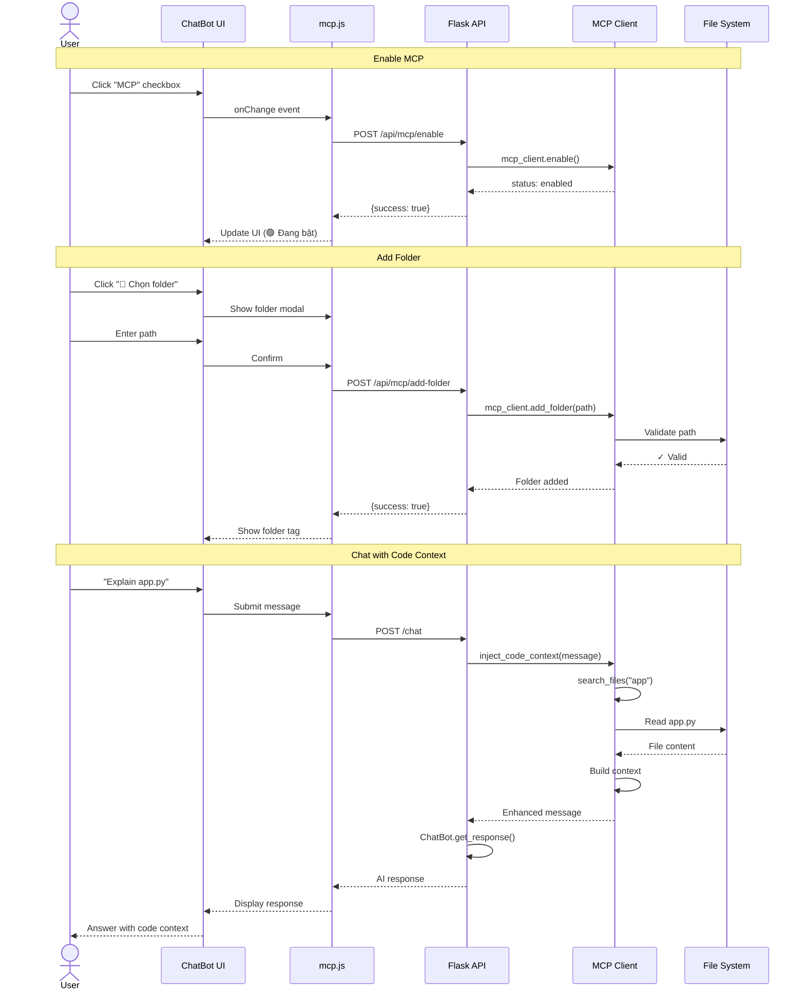
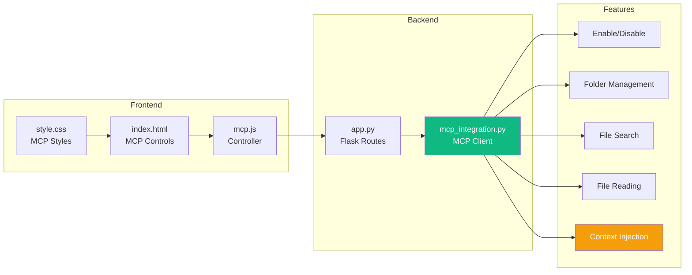
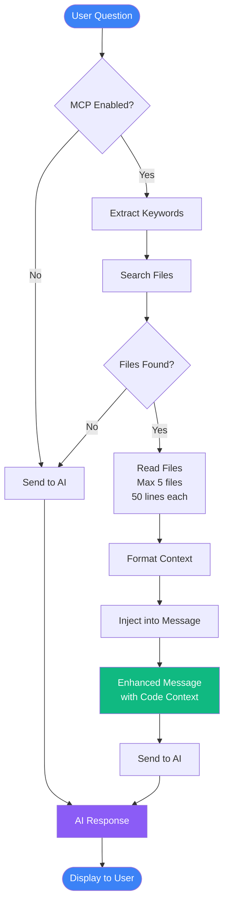

# 🎨 MCP Integration - Visual Diagrams

## 📊 Architecture Overview

```mermaid
graph TB
    subgraph "ChatBot UI"
        UI[User Interface]
        Toggle[MCP Toggle]
        FolderBtn[Folder Button]
        Chat[Chat Input]
    end
    
    subgraph "Frontend JavaScript"
        MCP_JS[mcp.js<br/>MCPController]
        API_Client[API Client]
    end
    
    subgraph "Flask Backend"
        Routes[MCP Routes<br/>8 endpoints]
        ChatRoute[/chat Route]
        MCP_Client[MCP Client<br/>Python]
    end
    
    subgraph "File System"
        Folders[Selected Folders]
        Files[Code Files]
    end
    
    UI --> Toggle
    UI --> FolderBtn
    UI --> Chat
    
    Toggle --> MCP_JS
    FolderBtn --> MCP_JS
    Chat --> MCP_JS
    
    MCP_JS --> API_Client
    API_Client --> Routes
    API_Client --> ChatRoute
    
    Routes --> MCP_Client
    ChatRoute --> MCP_Client
    
    MCP_Client --> Folders
    Folders --> Files
    
    style MCP_Client fill:#667eea,color:#fff
    style Files fill:#f59e0b,color:#fff
```

---

## 🔄 Request Flow



---

## 🏗️ Component Structure



---

## 📝 Data Flow



---

## 🎯 UI Mockup

```
┌────────────────────────────────────────────────────────────┐
│ 🤖 AI ChatBot Assistant                    🇬🇧 EN  @SkastVnT │
├────────────────────────────────────────────────────────────┤
│ Model: [Gemini ▼]  Chế độ: [Lập trình ▼]  🗑️ Xóa lịch sử   │
│                                                              │
│ ┌──────────────────────────────────────────────────────┐   │
│ │ 🔗 MCP Integration                                    │   │
│ │ ☑ MCP: Truy cập file local  [📁 Chọn folder]         │   │
│ │ 🟢 Đang bật • 2 folders                              │   │
│ │                                                        │   │
│ │ 📁 ...\AI-Assistant [×]   📁 ...\MyProject [×]       │   │
│ └──────────────────────────────────────────────────────┘   │
│                                                              │
│ ┌──────────────────────────────────────────────────────┐   │
│ │ 👤 User: Explain how app.py works                    │   │
│ │                                          [Copy] [⟳]   │   │
│ └──────────────────────────────────────────────────────┘   │
│                                                              │
│ ┌──────────────────────────────────────────────────────┐   │
│ │ 🤖 Assistant:                                         │   │
│ │                                                        │   │
│ │ 📁 CODE CONTEXT: Read 3 files (app.py, ...)          │   │
│ │                                                        │   │
│ │ Based on the code I read, app.py is a Flask          │   │
│ │ application that:                                     │   │
│ │                                                        │   │
│ │ 1. Initializes Flask app on port 5000                │   │
│ │ 2. Sets up MongoDB connections                       │   │
│ │ 3. Defines 8 MCP API routes:                         │   │
│ │    - POST /api/mcp/enable                            │   │
│ │    - POST /api/mcp/disable                           │   │
│ │    ...                                                │   │
│ │                                                        │   │
│ │                                          [Copy] [👍]   │   │
│ └──────────────────────────────────────────────────────┘   │
│                                                              │
│ ┌──────────────────────────────────────────────────────┐   │
│ │ Type your message...                        [Send]    │   │
│ └──────────────────────────────────────────────────────┘   │
└────────────────────────────────────────────────────────────┘
```

---

## 🔧 MCP Controls Detail

```
MCP Controls Section:
┌─────────────────────────────────────────────────────────┐
│ 🔗 MCP Integration                                       │
│                                                          │
│ ☑ MCP: Truy cập file local                             │
│                                                          │
│ [📁 Chọn folder]  🟢 Đang bật • 2 folders              │
│                                                          │
│ Selected Folders:                                        │
│ ┌──────────────────┐  ┌──────────────────┐            │
│ │ 📁 ...\MyProject │  │ 📁 ...\AI-Asst   │            │
│ │        [×]       │  │        [×]       │            │
│ └──────────────────┘  └──────────────────┘            │
└─────────────────────────────────────────────────────────┘

Folder Selection Modal:
┌───────────────────────────────────────┐
│ 📁 Chọn Folder Local             [×] │
├───────────────────────────────────────┤
│                                       │
│ Nhập đường dẫn folder:                │
│ ┌───────────────────────────────────┐ │
│ │ C:\Users\Dev\Projects\MyCode      │ │
│ └───────────────────────────────────┘ │
│                                       │
│ Ví dụ: C:\Users\...\AI-Assistant     │
│                                       │
│              [Hủy]  [✓ Thêm Folder]  │
└───────────────────────────────────────┘
```

---

## 📦 File Structure

```
services/chatbot/
│
├── 📄 app.py                       # Flask app with MCP routes
│   ├── POST /api/mcp/enable
│   ├── POST /api/mcp/disable
│   ├── POST /api/mcp/add-folder
│   ├── POST /api/mcp/remove-folder
│   ├── GET  /api/mcp/list-files
│   ├── GET  /api/mcp/search-files
│   ├── GET  /api/mcp/read-file
│   └── GET  /api/mcp/status
│
├── 📁 src/utils/
│   └── 📄 mcp_integration.py       # MCP Client
│       ├── class MCPClient
│       ├── enable()
│       ├── add_folder()
│       ├── search_files()
│       ├── read_file()
│       ├── get_code_context()
│       └── inject_code_context()
│
├── 📁 static/
│   ├── 📁 js/
│   │   └── 📄 mcp.js               # Frontend controller
│   │       ├── class MCPController
│   │       ├── enable()
│   │       ├── selectFolder()
│   │       ├── addFolder()
│   │       └── updateStatus()
│   │
│   └── 📁 css/
│       └── 📄 style.css            # MCP styling
│           ├── .mcp-controls
│           ├── .mcp-folder-tag
│           └── #mcpStatus
│
├── 📁 templates/
│   └── 📄 index.html               # UI with MCP controls
│       ├── <input id="mcpEnabledCheck">
│       ├── <button id="mcpSelectFolderBtn">
│       ├── <span id="mcpStatus">
│       └── <div id="mcpFolderList">
│
└── 📁 docs/
    ├── 📄 MCP_INTEGRATION.md       # Full documentation
    ├── 📄 QUICKSTART_MCP.md        # Quick start guide
    ├── 📄 MCP_INTEGRATION_SUMMARY.md
    └── 📄 VISUAL_DIAGRAMS.md       # This file
```

---

## 🎬 Usage Animation

```
Step 1: Enable MCP
┌─────────────────────┐       ┌─────────────────────┐
│ ☐ MCP: Truy cập... │  →→→  │ ☑ MCP: Truy cập... │
│ ⚪ Tắt              │       │ 🟢 Đang bật         │
└─────────────────────┘       └─────────────────────┘

Step 2: Add Folder
┌──────────────────────┐      ┌───────────────────────┐
│ No folders selected  │  →→→ │ 📁 ...\MyProject [×] │
└──────────────────────┘      └───────────────────────┘

Step 3: Ask Question
┌──────────────────────────────┐
│ 👤: Explain app.py           │
└──────────────────────────────┘
           ↓
    [MCP searches files]
           ↓
    [MCP reads app.py]
           ↓
    [Context injected]
           ↓
┌──────────────────────────────┐
│ 🤖: Based on code I read...  │
│                              │
│ app.py is a Flask app that: │
│ 1. ...                       │
│ 2. ...                       │
└──────────────────────────────┘
```

---

## 🧩 Integration Points

```mermaid
graph TD
    subgraph "User Interaction"
        Q[User Question:<br/>"Explain app.py"]
    end
    
    subgraph "MCP Processing"
        S[Search Files]
        R[Read Files]
        F[Format Context]
    end
    
    subgraph "AI Processing"
        E[Enhanced Message]
        AI[AI Model]
        Res[Response]
    end
    
    Q --> S
    S --> R
    R --> F
    F --> E
    E --> AI
    AI --> Res
    
    style E fill:#f59e0b,color:#fff
    style Res fill:#10b981,color:#fff
```

---

## 📊 Performance Metrics

```
┌─────────────────────────────────────────┐
│ MCP Performance                         │
├─────────────────────────────────────────┤
│                                         │
│ Enable MCP          │ ~50ms      ████  │
│ Add Folder          │ ~10ms      ██    │
│ List 1000 Files     │ ~1000ms    ██████████
│ Search Files        │ ~200ms     ████  │
│ Read File (50 ln)   │ ~50ms      ████  │
│ Context Injection   │ ~500ms     ██████│
│                                         │
│ Total Overhead:     │ ~500ms avg       │
└─────────────────────────────────────────┘
```

---

## 🎯 MCP in Action

### Before MCP:
```
User: "How does authentication work in this app?"

AI: "Based on general knowledge, authentication typically
     involves checking user credentials against a database..."
     
❌ Generic answer, no project-specific info
```

### After MCP:
```
User: "How does authentication work in this app?"

MCP: 
  - Searches: auth, login, authenticate
  - Finds: auth.py, login_handler.py
  - Reads: auth.py (50 lines)
  
AI: "📁 Based on auth.py I read:
    
     Your authentication uses JWT tokens with:
     1. User login via POST /api/login
     2. Password hashing with bcrypt
     3. Token generation with 24h expiry
     4. Refresh token mechanism
     
     See line 42 in auth.py for token generation."
     
✅ Specific, accurate, code-based answer
```

---

## 🔐 Security Flow

```mermaid
flowchart TD
    Request[File Read Request] --> Validate{Path Valid?}
    Validate -->|No| Reject[❌ Reject]
    Validate -->|Yes| InFolder{In Selected<br/>Folders?}
    
    InFolder -->|No| Reject
    InFolder -->|Yes| CheckType{File Type<br/>Allowed?}
    
    CheckType -->|No| Reject
    CheckType -->|Yes| CheckSize{Size < 10MB?}
    
    CheckSize -->|No| Reject
    CheckSize -->|Yes| CheckSens{Sensitive<br/>File?}
    
    CheckSens -->|Yes (.env, .key)| Reject
    CheckSens -->|No| Allow[✅ Allow Read]
    
    Reject --> Log[Log Security Event]
    Allow --> Read[Read File]
    Read --> Limit[Limit to 50 lines]
    Limit --> Return[Return Content]
    
    style Reject fill:#ef4444,color:#fff
    style Allow fill:#10b981,color:#fff
    style Return fill:#3b82f6,color:#fff
```

---

**🎨 Visual diagrams complete!**

See full documentation:
- [MCP_INTEGRATION.md](MCP_INTEGRATION.md)
- [QUICKSTART_MCP.md](QUICKSTART_MCP.md)
- [MCP_INTEGRATION_SUMMARY.md](MCP_INTEGRATION_SUMMARY.md)
