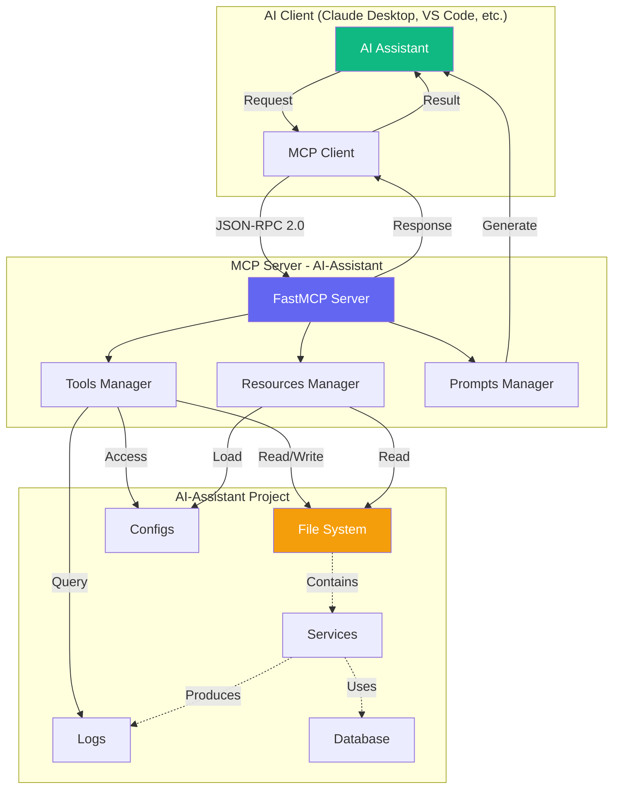
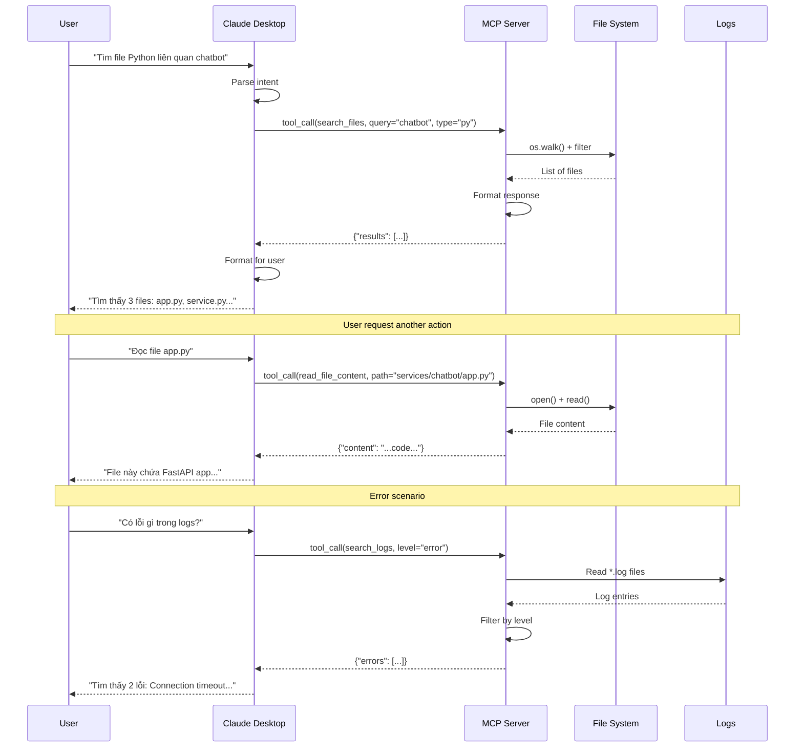
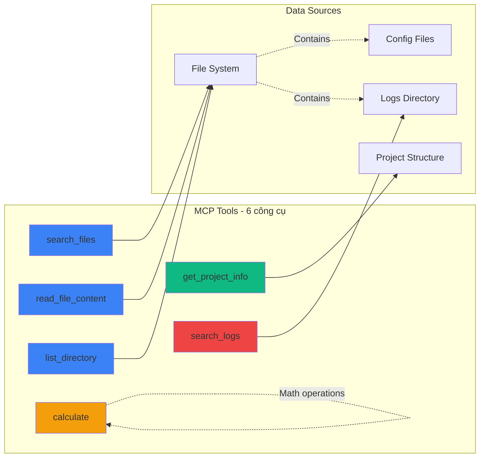
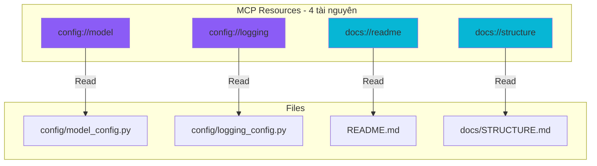
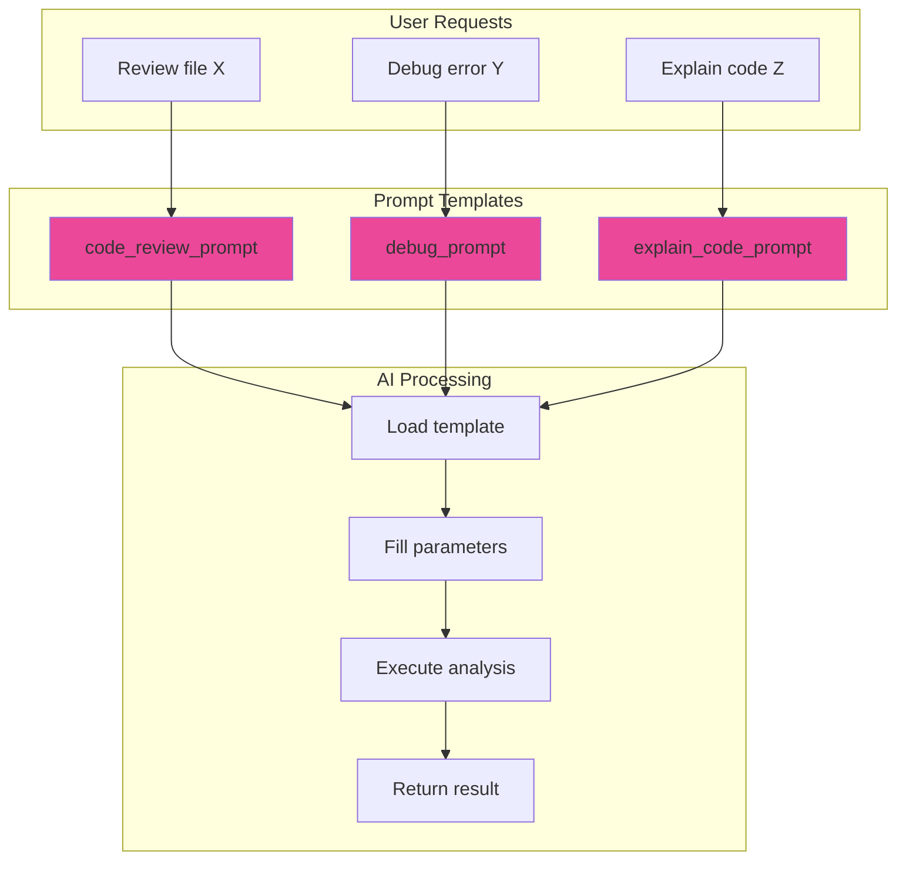
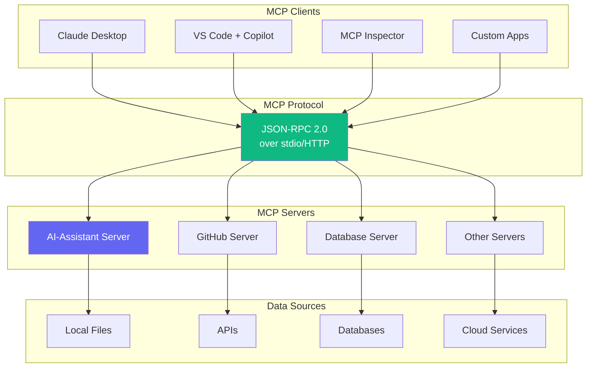
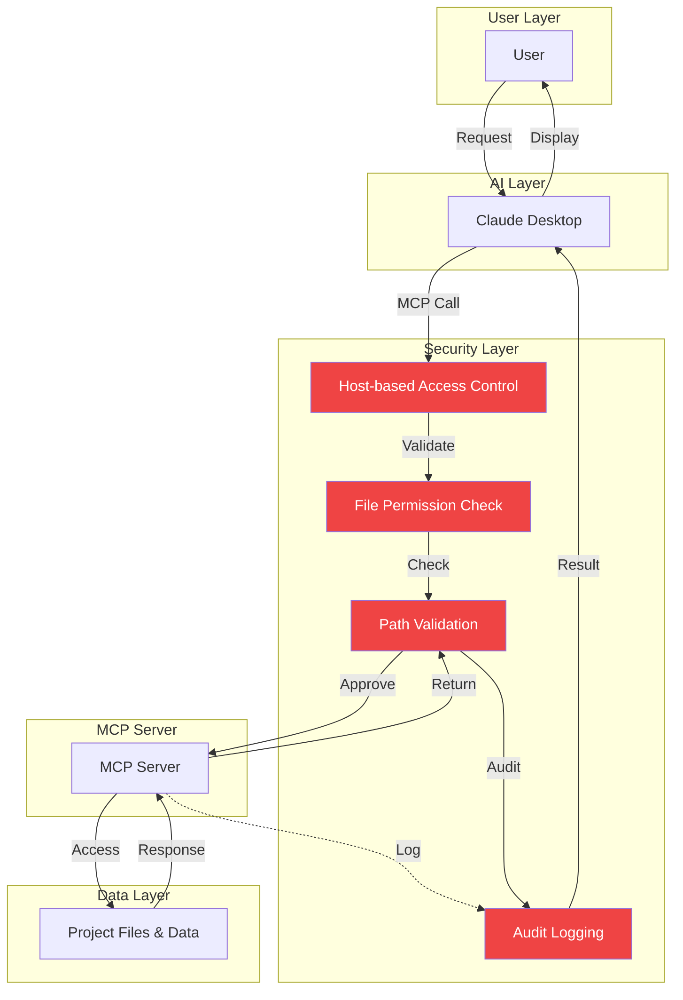
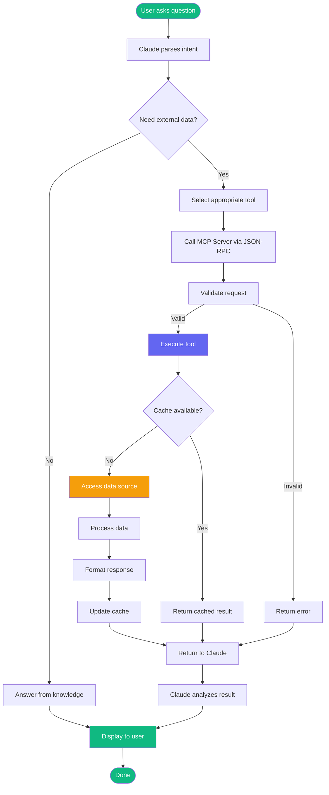
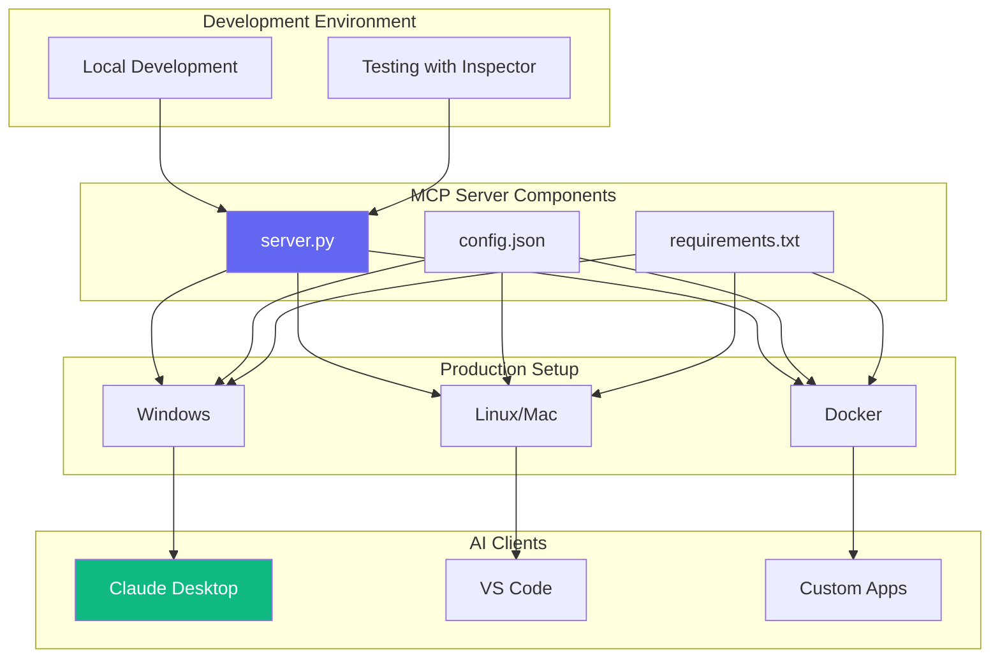
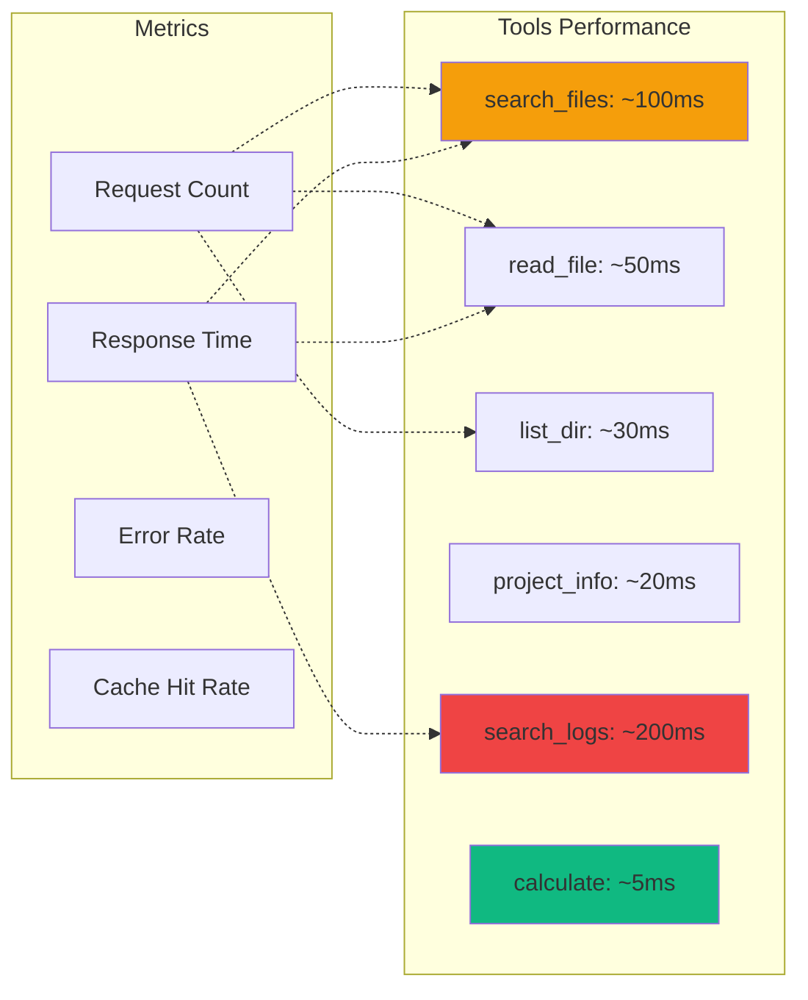

# 📊 MCP Server Architecture & Diagrams

Tài liệu này chứa các biểu đồ trực quan để hiểu kiến trúc MCP Server.

## 🏗️ 1. Architecture Overview



## 🔄 2. Request Flow Diagram



## 🔧 3. Tools Architecture



## 📦 4. Resources Structure



## 💬 5. Prompts Flow



## 🌐 6. MCP Ecosystem



## 🔐 7. Security Model



## 📈 8. Data Flow - End to End



## 🚀 9. Deployment Architecture



## 📊 10. Performance Metrics



---

## 📖 Cách đọc các diagram

### Màu sắc:
- 🔵 **Xanh dương** - Core components (MCP Server, Tools)
- 🟢 **Xanh lá** - Success/Endpoints (AI, Results)
- 🟡 **Vàng** - Data sources (Files, Logs)
- 🟣 **Tím** - Resources/Configs
- 🔴 **Đỏ** - Security/Errors
- 🔷 **Hồng** - Prompts/Templates

### Mũi tên:
- `-->` - Direct flow (luồng chính)
- `-.->` - Indirect/Optional flow (tùy chọn)
- `==>` - Strong dependency (phụ thuộc mạnh)

### Hình dạng:
- `[Rectangle]` - Process/Component
- `(Circle)` - Start/End
- `{Diamond}` - Decision point
- `((Circle))` - Database/Storage

---

## 🎯 Use Cases cho từng diagram

1. **Architecture Overview** - Hiểu tổng quan hệ thống
2. **Request Flow** - Debug luồng xử lý
3. **Tools Architecture** - Hiểu cách tools hoạt động
4. **Resources Structure** - Quản lý resources
5. **Prompts Flow** - Tạo prompts mới
6. **MCP Ecosystem** - Tích hợp với systems khác
7. **Security Model** - Audit và security review
8. **Data Flow** - Tối ưu performance
9. **Deployment** - Setup production
10. **Performance** - Monitoring và optimization

---

## 🔧 Tools để xem diagrams

### Online:
- **Mermaid Live Editor**: https://mermaid.live/
- **GitHub**: Tự động render Mermaid trong .md files
- **VS Code**: Extension "Markdown Preview Mermaid"

### Offline:
```bash
# VS Code extension
code --install-extension bierner.markdown-mermaid

# Hoặc dùng Mermaid CLI
npm install -g @mermaid-js/mermaid-cli
mmdc -i DIAGRAMS.md -o diagrams.pdf
```

---

**📚 Next Steps:**
1. Xem diagrams trên Mermaid Live Editor
2. Đọc hiểu từng luồng
3. Sử dụng để design thêm features
4. Tham khảo khi debug issues
