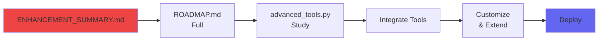

# 📚 MCP Server - Documentation Index

Chào mừng đến với MCP Server documentation! File này giúp bạn tìm đúng tài liệu cần đọc.

## 🎯 Bắt đầu nhanh - Chọn đường của bạn

### 🚀 Tôi muốn bắt đầu ngay (5 phút)
→ Đọc **[QUICKSTART.md](QUICKSTART.md)**

### 📖 Tôi muốn hiểu chi tiết (30 phút)
→ Đọc **[HUONG_DAN.md](HUONG_DAN.md)** (Tiếng Việt đầy đủ)

### 💻 Tôi muốn tài liệu kỹ thuật
→ Đọc **[README.md](README.md)** (Technical documentation)

### 🎨 Tôi muốn xem kiến trúc hệ thống
→ Đọc **[DIAGRAMS.md](DIAGRAMS.md)** (10 architecture diagrams)

### 🔧 Tôi muốn cải thiện server
→ Đọc **[ENHANCEMENT_SUMMARY.md](ENHANCEMENT_SUMMARY.md)**

### 🗺️ Tôi muốn biết roadmap
→ Đọc **[ROADMAP.md](ROADMAP.md)**

### 📊 Tôi muốn so sánh versions
→ Đọc **[COMPARISON.md](COMPARISON.md)**

---

## 📁 Tất cả Files - Organized

### 🎓 Getting Started (Bắt đầu)
| File | Mục đích | Thời gian đọc | Độ khó |
|------|----------|---------------|---------|
| **[QUICKSTART.md](QUICKSTART.md)** | Cài đặt nhanh 5 phút | 5 min | ⭐ |
| **[HUONG_DAN.md](HUONG_DAN.md)** | Hướng dẫn chi tiết tiếng Việt | 30 min | ⭐⭐ |
| **[README.md](README.md)** | Technical docs (English) | 20 min | ⭐⭐ |
| **[CHECKLIST.md](CHECKLIST.md)** | Setup checklist từng bước | 10 min | ⭐ |

### 📊 Architecture & Design (Kiến trúc)
| File | Mục đích | Thời gian đọc | Độ khó |
|------|----------|---------------|---------|
| **[DIAGRAMS.md](DIAGRAMS.md)** | 10 Mermaid diagrams | 30 min | ⭐⭐⭐ |
| **[COMPARISON.md](COMPARISON.md)** | So sánh v1.0 vs v1.1 vs v2.0 | 20 min | ⭐⭐ |

### 🚀 Development & Enhancement (Phát triển)
| File | Mục đích | Thời gian đọc | Độ khó |
|------|----------|---------------|---------|
| **[ENHANCEMENT_SUMMARY.md](ENHANCEMENT_SUMMARY.md)** | Tổng kết cải tiến | 15 min | ⭐⭐ |
| **[ROADMAP.md](ROADMAP.md)** | Kế hoạch phát triển | 45 min | ⭐⭐⭐ |
| **[IMPLEMENTATION_SUMMARY.md](IMPLEMENTATION_SUMMARY.md)** | Implementation overview | 10 min | ⭐⭐ |

### 💻 Code Files (Mã nguồn)
| File | Mục đích | Lines | Độ khó |
|------|----------|-------|---------|
| **[server.py](server.py)** | Basic MCP server (v1.0) | ~500 | ⭐⭐ |
| **[server_enhanced.py](server_enhanced.py)** | Enhanced server (v1.1) | ~800 | ⭐⭐⭐ |
| **[tools/advanced_tools.py](tools/advanced_tools.py)** | 15+ advanced tools | ~600 | ⭐⭐⭐ |
| **[examples.py](examples.py)** | Usage examples | ~300 | ⭐ |

### ⚙️ Configuration (Cấu hình)
| File | Mục đích |
|------|----------|
| **[config.json](config.json)** | Claude Desktop config mẫu |
| **[requirements.txt](requirements.txt)** | Python dependencies |

### 📜 Scripts (Scripts)
| File | Mục đích | Platform |
|------|----------|----------|
| **[start-mcp-server.bat](start-mcp-server.bat)** | Khởi động server | Windows |
| **[start-mcp-server.sh](start-mcp-server.sh)** | Khởi động server | Linux/Mac |

---

## 🎯 Learning Paths - Lộ trình học

### Path 1: Người mới bắt đầu (Beginner) - 1-2 giờ

**Checklist:**
- [ ] Đọc QUICKSTART.md
- [ ] Cài đặt MCP SDK
- [ ] Chạy server.py
- [ ] Đọc HUONG_DAN.md
- [ ] Xem examples.py
- [ ] Connect với Claude Desktop
- [ ] Test 3-5 tools

**Kết quả**: Bạn có thể sử dụng MCP Server cơ bản!

---

### Path 2: Người dùng thành thạo (Intermediate) - 3-4 giờ

**Checklist:**
- [ ] Đọc README.md kỹ
- [ ] Xem tất cả 10 diagrams
- [ ] So sánh v1.0 vs v1.1
- [ ] Đọc server_enhanced.py
- [ ] Hiểu caching, logging, metrics
- [ ] Test enhanced version
- [ ] Complete CHECKLIST.md

**Kết quả**: Bạn hiểu sâu về MCP architecture và có thể customize!

---

### Path 3: Developer nâng cao (Advanced) - 6-8 giờ

**Checklist:**
- [ ] Đọc ENHANCEMENT_SUMMARY.md
- [ ] Đọc toàn bộ ROADMAP.md
- [ ] Study advanced_tools.py
- [ ] Integrate 2-3 advanced tools
- [ ] Thêm custom tools riêng
- [ ] Implement caching/logging
- [ ] Deploy to production
- [ ] Monitor & optimize

**Kết quả**: Bạn có MCP Server production-ready tùy chỉnh!

---

## 🔍 Tìm thông tin theo chủ đề

### Installation & Setup
- QUICKSTART.md → Quick 5-min setup
- HUONG_DAN.md → Chi tiết tiếng Việt
- CHECKLIST.md → Step-by-step checklist

### Understanding Architecture
- DIAGRAMS.md → 10 visual diagrams
- README.md → Architecture section
- COMPARISON.md → Version comparisons

### Using Tools & Features
- README.md → Tools documentation
- examples.py → Code examples
- HUONG_DAN.md → Usage examples

### Customization & Extension
- ROADMAP.md → Feature suggestions
- ENHANCEMENT_SUMMARY.md → Improvements
- advanced_tools.py → Advanced features

### Performance & Optimization
- server_enhanced.py → Optimized code
- COMPARISON.md → Performance metrics
- ROADMAP.md → Phase 2 optimizations

### Security
- server_enhanced.py → Security features
- ROADMAP.md → Security enhancements
- DIAGRAMS.md → Security model

### Troubleshooting
- HUONG_DAN.md → FAQ section
- README.md → Troubleshooting
- CHECKLIST.md → Common issues

---

## 📊 Document Statistics

| Category | Files | Total Lines | Words |
|----------|-------|-------------|-------|
| Getting Started | 4 | ~1,500 | ~12,000 |
| Architecture | 2 | ~1,200 | ~8,000 |
| Development | 3 | ~2,000 | ~15,000 |
| Code | 4 | ~2,200 | ~5,000 |
| **TOTAL** | **13** | **~6,900** | **~40,000** |

---

## 🎯 Quick Reference - Cheat Sheet

### Tôi muốn...

| Mục đích | Đọc file này |
|----------|-------------|
| Cài đặt nhanh | QUICKSTART.md |
| Hiểu cơ bản | HUONG_DAN.md |
| Tài liệu kỹ thuật | README.md |
| Xem kiến trúc | DIAGRAMS.md |
| So sánh versions | COMPARISON.md |
| Cải thiện server | ENHANCEMENT_SUMMARY.md |
| Plan tương lai | ROADMAP.md |
| Code examples | examples.py |
| Advanced features | advanced_tools.py |
| Enhanced code | server_enhanced.py |

### Tôi gặp vấn đề...

| Vấn đề | Giải pháp |
|--------|-----------|
| Không biết bắt đầu từ đâu | QUICKSTART.md |
| Lỗi khi cài đặt | HUONG_DAN.md FAQ |
| Server không chạy | README.md Troubleshooting |
| Claude không connect | CHECKLIST.md Step 4-5 |
| Muốn thêm features | ROADMAP.md |
| Cần optimize performance | COMPARISON.md + server_enhanced.py |

---

## 🎓 Recommended Reading Order

### Lần đầu tiên (First Time)
1. **INDEX.md** (this file) - 5 min
2. **QUICKSTART.md** - 5 min
3. **Install & Test** - 10 min
4. **HUONG_DAN.md** - 30 min
5. **Try with Claude** - 20 min

**Total: ~70 minutes to get started!**

### Hiểu sâu hơn (Deep Dive)
1. **README.md** - 20 min
2. **DIAGRAMS.md** - 30 min
3. **COMPARISON.md** - 20 min
4. **server_enhanced.py** (read code) - 30 min

**Total: ~100 minutes for deep understanding**

### Phát triển (Development)
1. **ENHANCEMENT_SUMMARY.md** - 15 min
2. **ROADMAP.md** - 45 min
3. **advanced_tools.py** (study) - 30 min
4. **Implement features** - varies

**Total: Start enhancing!**

---

## 📞 Need Help?

### Step 1: Check Documentation
- Tìm trong INDEX.md (file này)
- Đọc phần liên quan

### Step 2: Check Examples
- examples.py - Code examples
- HUONG_DAN.md - Usage examples

### Step 3: Check Troubleshooting
- README.md - Troubleshooting section
- HUONG_DAN.md - FAQ section
- CHECKLIST.md - Common issues

### Step 4: External Resources
- MCP Docs: https://modelcontextprotocol.io
- Python SDK: https://github.com/modelcontextprotocol/python-sdk
- Claude Desktop: https://claude.ai/download

---

## 🎉 You're Ready!

Với documentation này, bạn có:
- ✅ Complete setup guide
- ✅ Architecture understanding
- ✅ Code examples
- ✅ Enhancement roadmap
- ✅ Troubleshooting help

**Chọn một learning path phía trên và bắt đầu ngay! 🚀**

---

*Last Updated: December 16, 2025*  
*MCP Server v1.1 Documentation*
